# PhpMyAdmin 

phpMyAdmin được sử dụng để quản lý cơ sở dữ liệu MySQL thông qua giao diện đồ họa dựa trên web. Nó có thể được cấu hình để quản lý cơ sở dữ liệu cục bộ (trên cùng một hệ thống) hoặc cơ sở dữ liệu từ xa (qua mạng)

# Cài đặt phpMyAdmin

Bước 1: Cài đặt kho lưu trữ EPEL release
```
yum install epel-release 
```

Bước 2: Cài đặt phpMyAdmin 
```sh
yum install phpmyadmin
```

Bước 3: Để máy chủ nginx tìm và gọi đến các tệp phpMyAdmin một cách chính xác, ta cần tạo một liên kết từ các tệp đến thư mục gốc Nginx 
```sh
ln -s /usr/share/phpMyAdmin /usr/share/nginx/html
```

Bước 4: Vào thư mục `/var/lib/php` chỉnh lại quyền cho thư mục `session`
```sh
chown -R root:nginx session
```

Bước 5: Khởi động lại bộ xử lý PHP-FPM
```sh
systemctl restart php-fpm
```

- Truy cập vào phpMyAdmin bằng cách vào trình duyệt web nhập : IP/phpMyAdmin


# Backup database sql bằng phpMyAdmin

- Trước tiên ta tạo 2 bài viết mới


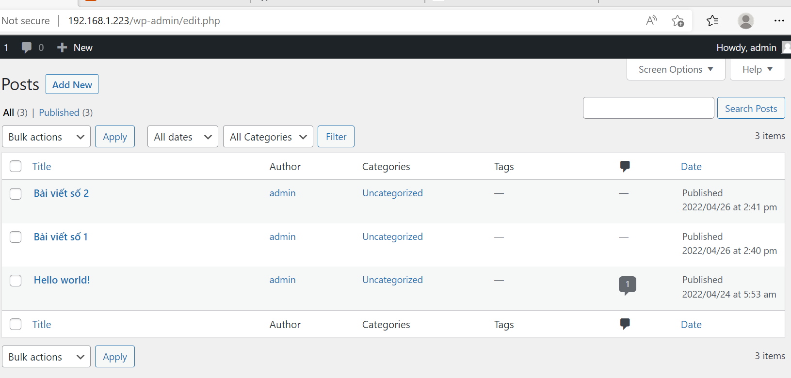

- Qua giao diện phpMyAdmin chọn database website để xuất file website.sql

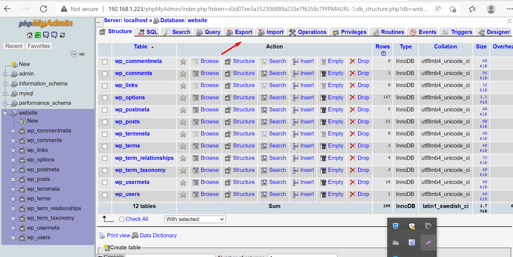

- Với các tùy chọn : 

   - Quick để sao lưu toàn bộ

   - Custom để sao lưu tùy chọn các bảng trong database

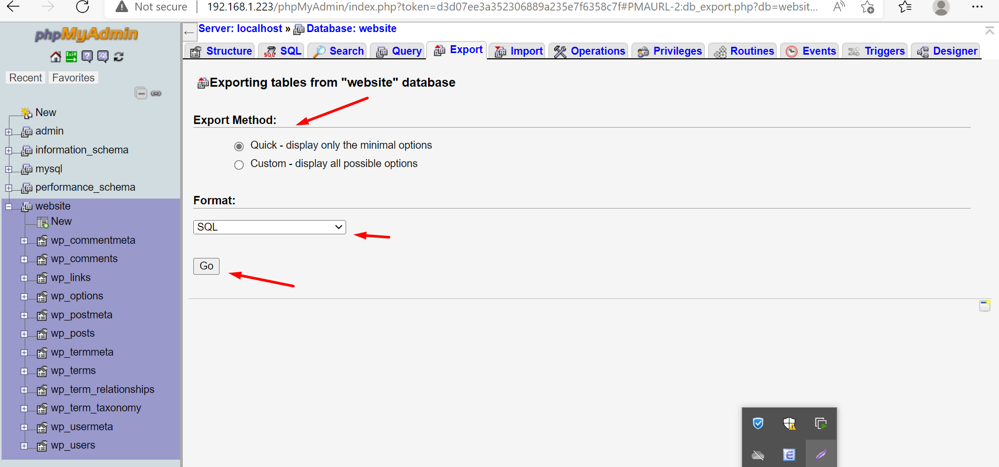

- Bấm go là nhận được file tên website.sql
- Sau đó bên web ta xóa hết các bài viết

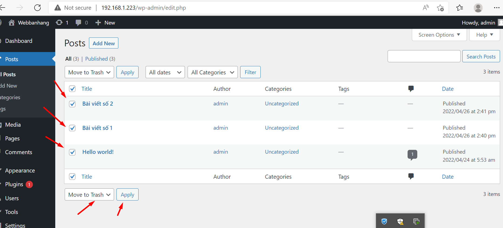

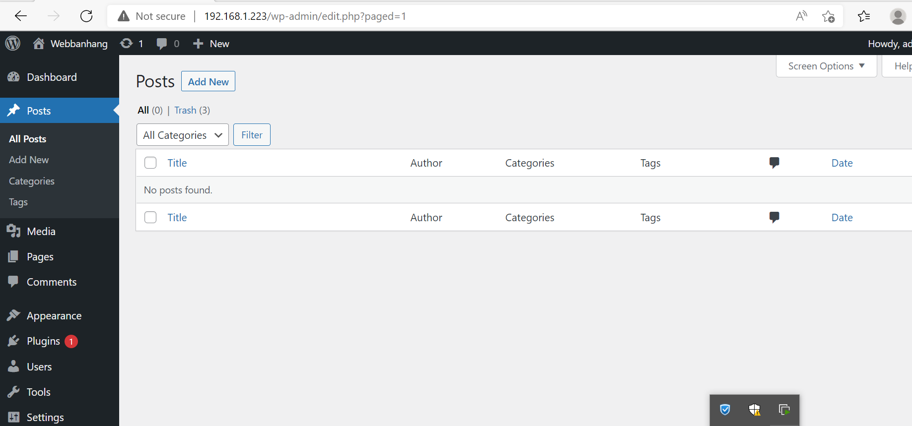

- Do chọn backup full nên ta xóa sạch data trong các table

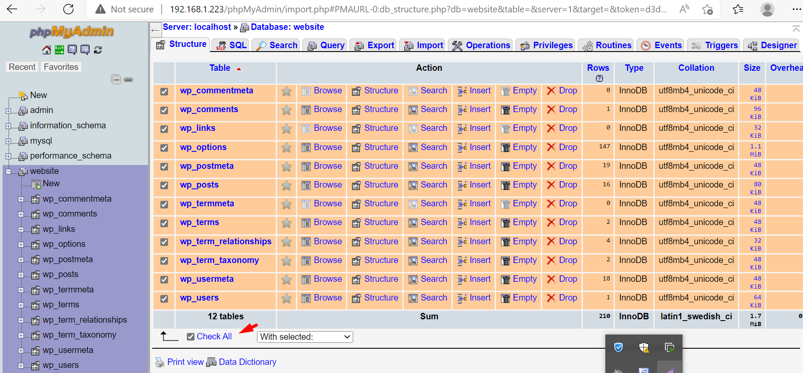

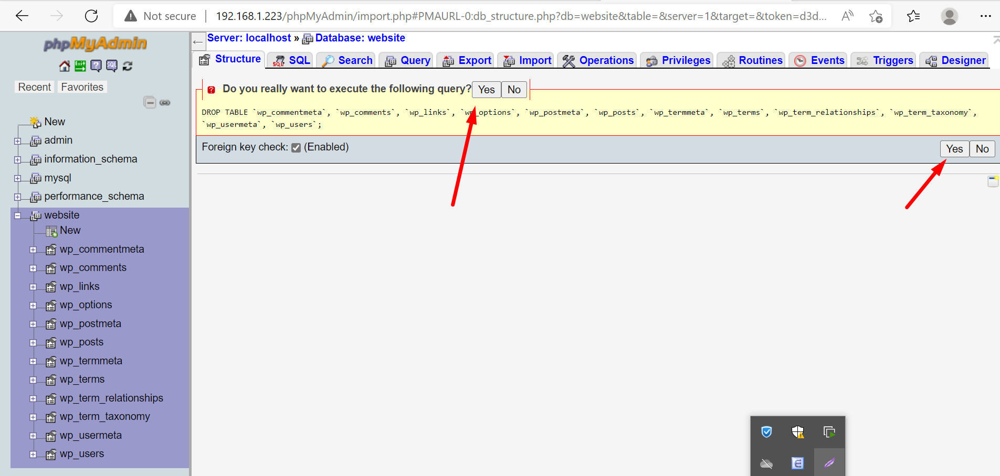

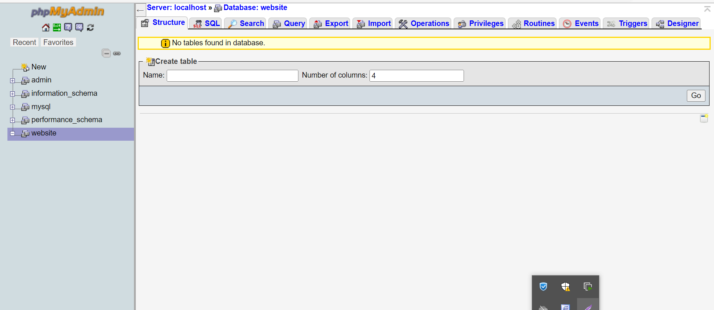

- Wordpress đã trắng

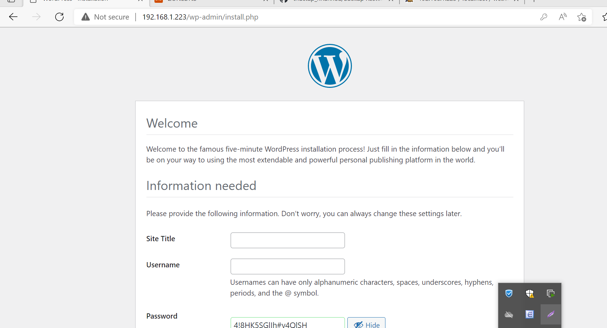

- Giờ tiến hành import lại file website.sql ban nãy

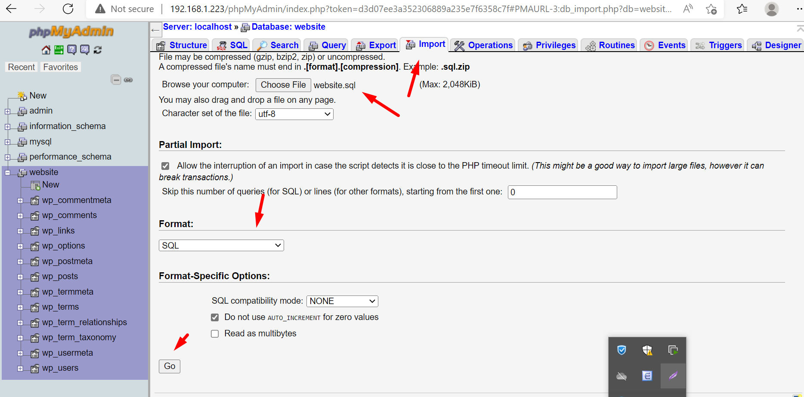

- Website đã khôi phục

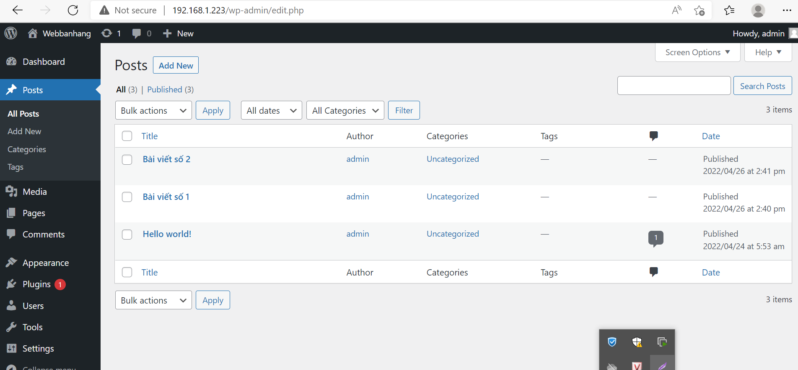
