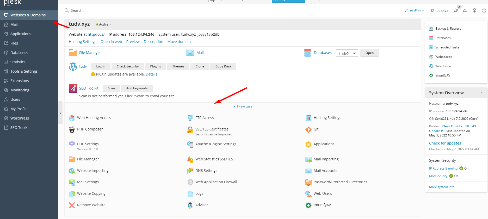
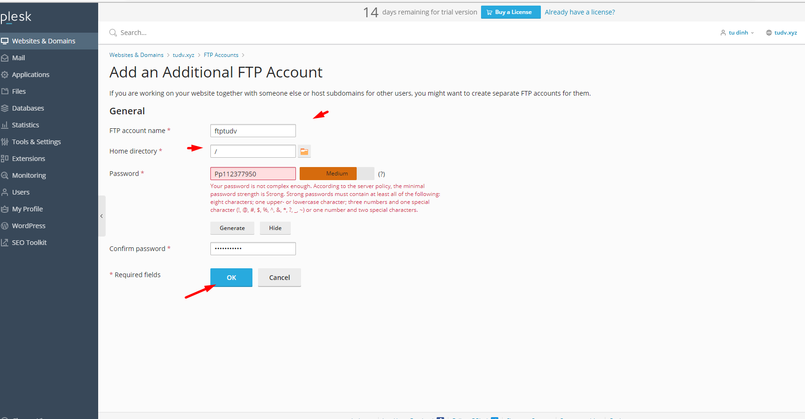
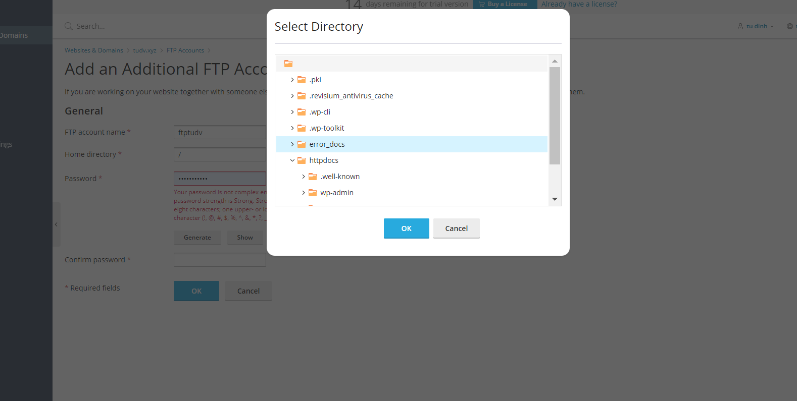
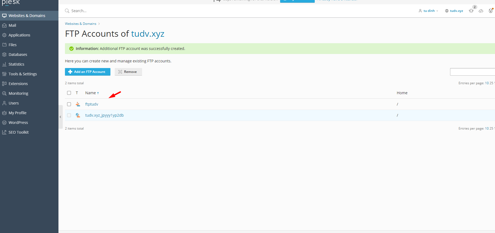
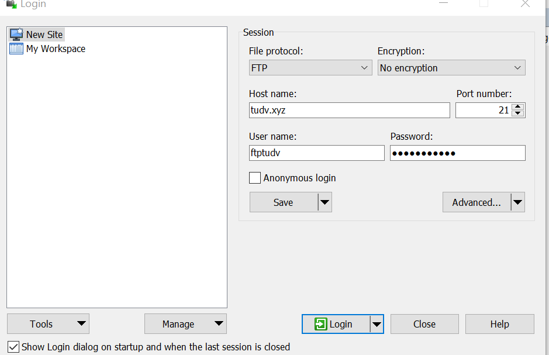
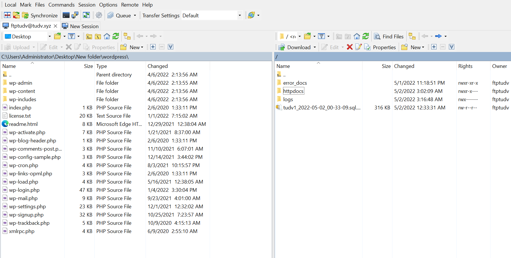
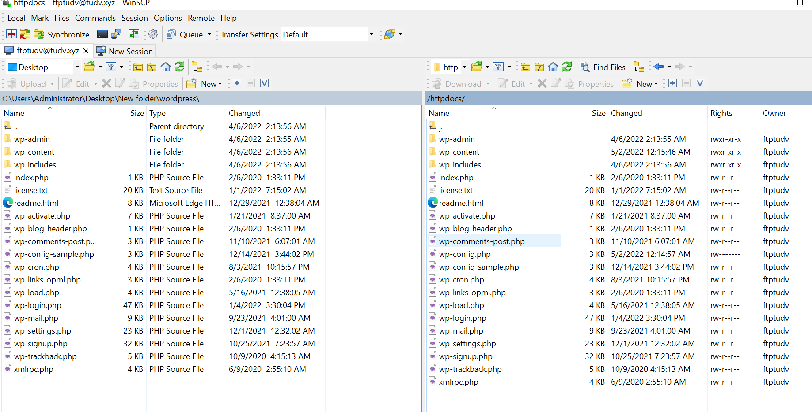

# Add User FTP 
- Tại Plesk Control Panel -> Chọn `Webmail & Domains` -> `FTP Access` 

- Chọn `Add an FTP Account` để tạo tài khoản FTP 

- Điền thông tin cần thiết, chọn thư mục mà User có quyền quản lý và click `OK`

- Kiểm tra

