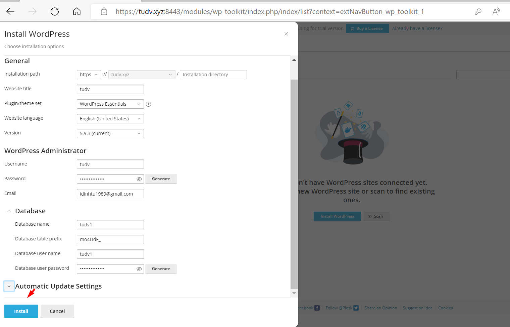

# Add database
- Plesk triển khai mariadb làm ứng dụng quản lý cơ sở dữ liệu.

- Để tạo thêm 1 đoạn database trên mariadb ta làm như sau:

- Tại giao diện Home -> chọn `Databases` -> `Add Database`

- Thiết lập thông tin database muốn tạo

- Database  tên tudv2

# Backup database

- Post 1 bài tiêu đề : `` Trước khi xóa ``

- Export file dữ liệu 

- Ra wp xóa bài 

- Restore database

