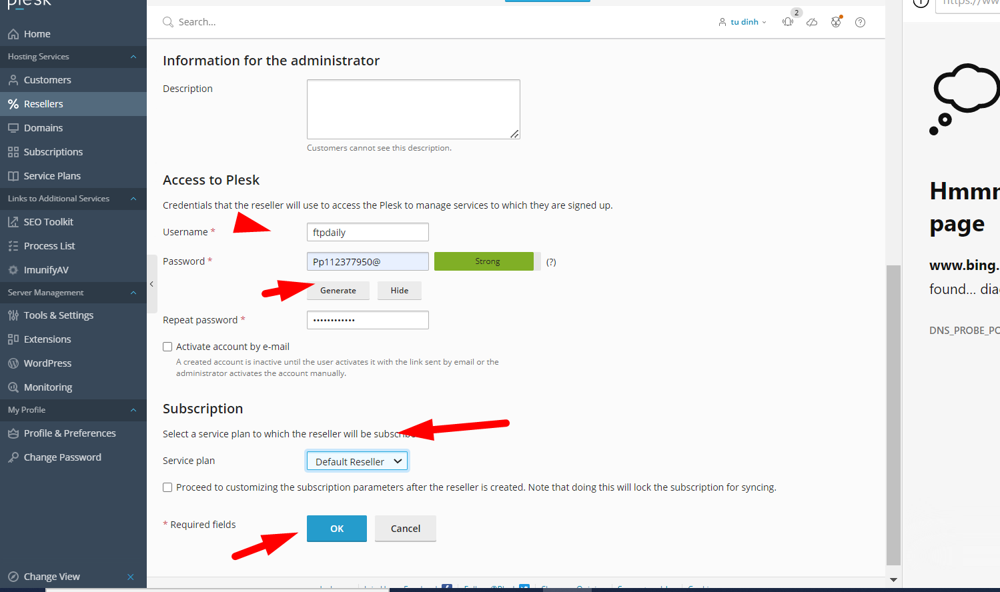

# Tạo Service Plan
- Chọn Service Plan

- Chọn create

- Đặt tên cho gói

- Các tùy chọn về chính sách sử dụng gói:

  - Không cho phép sử dụng tài nguyên quá mức. Đăng ký sẽ tự động bị tạm ngưng nếu việc sử dụng tài nguyên vượt quá giá trị giới hạn.
  - Cho phép sử dụng quá mức không gian đĩa và lưu lượng. Không cho phép sử dụng quá mức các tài nguyên khác.(Gửi mail cảnh báo)

  - Cho phép khách hàng sử dụng nhiều tài nguyên hơn so với kế hoạch cung cấp ban đầu.

- Thông tin của gói Pakage1 được định nghĩa như sau:

  - Không gian đĩa tối đa: 2GB
  - Sử dụng 80% thì cảnh báo
  - Lưu lượng 1 tháng 100GB
  - 80 % lưu lượng đến thì cảnh báo
  - 

  - Tên miền tối đa tạo ra =10
  - Không giới hạn subdomain
  - Domain alias ko giới hạn
  - Mailbox =100 thư
  - Mail size =100MB
  - List 100 mail
  - Thêm tài khoản ftp Không giới hạn
  - Database tối đa tạo 10 bảng
  - Không hết hạn theo thời gian
  - Web wordpress ko giới hạn số lần cài qua WordPress   Toolkit
  - Không giới hạn số lần backup wordpress qua WordPress Toolkit
  ...

# Tạo Customer
- Mở tab customer và điền các thông tin sau:

- Tên khách hàng
- Email liên hệ
- Tài khoản truy cập plesk
- Password

- Đã có domain đăng ký
- Tên domain
- Chọn gói đăng ký dịch vụ 
- Add customer

# Tạo Reseller 

- Click thẻ Reseler Chon create

Điền các thông tin cơ bản 

- Phần default là gói tùy chọn của đại lý, tạo trước và chọn