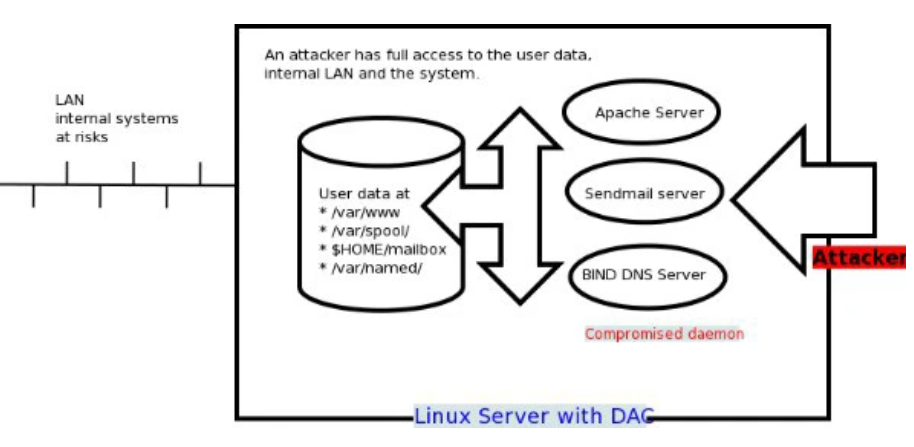

# SELinux 

SELinux là một từ viết tắt của Security-enhanced Linux (tạm dịch: Linux tăng cường bảo mật). Nó là một tính năng bảo mật của Linux kernel, được thiết kế để bảo vệ máy chủ chống lại cấu hình sai và/hoặc các compromised daemons. Nó đặt các giới hạn và chỉ thị cho server và các chương trình: những file nào user có thể truy cập và những hành động nào user có thể thực hiện bằng cách đưa ra một chính sách bảo mật.

## DAC: 

Cơ chế bảo mật Unix/Linux truyền thống

DAC là từ viết tắt của Discretionary Access Control (tạm dịch: Điều khiển truy cập tùy ý). Đây là cơ chế bảo mật OS tiêu chuẩn cho Linux, *BSD, Apple OSX và Unix. Theo DAC, mỗi tiến trình sẽ chạy dưới một user và một group. Ví dụ: httpd process hoạt động với một người dùng và một nhóm được liên kết gọi là apache. Httpd process có quyền truy cập vào tất cả các tệp và thư mục mà apache có thể truy cập. Nếu httpd process bị bẻ khóa, nó có thể tạo ra một số vấn đề về bảo mật. Hacked httpd process có thể truy cập, sửa đổi và phá hủy tất cả các files thuộc về người dùng apache. Nó có thể truy cập các thư mục tạm thời (/tmp/ hoặc /var/tmp) và các tệp có thể đọc được trên thế giới. Các /tmp hoặc /var/tmp hoặc bất kỳ thư mục hợp pháp khác như thư mục bộ nhớ đệm có thể được sử dụng để cài đặt backdoor và kiểm soát hoàn toàn hệ thống Linux của bạn. Một cgi hoặc php script với quyền truy cập không mong muốn có thể thực hiện bất cứ điều gì đối với các tập tin thuộc sở hữu của apache user. Nó có thể thực hiện bất kỳ thao tác nào trên các tệp trong apache group. Kẻ tấn công có thể sử dụng misocofigured cgi/php script hoặc broken apache server để chiếm quyền truy cập cấp độ root. Điều này sẽ cung cấp quyền truy cập superuser trên hệ thống Linux. Sau khi root, kẻ tấn công có thể ăn cắp dữ liệu cá nhân hoặc truy cập các phần khác của mạng LAN.



## MAC: Cơ chế bảo mật thông qua SELinux

MAC là từ viết tắt của Mandatory Access Control (MAC). 

SELinux là một thực thi của cơ chế bảo mật MAC. Nó được xây dựng trong Linux kernel và được kích hoạt mặc định trên Fedora, CentOS, RHEL và một vài bản phân phối Linux khác. SELinux cho phép quản trị viên máy chủ xác định các quyền khác nhau cho tất cả quy trình. Nó xác định cách tất cả các tiến trình có thể tương tác với các phần khác của máy chủ như:

- Pipes

- Files

- Network ports

- Sockets

- Directories

- Quá trình khác

SELinux đặt các hạn chế đối với từng đối tượng trên theo chính sách. Ví dụ, một người dùng apache với sự cho phép đầy đủ chỉ có thể truy cập thư mục /var/www/html, nhưng không thể chạm vào các phần khác của hệ thống như thư mục /etc. Nếu có thể chiếm quyền truy cập vào sendmail mail hoặc bind dns hoặc apache web server, thì kẻ tấn công này cũng chỉ có quyền truy cập vào máy chủ bị khai thác đó và các tệp trong máy chủ này. Kẻ tấn công không thể truy cập vào các phần khác của hệ thống hoặc mạng nội bộ. Nói cách khác, thiệt hại sẽ được hạn chế đối trong phạm vi máy chủ và các files cụ thể. Các cracker cài cắm được shell lên trên máy chủ của bạn thông qua daemon phổ biến như Apache/BIND/Sendmail khi SELinux cung cấp các tính năng bảo mật sau đây:

- Bảo vệ dữ liệu của người dùng khỏi bị truy cập trái phép.

- Bảo vệ các daemons hoặc programs khác khỏi truy cập trái phép.

- Bảo vệ ports/ sockets/ files khỏi truy cập trái phép.

- Bảo vệ máy chủ chống lại việc khai thác.

- Tránh leo thang đặc quyền.

Tuy SELINIX hoạt động nhưng bạn vẫn cần phải tuân theo các phương thức bảo mật khác như:

- Thực hiện chính sách tường lửa.

- Giám sát máy chủ.

- Vá hệ thống kịp thời.

- Viết và bảo mật các script cgi/ php/ python/ perl.

## Các mode hoạt động của SELINUX

SELinux có 3 chế độ hoạt động cơ bản

- Enforcing: Chế độ mặc định sẽ cho phép và thực thi chính sách bảo mật SELinux trên hệ thống, từ chối các hành động truy cập và ghi nhật ký
- Permissive: Trong chế độ Permissive, SELinux được kích hoạt nhưng sẽ không thực thi chính sách bảo mật, chỉ cảnh báo và ghi lại các hành động. Chế độ Permissive hữu ích cho việc khắc phục sự cố
- Disabled: SELinux bị vô hiệu hóa.

## Vô hiệu hóa SElinux

Việc bảo mật trên Linux cũng vô cùng quan trọng nhưng việc chưa control được selinux gây đến khó khăn trong khi chúng ta cài đặt vận hành các phần mềm trên Linux.

Trước khi cài đặt phần mềm nào đó ví dụ như mysql, httpd, … chúng ta thường nghĩ ngay đến việc vô hiệu hóa SElinux và firewall.

- Vô hiệu hóa tạm thời sẽ có tác dụng lên Server cho đến khi Server được reboot lại
```
   setenforce 0
```
- Vô hiệu hóa SELinux vĩnh viễn

   Chỉnh sửa nội dung trong file /etc/sysconfig/selinux với nội dung SELINUX=disabled

- Kiểm tra lại trạng thái của SElinux

   Sau khi vô hiệu hóa vĩnh viễn xác nhận quá trình vô hiệu hóa thành công

   ```
   sestatus

   ```


