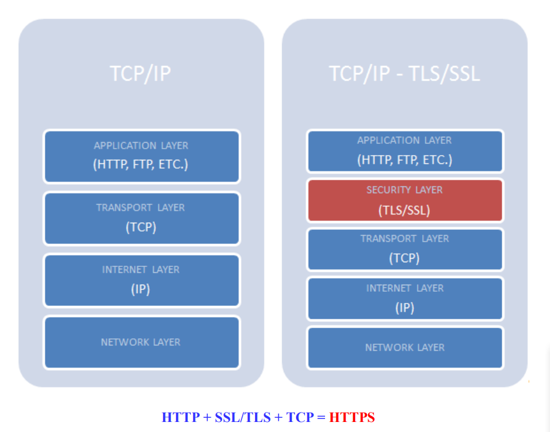

# Secure Socket Layer

## SSL - Secure Sockets Layer

SSL - một tiêu chuẩn an ninh công nghệ toàn cầu tạo ra một liên kết được mã hóa giữa 
máy chủ web và trình duyệt. Liên kết này đảm bảo tất cả các dữ liệu trao đổi giữa máy 
chủ web và trình duyệt luôn được bảo mật an toàn. SSL là giao thức hoạt động ở trên 
tầng Transport trong mô hình TCP/IP.



Chứng chỉ số SSL - cài trên server website của doanh nghiệp, cho phép khách hàng khi 
truy cập có thể xác minh được tính xác thực, tin cậy của website, đảm bảo mọi dữ liệu, 
thông tin trao đổi giữa website và khách hàng được mã hóa, tránh nguy cơ bị can thiệp.
SSL chỉ được cung cấp bởi các đơn vị cấp phát chứng chỉ (Certificate Authority - CA) có
uy tín trên toàn thế giới sau khi đã thực hiện xác minh thông tin về chủ thể đăng ký rất kỹ
càng mang lại mức độ tin cậy cao cho người dùng Internet và tạo nên giá trị cho các
website, doanh nghiệp cung cấp dịch vụ.

Lợi ích của việc sử dụng Chứng chỉ số SSL

▪ Chứng thực doanh nghiệp - tránh giả mạo website.

▪ Bảo mật và mã hóa các thông điệp trao đổi giữa trình duyệt và server (Bảo mật 
các giao dịch giữa khách hàng và doanh nghiệp, các dịch vụ truy nhập hệ thống)

▪ Nâng cao hình ảnh, thương hiệu và uy tín doanh nghiệp (Tạo lợi thế cạnh tranh, 
tăng niềm tin của khách hàng đối với website, tăng số lượng giao dịch, giá trị 
giao dịch trực tuyến của khách hàng)

# Cài SSL trên server LAMP dùng chứng chỉ miễn phí  Certbot-apache

- Cài đặt EPEL reppsitory

```
yum install -y epel-release

```

Cài đặt certbot-apache

```
yum -y install certbot python2-certbot-apache mod_ssl

```


- Để cài đặt SSL cho website, ta sử dụng câu lệnh sau:Trước tiên phải trỏ bản ghi A và Cname


```
certbot --apache -d tudv.xyz -d www.tudv.xyz
```
- Sau đó ta nhập email, chọn 'Y' để điều đồng ý với điều khoản, chọn 'N' để từ chối nhận thông tin, tin tức từ Let's Encrypt và Certbot


- Mã key public key và private key.


Khi cài ssl tự động :  tự Tạo 1 file Virtual Host mới cho domain tudv1.tudv.xyz lắng nghe trên port 443 

File này sẽ đc include vào file cấu hình chính của httpd tại

 /etc/httpd/conf/httpd.conf  

 

 và tự thêm 1 đoạn chuyển hướng từ http sang https trong file virtual của tudv1.tudv.xyz