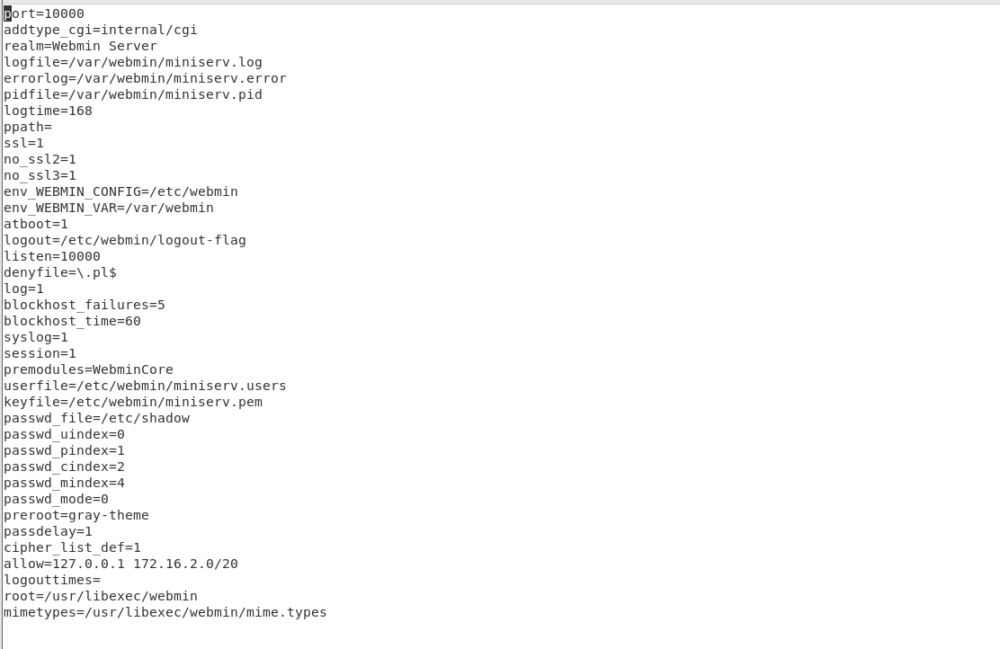
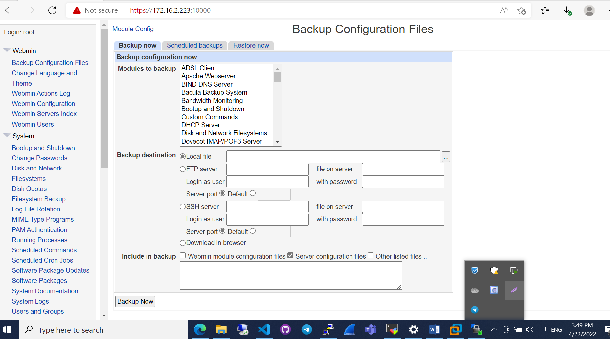

# WEBMIN

Webmin là một giao diện web để quản trị hệ thống cho Linux. Nó cho phép điều khiển nhiều máy tính thông qua một giao diện duy nhất. Hoặc đăng nhập liền mạch trên các Webmin host khác trên cùng một subnet hoặc mạng LAN. Bạn có thể sử dụng bất kỳ trình duyệt web hiện đại nào để kết nối với server của bạn.

Webmin loại bỏ nhu cầu chỉnh sửa các file cấu hình Linux  theo cách thủ công. Nó cũng cho phép bạn quản lý server từ xa hoặc bảng điều khiển. Với Webmin, bạn có thể định cấu hình hệ điều hành nội bộ như users, service. Hoặc là các file cấu hình, disk quotas. Bên cạnh đó là sửa đổi và kiểm soát các ứng dụng nguồn mở (open-source) như Apache hay Tomcat, PHP, MySQL, DNS và chia sẻ file. Webmin, dựa trên Perl, chạy như một quy trình và web server của riêng nó.

# Thực hành

- Cài đặt:

- IP 172.16.2.223/20

`yum -y install perl-Net-SSLeay`

- Tải bản mới nhất trên trang chủ : http://download.webmin.com/download/yum/

`yum -y install http://download.webmin.com/download/yum/webmin-1.991-1.noarch.rpm`

- Thêm dải mạng cho truy cập

`vi /etc/webmin/miniserv.conf`

- thêm vào:

`allow=127.0.0.1 172.16.0.0/20`

- Khởi động lại

`/etc/rc.d/init.d/webmin restart`

`firewall-cmd --zone=publicweb --add-port=10000/tcp --permanent`

`firewall-cmd --reload`

Mở trình duyệt truy cập:

https://172.16.2.223:10000/

