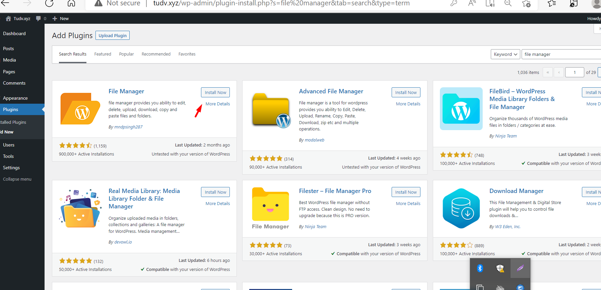
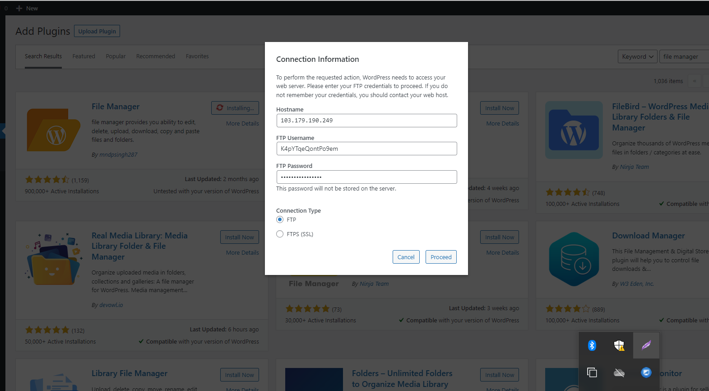
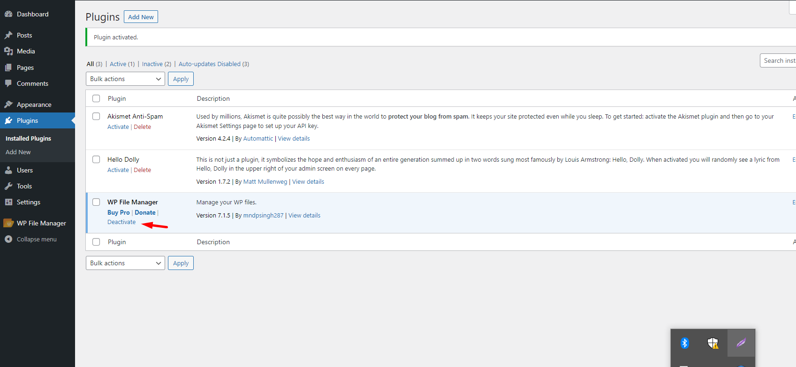
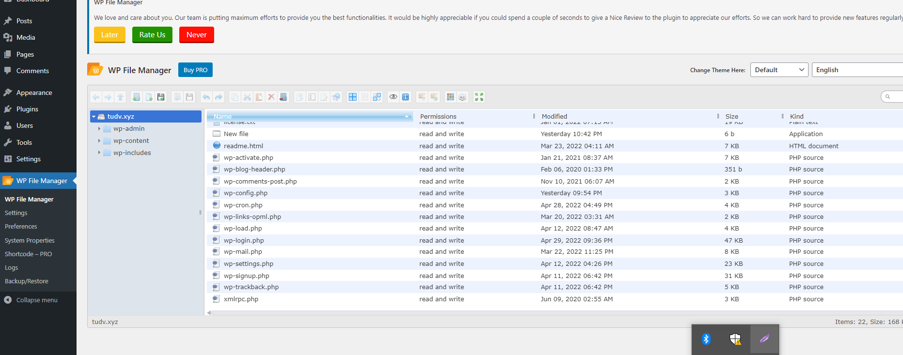

# Sử dụng wordpress

http://tudv.xyz/

## 1-Plugins tải file lên trực tiếp trên web

- Cài đặt ftp server

- Truy cập vào admin website chọn thẻ plugins rồi chọn Add New

- Bước này nhập IP sever, user ftp và pass user rồi chọn cài đặt

-Viết 1 số bài

- Tạo menu

- Cài theme

- Chèn link

- Widget trang

http://tudv.xyz/

