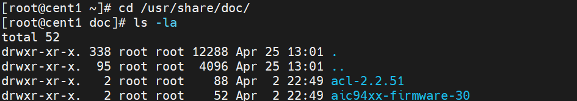

# Zabbix

Zabbix là một công cụ mã nguồn mở giải quyết cho ta các vấn đề về giám sát. Zabbix là phần mềm sử dụng các tham số của một mạng, tình trạng và tính toàn vẹn của Server cũng như các thiết bị mạng. Zabbix sử dụng một cơ chế thống báo linh hoạt cho phép người dùng cấu hình email hoặc sms để cảnh báo dựa trên sự kiện được ta thiết lập sẵn. Ngoài ra Zabbix cung cấp báo cáo và dữ liệu chính xác dựa trên cơ sở dữ liệu. Điều này khiến cho Zabbix trở nên lý tưởng hơn.
Tất cả các cấu hình của Zabbix thông qua giao diện web. Việc lên kế hoạch và cấu hình một cách đúng đắn sẽ giúp cho việc giám sát trở nên dễ dàng và thuận tiện hơn. Zabbix đóng một vai trò quan trọng trong việc theo dõi hạ tầng mạng.

Zabbix có các ưu điểm 

- Giám sát cả Server và thiết bị mạng

- Dễ dàng thao tác và cấu hình

- Hỗ trợ máy chủ Linux, Solaris, FreeBSD …

- Đáng tin cậy trong việc chứng thực người dùng

- Linh hoạt trong việc phân quyền người dùng

- Giao diện web đẹp mắt

- Thông báo sự cố qua email và SMS

- Biểu đổ theo dõi và báo cáo

- Mã nguồn mở và chi phí thấp

# Cài đặt

``` 
yum update -y

```

- Cài đặt apache

```
yum install httpd -y

```


- Cài đặt epel 7 và remi 7 

```
yum install yum-utils -y

yum install epel-release -y

yum install http://rpms.remirepo.net/enterprise/remi-release-7.rpm -y


```

- Kiểm tra PHP hiện tại trên máy nếu có PHP 5 thì disable PHP 5 repository, nếu không có thì tải PHP7 repository

```
yum-config-manager --disable remi-php54
yum-config-manager --enable remi-php72

yum install php php-pear php-cgi php-common php-mbstring php-snmp php-gd php-pecl-mysql php-xml php-mysql php-gettext php-bcmath -y

```
- Chỉnh sửa time zone 

```
vi /etc/php.ini

```


- Cài mariadb

```

yum install mariadb-server -y

systemctl start mariadb.service

systemctl enable mariadb

service mariadb restart

```

- Cài maria

mysql_secure_installation


Khi được nhắc nhập mật khẩu, ta có thể nhấn Enter để trống hoặc cập nhật mật khẩu mới
Sau đó làm các bước để thiết lập mật khẩu. Cuối cùng, tập lệnh sẽ yêu cầu định cấu hình một số biện pháp bảo mật, bao gồm:

    - Xóa người dùng ẩn danh?

    - Không cho phép đăng nhập từ xa?

    - Xóa cơ sở dữ liệu thử nghiệm và truy cập vào nó?

    - Tải lại bảng đặc quyền ngay bây giờ


- Login Maria 

```
mysql -u root -p

```

- Tạo database tên zabbix

```
CREATE DATABASE zabbix CHARACTER SET UTF8 COLLATE UTF8_BIN;

```

- Tạo người dùng cho cơ sở dữ liệu zabbixuser

```

CREATE USER zabbixuser@localhost IDENTIFIED BY 'abc@123';

```

Tại thời điểm này, ta đã tạo một người dùng cơ sở dữ liệu, tuy nhiên ta vẫn chưa cấp cho người dùng đó quyền truy cập vào cơ sở dữ liệu. Có thể thêm các quyền đó bằng lệnh sau:

```

GRANT ALL PRIVILEGES ON zabbix.* to zabbixuser@localhost IDENTIFIED BY 'abc@123';

```

- Bây giờ người dùng có quyền truy cập vào cơ sở dữ liệu, ta cần xóa các đặc quyền để MySQL biết về những thay đổi đặc quyền gần đây mà ta đã thực hiện

``` 
FLUSH PRIVILEGES;
exit

```

- Cài zabrix

```
rpm -ivh https://repo.zabbix.com/zabbix/4.0/rhel/7/x86_64/zabbix-release-4.0-1.el7.noarch.rpm

yum install zabbix-server-mysql  zabbix-web-mysql zabbix-agent zabbix-get -y

```

- Configure Zabbix ,đổi múi giờ theo múi giờ php bên trên

```

vi /etc/httpd/conf.d/zabbix.conf

```


```
service httpd restart

```

- Di chuyển vào zabbix-server-mysql-4.0.39

```
cd /usr/share/doc/

ls -la

cd zabbix-server-mysql-4.0.39

```




- Dùng công cụ zcat để import  file MySQL dump 

```
zcat create.sql.gz | mysql -u zabbixuser -p zabbix

```


- Nhập Pass zabbixuser


- Chỉnh sửa kết nối database các dòng 91 100 116 124

```
vi /etc/zabbix/zabbix_server.conf

```

```
DBHost=localhost  > dòng 91
DBName=zabbix     > dòng 100
DBUser=zabbixuser > dòng 116
DBPassword=abc@123 > dòng 124

```


- Khởi động lại dịch vụ

```
systemctl start zabbix-server.service
systemctl enable zabbix-server.service

```
- Truy cập IP/zabbix/setup.php


- Hệ thống check 1 vài thông số nên có của máy chủ giám sát này

Các fail là các lỗi liên quan đến cấu hình PHP 


max size up file =16

thời gian thực thi =300s


- Mấy lỗi này chỉnh sửa trong /etc/php.ini

Nguyên nhân là do sự ko đồng nhất cấu hình trong 2 file ``/etc/httpd/conf.d/zabbix.conf`` và ``/etc/php.ini``

```
vi /etc/php.ini

```


```
service httpd restart

```

- Reload lại và khai báo vào database


```
systemctl start zabbix-server.service
systemctl enable zabbix-server.service

service httpd restart

```


``Mật khẩu mặc định là zabbix với tk Admin``


- Cài thử zabbix trên win10 và add các thông số 
- Thử giám sát Win10 đang là host


