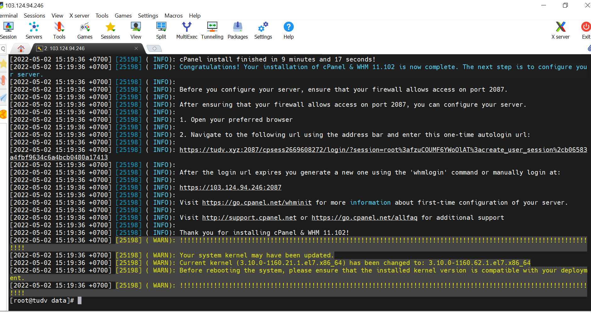
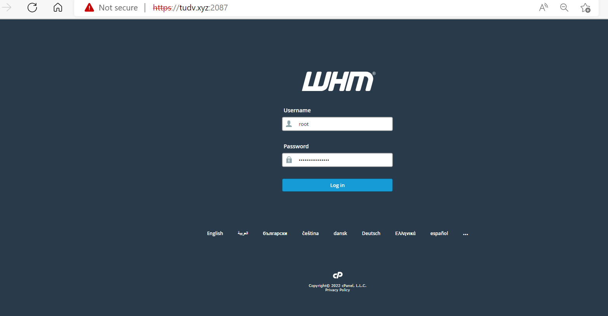
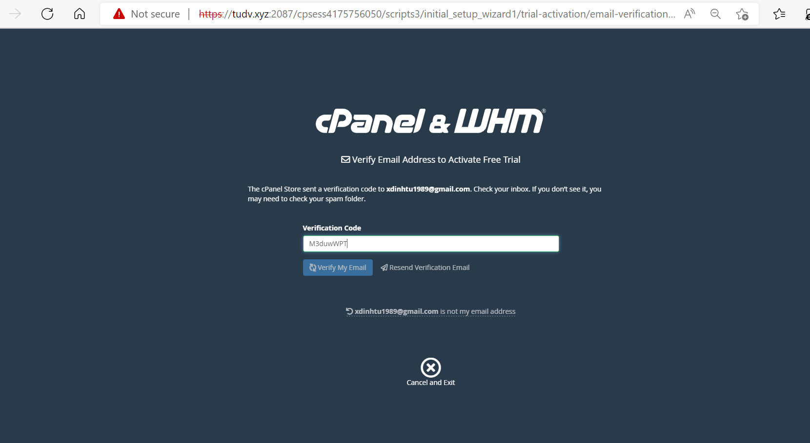
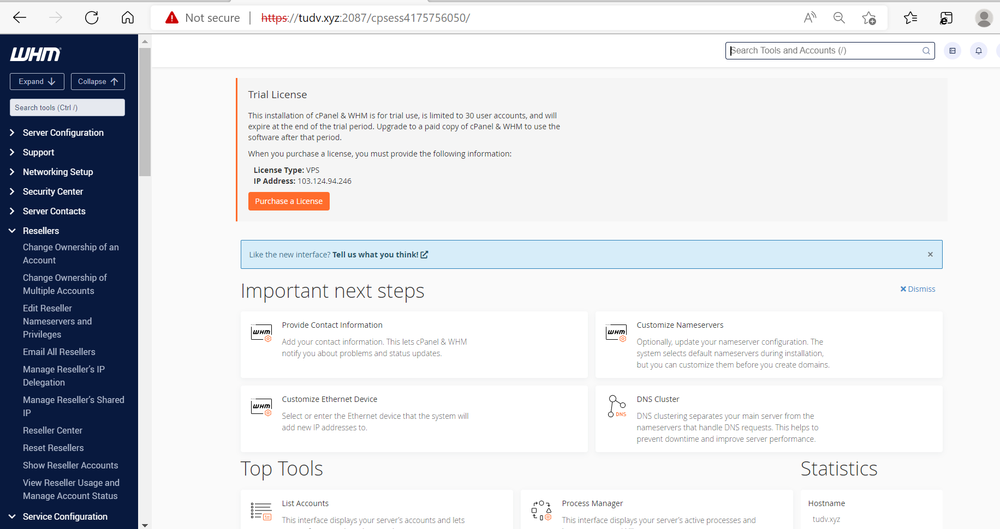

# Cài cPanel trên centos7

- Đổi tên host:

```
hostnamectl set-hostname tudv.xyz
exec bash

```

- 1 server trắng

- Tắt Selinux

- Tắt Network Manager

Từ phiên bản 68 trở đi, cPanel sẽ không hỗ trợ Network Manager service , nên  cần tắt dịch vụ này đi trước khi cài đặt:

```
systemctl stop NetworkManager.service
systemctl disable NetworkManager.service
systemctl enable network.service
systemctl start network.service
```

- Update yum

```
yum update -y

```

- Cài đặt 2 gói perl và curl

``` 
yum install perl
yum install curl

```


- Cài đặt cPanel

```
mkdir /data && cd /data
curl -o latest -L https://securedownloads.cpanel.net/latest
sh latest

```



- Reboot


- Sau khi cài xong cần có tài khoản sử dụng

Đăng ký dùng thử liense 15 ngày 

https://cpanel.net/






