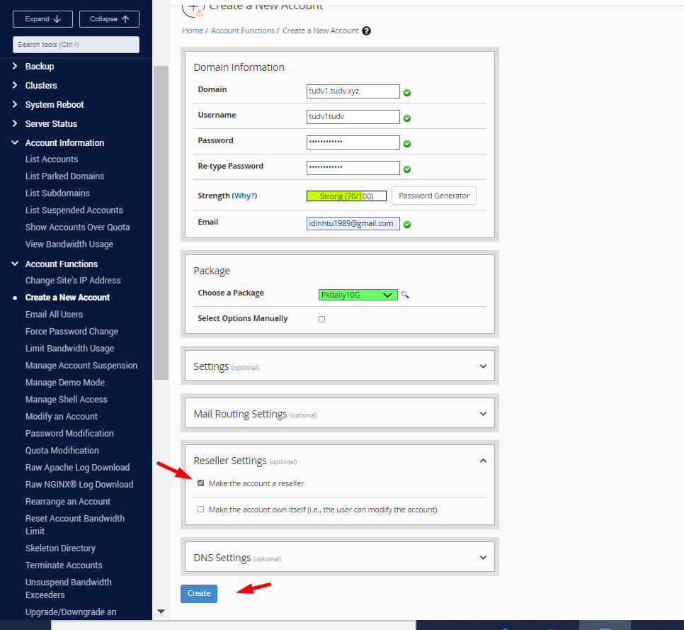

# Tạo packages 
- Chọn Packages > Add a package

- Điền các thông số của packages này

  - Dung lượng lấy từ đĩa: 10GB
  - Lưu lượng 1 tháng không giới hạn
  - FTP tài khoản tạo không hạn
  - Max mail nhóm
  - Max database tạo
  - Max Parked Domains: Số lượng tên miền alias/parked được chạy trên gói hosting. Alias/Parked domain là tên miền bí danh cho một tên  miền khác. Ví dụ khi Quý khách truy cập vào abc.com thì sẽ hiện website của def.com, trong trường hợp này abc.com là alias domain của tên miền def.com.

  - Max Addon Domains: Số lượng tên miền mà người dùng được phép thêm vào. Ví dụ tên miền chính của người dùng là qwe.com, người dùng thêm vào một tên miền nữa để chạy trên cùng 1 gói hosting này là pqe.com thì pqe.com là addon domain.

  ...

- Xem các gói

# Tạo User 

- Account funtion > Create a new account

# Reseller

- Vào mục Reseller > Edit Reseller Namespace

- Tạo package để bán :

- Create 1 account mới và gán package cho user

- Sau khi vào giao diện login thì login tài khoản đã tạo trước đó, tài khoản này sẽ được gửi qua email cho Reseller. Kéo xuống phần Advanced >> WebHost Manager

- Tại giao diện quản lý này ta cũng bắt đầu tạo Package >> Tạo Account gán vào package >> Vào list Account đễ vào Cpanel của người dùng mới tạo >> Thử tạo site bằng cách install software wordpress auto có sẳn trong tool.

