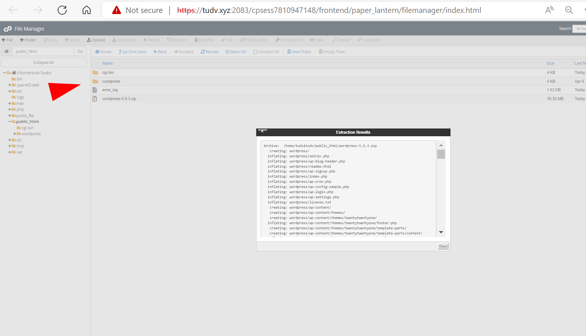
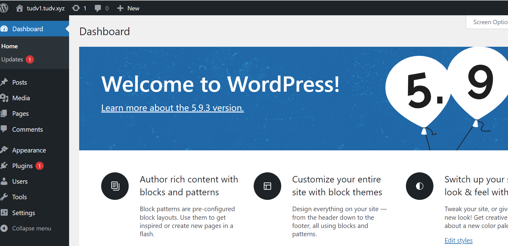

# Tạo database

 

 

 - Sang thẻ phpMyAdmin

 

# Up wordpress lên database

- Chúng ta chọn file manager

- Vào mục html và chọn up wordpress file.zip

- Sau đó giải nén được thư mục wordpress

- Vào thư mục wordpress copy toàn bộ file và thư mục ra ngoài

- Kết nối database

- Backup database: Chọn thẻ backup
trước khi xóa viết thử 1 bài

- Xóa 

# Đổi ver php
- Thẻ MultiPHP

