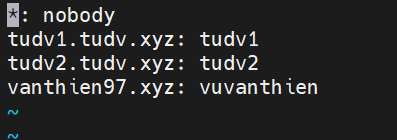

Toàn bộ port service của cPanel đc mô tả trong 

```
etc/services

```
Thông tin documentroot của user tại 

```
/etc/userdatadomains

```


Thông tin chủ sở hữu domain tại

```
etc/userdomains

```
