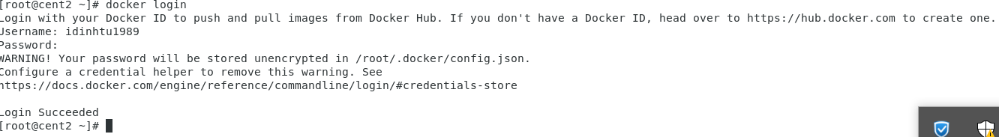
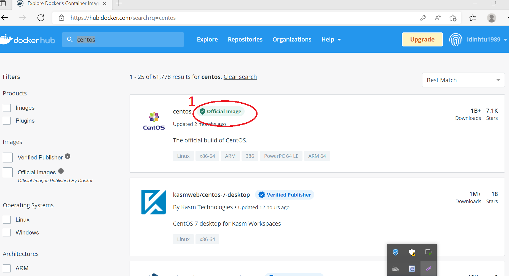
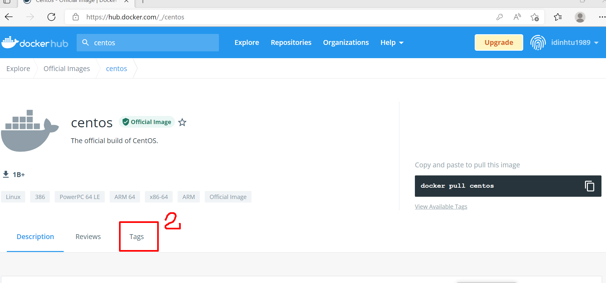
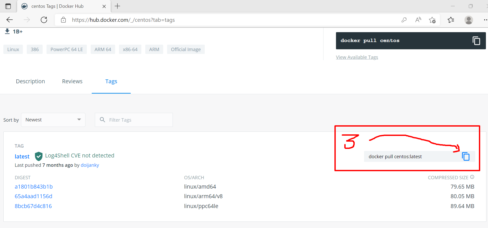
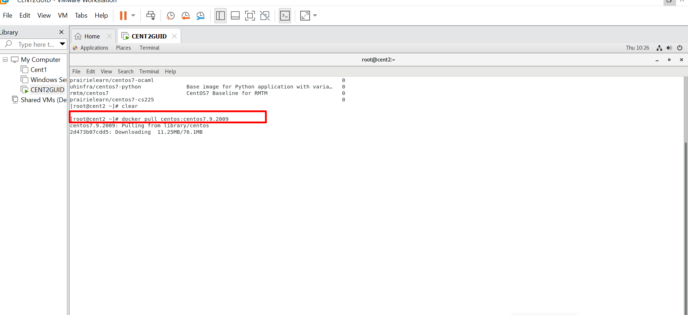
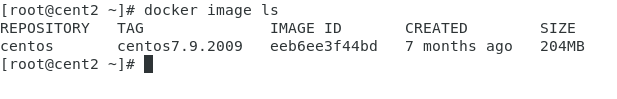

# Tìm hiểu về docker và container

## Giới thiệu

   Ứng dụng rất quan trọng đối với các doanh nghiệp. Hầu như tất cả ứng dụng đều chạy trên các server. Các hệ điều hành chỉ dùng để chạy một ứng dụng. Khi cần triển khai bất kì ứng dụng nào đêu cần mua một server mới mà không biết chính xác phần cứng yêu cầu cho ứng dụng. Vì vậy dẫn đến sự lãng phí lớn về tài nguyên phần cứng, điện năng,...cho các công ty.

   VMware giới thiệu công nghệ ảo hóa virtual machine(VM)công nghệ giúp chạy đa ứng dụng một cách an toàn và bảo mật trên một server vật lý IT không cần mua một server mới khi công ty yêu cầu một ứng dụng mới nữa. Họ hoàn toàn có thể triển khai chúng trên server sẵn có với một máy ảo mới Điều này giúp giảm sự lãng phí về tài nguyên.

   Tuy nhiên, VM vẫn không hoàn hảo:

   - Cần một hệ điều hành riêng cho mỗi VM, dẫn đến sự tốn kém về tài nguyên, license, bảo hành, theo dõi cho mỗi VM đó.
   - Vm boot chậm và không có tính di động - sao lưu hay di chuyển VM giữa các đều rất khó khăn.

**Container**

Trong một khoảng thời gian dài, các công ty lớn sử dụng công nghệ container để khắc phục những thiếu sót của VM. Container không cần hệ điều hành riêng như VM mà các container chia sẻ hệ điều hành với HostOS. Dẫn đến giảm tiêu tốn tài nguyên cũng như chi phí cho công ty. Container có tính di động cao - việc di chuyển container giữa laptop, cloud, hay VM là một việc đơn giản

Container hiện đại thì bắt đầu trên LInux. Được phát triển và đóng góp rất nhiều từ rất nhiều người, công ty lớn để có được công nghệ container ngày nay. Một số công nghệ giúp containter pát triển mạnh bao gồm: Kernel namespaces, cgroup, union filesystem, và đương nhiên Docker. Tuy vậy, container vẫ khá phức tạp và khó tiếp cận với hầu hết các công ty cho đến khi Docker xuất hiện.

**Docker**

 là một nền tảng để cung cấp cách để building, deploying và running ứng dụng dễ dàng hơn bằng cách sử dụng các containers (trên nền tảng ảo hóa).

Các containers cho phép lập trình viên đóng gói một ứng dụng với tất cả các phần cần thiết, chẳng hạn như thư viện và các phụ thuộc khác, và gói tất cả ra dưới dạng một package.

Bằng cách đó, nhờ vào container, ứng dụng sẽ chạy trên mọi máy Linux khác bất kể mọi cài đặt tùy chỉnh mà máy có thể có khác với máy được sử dụng để viết code.

Theo một cách nào đó, Docker khá giống virtual machine. Nhưng tại sao Docker lại phát triển, phổ biến nhanh chóng? Đây là những nguyên nhân
- Tính dễ ứng dụng: Docker rất dễ cho mọi người sử dụng từ lập trình viên, sys admin… nó tận dụng lợi thế của container để build, test nhanh chóng. Có thể đóng gói ứng dụng trên laptop của họ và chạy trên public cloud, private cloud… Câu thần chú là “Build once, run anywhere”.

- Tốc độ: Docker container rất nhẹ và nhanh, bạn có thể tạo và chạy docker container trong vài giây.

- Môi trường chạy và khả năng mở rộng: Bạn có thể chia nhỏ những chức năng của ứng dụng thành các container riêng lẻ. Ví dụng Database chạy trên một container và Redis cache có thể chạy trên một container khác trong khi ứng dụng Node.js lại chạy trên một cái khác nữa. Với Docker, rất dễ để liên kết các container với nhau để tạo thành một ứng dụng, làm cho nó dễ dàng scale, update các thành phần độc lập với nhau.

# Thực hành cài đặt docker ,pull push, run image container

1- yum install - y yum-utils

2- yum-config-manager \

            --add-repo \

                          https://download.docker.com/linux/centos/docker-ce.repo

3- yum install docker-ce docker-ce-cli containerd.io -y

4- service docker restart

docker version  // kiem tra phien ban docker

docker --help   //xem cac lenh docker

dang nhap docker.com tao tai khoan dockerhub(nhu github)

7- tren centos go lenh: docker login va nhap tai khoan pass vua tao tai dockerhub

8- tim kiem 1 image bat ky tren dockerhub  : go truc tiep tren thanh search cua dockerhub

tren centos7 go lenh: 
- docker search + ten image muon tim

thong thuong ta tim truc tiep tren dockerhub

search va click vao official image

## pull image 

click tag

copy dong lenh va paste  dong lenh vao centos lab

doi no tai ve

Ta thấy image tải về có 76MB , nó ko phải file iso của centos7 ~ 4.4 GB
mà là 1 phiên bản container được đóng gói thành image trong đó có chứa các thư viện tập lệnh có giá trị rất nhỏ, khi sử dụng nó sẽ sử dụng nhân của hdh bên ngoài máy centos đang chạy thông qua 1 teminal là công cụ đứng giữa, có những image rất nhỏ ~ vài MB nhưng chứa rất nhiều tập tin thư viện bên trong .

Sau khi đã load thành công gõ:
- docker image --help

ta dùng lệnh **docker image ls** để ktra image vừa tải về

gõ **docker run --help** để trợ giúp xem ý nghĩa lệnh

