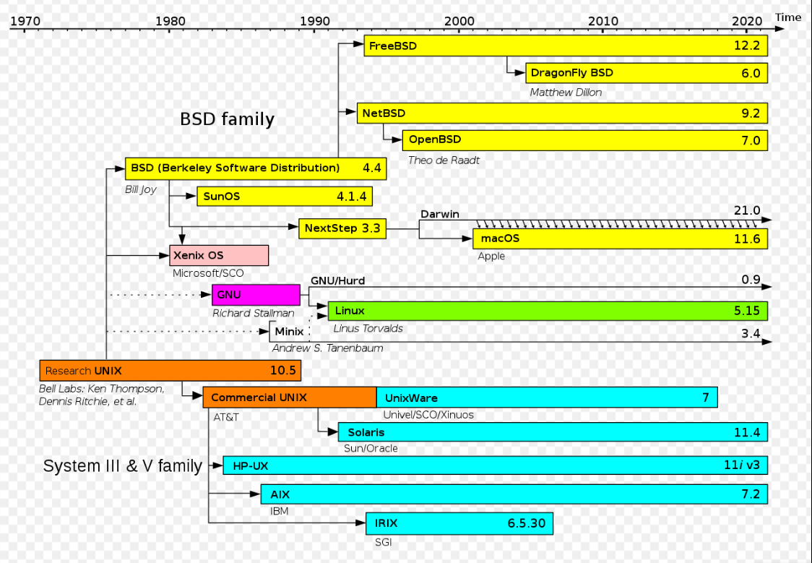
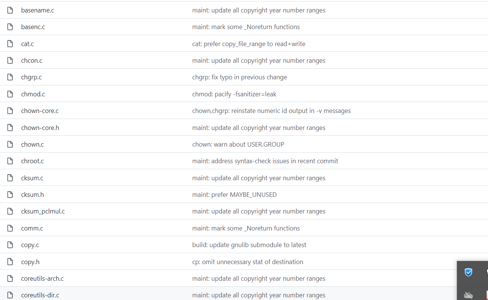
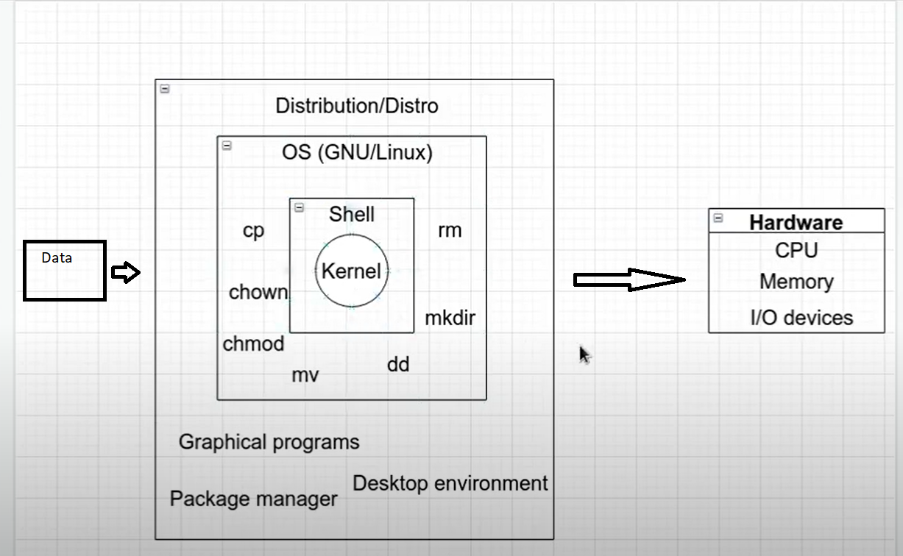

# **Tìm hiểu hệ điều hành linux**

**1.Lịch sử phát triển UNIX**

**2.Dự án mã nguồn mở GNU**

**3.Nhân LINUX**

**4.Sự kết hợp GNU và nhân LINUX**

____________________________________________________________________________
**1.Lịch sử phát triển UNIX**

Vào năm 1969, phòng thí nghiệm Bell Labs của AT&T (một trong những nhà cung cấp dịch vụ viễn thông lớn nhất Hoa Kỳ) đã phát triển một hệ điều hành gọi là "Unix". Unix ban đầu được viết bằng Assembly (Hợp ngữ).

UNIX - là một hệ điều hành đa người dùng có tính linh hoạt và khả năng thích ứng cao. 

Vào đầu những năm 1970 UNIX đã được viết lại bằng C

Nhìn vào ảnh ta có thể thấy Unix đã phát triển 1 chặng rất dài, tới nay có rất nhiều phiên bản hệ điều hành phát triển dựa trên UNIX.

**2.Dự Án GNU**

GNU's Not Unix (GNU) là 1 dự án mã nguồn mở viết lại tập lệnh của unix được phát triển từ những năm 1984

Hiện nay ta cũng có thể xem được kho tập lệnh GNU Utinity trên internet , toàn bộ được viết bằng C 

**3.Nhân LINUX**

Năm 1991, khi theo học tại Đại học Helsinki, Torvalds trở nên tò mò về hệ điều hành.Thất vọng vì việc cấp phép MINIX, lúc đó chỉ giới hạn sử dụng cho mục đích giáo dục,ông bắt đầu làm việc với nhân hệ điều hành của chính mình, cuối cùng trở thành Linux.

Torvalds đã bắt đầu phát triển nhân Linux trên MINIX và các ứng dụng được viết cho MINIX cũng được sử dụng trên Linux. Sau đó, Linux trưởng thành và việc phát triển nhân Linux được tiếp tục trên các hệ thống Linux. Các ứng dụng GNU cũng thay thế tất cả các thành phần MINIX, vì việc sử dụng mã có sẵn miễn phí từ GNU với một hệ điều hành còn non trẻ có nhiều lợi ích: mã nguồn được cấp phép theo GNU GPL có thể được sử dụng lại trong các chương trình máy tính khác miễn là chúng cũng được phát hành theo cùng một giấy phép hoặc một giấy phép tương thích. Từ một giấy phép cấm phân phối lại thương mại do ông tạo ra ban đầu, Torvalds bắt đầu chuyển sang sử dụng GNU GPL.Các nhà phát triển tích hợp các thành phần GNU với nhân Linux, tạo ra một hệ điều hành đầy đủ chức năng và tự do.

**4.Sự kết hợp GNU và nhân Linux**

Phân tích 1 phiên bản linux nào đó dựa trên nhân LINUX ta có các khái niệm sau:

- Nhân 

- GNU

- Shell

- Hệ điều hành GNU/Linux

- Distro

**4.1 Kernel**

Làm việc trực tiếp với phần cứng:

- Quản lý tiến trình CPU

- Quản lý bộ nhớ RAM

- Quản lý hệ thống nhập xuất.

...

Kernel là cầu nối giữa hệ điều hành và phần cứng (CPU RAM I/O)

**4.2 GNU project**

- Là tập lệnh mã nguồn mở viết lại bằng C

Ví dụ : rm,ls,chown,chmod,cd,cp,mv....

**4.3 Shell**

- Khi ta sử dụng các câu lệnh của GNU thì kernel không hiểu là gì, vì vậy shell là môi trường trung gian hoặc chương trình dịch sang ngôn ngữ nhị phân để kernel hiểu và thực thi lệnh.

Shell là cầu nối giữa hệ điều hành và kernel

**4.4 Hệ điều hành OS GNU/Linux**

Sự kết hợp giữa nhân , shell, GNU tạo lên hệ điều hành GNU/LInux

**4.5 Phiên bản**

Ubuntu- Linux Mint- Debian- Fedora- CentOS Linux...

Sự sửa đổi mã nguồn đã tạo ra các phiên bản với các mục đích khác nhau

- Mỗi 1 phiên bản dựa trên GNU/Linux đều được bổ sung thêm 1 vài thứ trong đó có packetmanager là công cụ quản lý gói tập tin, ví dụ trên ubuntu khi cần cài hay xóa ứng dụng nào đó ta sử dụng sudo apt... package manager CentOS 7 là yum.

- Graphical programs là những ứng dụng đồ họa như firefox, teminal...

- Desktop evironment : 1 vài phiên bản có 1 vài phiên bản ko có,ví dụ packetmanager là apt và desktop evironment  Plasma - KDE tạo ra kubuntu...

