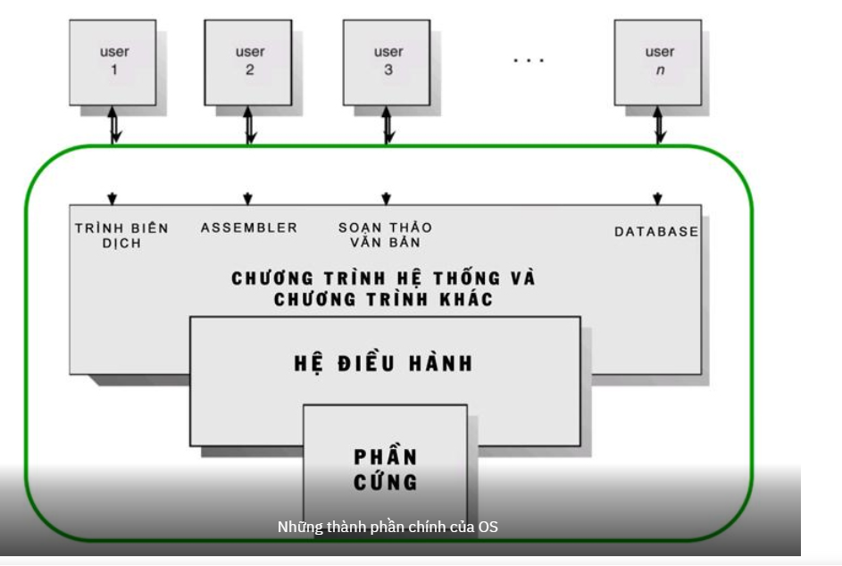

# 1-Tìm hiểu về hệ điều hành
**Khái niệm**

Hệ điều hành (Operating System) là một chương trình quản lý tất cả những yếu tố như phần cứng và phần mềm của máy tính. Trong đó:

- Phần cứng gồm có: CPU, RAM, ROM, thiết bị nhập (chuột, bàn phím,…) cùng với các thiết bị xuất (loa, máy in,…)
- Phần mềm gồm có các chương trình hoặc các ứng dụng có trong máy tính và cả các trình duyệt web.

Hay nói tổng quát nó là 1 môi trường trung gian giữa phần cứng máy tính và ứng dụng người dùng để con người có thể sử dụng 1 máy tính.

Khi một máy tính khởi động, nó sẽ tải UEFI firmware( hoặc BIOS ) từ bo mạch chủ. Phần mềm cơ sở này là phần mềm cấp thấp khởi động nhanh phần cứng máy tính. Sau đó, nó khởi động hệ điều hành  từ ổ cứng thể rắn hoặc ổ cứng của máy tính. (Ổ cứng thể rắn hoặc ổ cứng đó có phần mềm cơ sở bên trong của riêng nó, phần mềm này xử lý việc lưu trữ dữ liệu trên các khu vực vật lý bên trong ổ đĩa.)

# 1-1 Thành phần chính của Operating System
Hệ điều hành OS gồm có rất nhiều tính năng lẫn thành phần,hiện ta có thể nói nó  có ba thành phần dễ xác định như sau:
- Kernel: Cung cấp những điều khiển dừng lại ở mức cơ bản đối với các thiết bị phần cứng của máy tính. Vai trò chính của chúng bao gồm: Đọc và ghi dữ liệu vào bộ nhớ, tiến hành xử lý những lệnh thực hiện và xác định cách mà dữ liệu được nhận cũng như được gửi bởi các thiết bị khác. Ngoài ra, chúng cũng xác định được cách diễn giải những dữ liệu nhận được từ mạng. 
- API – giao diện lập trình ứng dụng: API sẽ cho phép những nhà phát triển ứng dụng có thể viết các mã module. 
- Giao diện người dùng: User Interface sẽ cho phép hệ thống tương tác với người sử dụng thông qua những graphical icons và 1 desktop hoặc có thể thông qua một command line. 

# 1-2 Phân loại hệ điều hành

- Đơn nhiệm và đa nhiệm (đơn tác vụ và đa tác vụ) :
Hệ thống đơn tác vụ chỉ có thể chạy một chương trình tại một thời điểm, trong khi hệ điều hành đa tác vụ cho phép nhiều chương trình chạy đồng thời. Điều này đạt được bằng cách chia sẻ thời gian, trong đó thời gian của bộ xử lý được chia sẻ với nhiều quá trình. Mỗi quá trình này bị gián đoạn lặp đi lặp lại trong thời gian bằng cách dùng một hệ thống con lập lịch tác vụ của hệ điều hành. 

- Một người và nhiều người dùng :
Hệ điều hành một người dùng không có phương tiện để phân biệt người dùng, nhưng có thể cho phép nhiều chương trình chạy song song. Hệ điều hành nhiều người dùng mở rộng khái niệm cơ bản về đa tác vụ với các cơ sở xác định các quy trình và tài nguyên, chẳng hạn như không gian đĩa, thuộc về nhiều người dùng và hệ thống cho phép nhiều người dùng tương tác với hệ thống cùng một lúc. Hệ điều hành chia sẻ thời gian lên lịch các tác vụ để sử dụng hiệu quả hệ thống và cũng có thể bao gồm phần mềm kế toán để phân bổ chi phí thời gian xử lý, lưu trữ hàng loạt, in ấn và các tài nguyên khác cho nhiều người dùng.

- Phân tán :
Hệ điều hành phân tán quản lý một nhóm các máy tính nối mạng riêng biệt và làm cho chúng dường như là một máy tính duy nhất, vì tất cả các tính toán được phân phối (chia cho các máy tính cấu thành).

- Tạo khuôn mẫu :
Trong bối cảnh điện toán đám mây và phân tán của một hệ điều hành, tạo khuôn mẫu đề cập đến việc tạo một hình ảnh máy ảo duy nhất làm hệ điều hành khách, sau đó lưu nó làm công cụ cho nhiều máy ảo đang chạy máy ảo. Kỹ thuật này được sử dụng cả trong ảo hóa và quản lý điện toán đám mây, và phổ biến trong các kho máy chủ lớn.

- Nhúng :
Hệ điều hành nhúng được thiết kế để sử dụng trong các hệ thống máy tính nhúng. Chúng được thiết kế để hoạt động trên các máy nhỏ với ít quyền tự chủ hơn.

- Thời gian thực :
Hệ điều hành thời gian thực là hệ điều hành đảm bảo xử lý các sự kiện hoặc dữ liệu theo một thời điểm cụ thể. Hệ điều hành thời gian thực có thể hoạt động đơn hoặc đa tác vụ, nhưng khi đa nhiệm, nó sử dụng các thuật toán lập lịch chuyên biệt để đạt được bản chất xác định của hành vi. Một hệ thống hướng sự kiện như vậy sẽ chuyển đổi giữa các tác vụ dựa trên mức độ ưu tiên của chúng hoặc các sự kiện bên ngoài, trong khi hệ điều hành chia sẻ thời gian chuyển đổi các tác vụ dựa trên các ngắt đồng hồ.

- Thư viện :
Hệ điều hành thư viện là hệ điều hành trong đó các dịch vụ mà hệ điều hành điển hình cung cấp, chẳng hạn như mạng, được cung cấp dưới dạng thư viện và được cấu tạo với ứng dụng và mã cấu hình để xây dựng một kênh đơn lẻ: một không gian địa chỉ chuyên biệt, một hình ảnh máy, có thể được triển khai cho môi trường đám mây hoặc môi trường nhúng.

# 2- Một số Hệ điều hành thông dụng sử dụng trong doanh nghiệp:

Hệ điều hành mã nguồn mở là một thuật ngữ chung để chỉ một loại hệ điều hành chạy trên các thiết bị điện toán, cho phép người dùng xem và sửa đổi toàn bộ mã nguồn của nó (cấu trúc bên trong). Hầu hết các hệ điều hành mã nguồn mở đều cho phép sử dụng miễn phí, đây là đặc điểm nổi bật nhất của hệ điều hành này.

UNIX là một hệ điều hành được phát triển vào thập kỷ 60. Nó là một hệ thống đa nhiệm, đa người dùng và ổn định đối với các máy chủ, máy trạm hoặc các laptop. Các hệ thống UNIX cũng có một giao diện đồ họa (GUI) giống như Windows của Microsoft, tạo sự dễ dàng trong sử dụng. Tuy vậy bạn vẫn phải cần đến rất nhiều kiến thức cần thiết cho các hoạt động của UNIX, đây là các kiến thức không được mô tả bằng chương trình đồ họa, hoặc không có giao diện cửa sổ, ví dụ trong một phiên telnet.

### 2.1 Hệ điều hành nhân Linux
Hệ điều hành nhân Linux được phát triển dựa vào hệ điều hành Unix và được phát hành miễn phí. Server Linux thường được sử dụng nhiều hơn là Windows hay bất kì hệ điều hành nào khác. 

Một số bản phân phối phát triển từ nhân linux:

- Ubuntu
- Linux Mint
- Debian
- Fedora
- CenOS/Red Hat Enterprise Linux
- OpenSUSE/SUSE Linux Enterprise
- Mageia/Mandriva
- Slackware Linux.

Ưu điểm: 
- Không tốn nhiều chi phí mua bản quyền
- Tính bảo mật tương đối cao
- Tính linh hoạt
- Có thể hoạt động tốt trên các máy tính cấu hình yếu

Nhược điểm :
- Số lượng ứng dụng được hỗ trợ trên Linux còn hạn chế.
- Một số nhà sản xuất không phát triển driver hỗ trợ nền tảng Linux.

### 2.2 Hệ điều hành Windows (người dùng)

 Đây là hệ điều hành được phát hành đầu tiên trong năm 1980 bơi công ty Microsoft. Trải qua khá nhiều phiên bản, hiện nay công ty cho ra mắt hệ điều hành Windows 11 (được cho ra mắt chính thức vào năm 2021) .Hệ điều hành này đang được sử dụng  phổ biến nhất trên thế giới. 

- Ưu điểm: Phổ biến, rất dễ dùng, có tính ổn định cao và hội tụ đầy đủ tính năng để hỗ trợ cho công việc lẫn giải trí. 

- Nhược điểm: Bạn cần phải trả tiền mua bản quyền để có thể sử dụng. 

### 2.3 Hệ điều hành window server( máy chủ):

- Dùng để cung cấp các dịch vụ máy chủ trong mạng và ngoài mạng như :Xác thực,File,WEB IIS,DNS,Mail exchange,FTP,DHCP...

### 2.4 Hệ điều hành IOS

- Là một hệ điều hành được dùng ở trên điện thoại nhà Apple và chính thức ra mắt vào năm 2007. Hệ điều hành này được tạo ra và trở thành một cuộc cách mạng công nghệ phần mềm. iOS cũng được đánh giá cao về tính năng lẫn sự ổn định. 

- Ưu điểm: Giao diện bắt mắt và được cài sẵn trên tất cả các thiết bị máy tính của nhà Apple và không tốn chi phí. 
- Nhược điểm: Số người dùng macOS khá ít nên một số phần mềm còn chưa được phát hành để phục vụ cho hệ điều hành này. 

### 2.5 Hệ điều hành Android

Được phát triển bởi công ty Android Inc và đã được công ty Google mua lại vào năm 2005. Đây là một hệ điều hành ở trên di động và được sử dụng cực kỳ phổ biến trên thế giới. Theo thống kê vào năm 2017, tỷ lệ sử dụng Android chiếm đến 87,7% thị phần. 

- Ưu điểm: Là một hệ điều hành mở với một kho ứng dụng khổng lồ. Hệ điều hành có khả năng tùy biến cao và dễ dàng đặt lại nếu quên mật khẩu. 
- Nhược điểm: Độ bảo mật tương đối cao nhưng vẫn thua iOS. 
### 2.6 Và rất nhiều phiên bản khác

Có rất nhiều các nhà sản xuất thiết bị , sản phẩm điện tử trên thế giới đều có thể dựa vào nhân Linux để tùy biến tạo ra các hệ điều hành chuyên biệt , các hệ điều hành này tương thích, giao tiếp  với các phần cứng trên main sản phẩm của họ .Hiện nay có hàng trăm loại phân phối như vậy.

