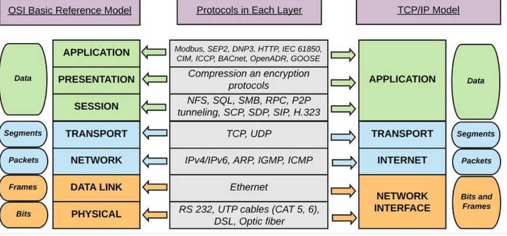
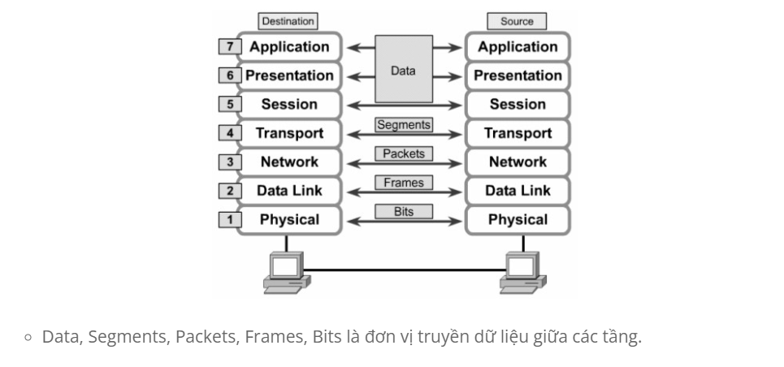
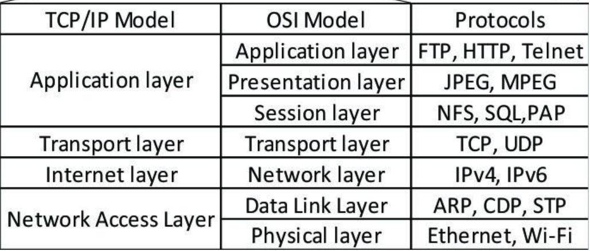
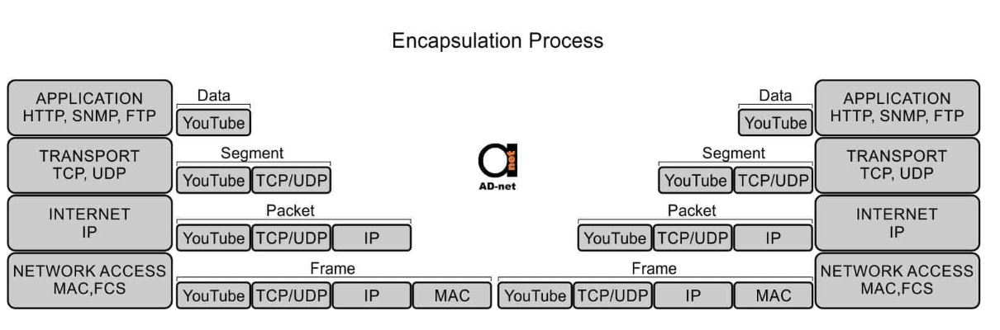
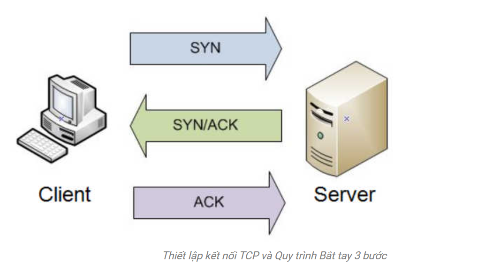

# 1.1-Mô hình OSI

- Mô hình OSI (Open system interconnection – Mô hình kết nối các hệ thống mở) là một cơ sở dành cho việc chuẩn hoá các hệ thống truyền thông, nó được nghiên cứu và xây dựng bởi ISO (International Organization for Standardization).

- Việc nghiên cứu về mô hình OSI được bắt đầu tại ISO vào năm 1971 với mục tiêu nhằm tới việc nối kết các sản phẩm của các hãng sản xuất khác nhau và phối hợp các hoạt động chuẩn hoá trong các lĩnh vực viễn thông và hệ thống thông tin. Đến năm 1984, mô hình tham chiếu OSI chính thức được đưa ra giới thiệu.

Mô hình này chia thành 7 lớp:

1/ Application layer:

Là tầng gần với người sử dụng nhất. Nó cung cấp phương tiện cho người dùng truy nhập các thông tin và dữ liệu trên mạng thông qua chương trình ứng dụng.
Các ứng dụng cung được cấp như các chương trình xử lý kí tự, bảng biểu, thư tín, các giao thức HTTP, FTP, SMTP, POP3, Telnet.

2/ Presentation layer:

Thực hiện các tác vụ như mã hóa dữ liệu sang dạng MIME, nén dữ liệu, và các thao tác tương tự đối với biểu diễn dữ liệu để trình diễn dữ liệu.
Chẳng hạn như chuyển đổi văn bản từ mã EBCDIC sang mã ASCII, hoặc tuần tự hóa các đối tượng (Object Serialization) hoặc các cấu trúc dữ liệu (Data Structure) khác sang dạng XML và ngược lại.

3/ Session layer:

Thực hiện thiết lập, duy trì và kết thúc các phiên làm việc giữa hai hệ thống.
Tổ chức kết nối theo các phương thức:
Duplex
Half-duplex
Single
Các giao thức trong lớp 5 sử dụng là NFS, X- Window System, ASP.

4/ Transport layer:

Kiểm soát độ tin cậy của một kết nối. Theo dõi các gói tin và truyền lại các gói bị thất bại.
Là nơi các thông điệp được chuyển sang thành các gói tin TCP hoặc UDP. Các giao thức phổ biến tại đây là TCP, UDP, SPX.

5/ Network layer:

Thực hiện chức năng định tuyến. Quyết định đường đi của dữ liệu, xác định việc chuyển hướng, vạch đường các gói tin trong mạng, các gói tin này có thể phải đi qua nhiều chặng trước khi đến được đích cuối cùng.
Router hoạt động tại tầng này. Các giao thức được sử dụng là IP, RIP, IPX, OSPF, AppleTalk.

6/ Data link layer:

Xác định các giao thức trực tiếp với các thành phần vật lý như card mạng, dây cáp.
Đưa dữ liệu vào khung và điều khiển luồng thông tin qua liên kết này

7/ Phisical layer:

Các thiết bị tầng vật lý bao gồm Hub, bộ lặp (Repeater), thiết bị tiếp hợp mạng (Network adapter) và thiết bị tiếp hợp kênh máy chủ (Host Bus Adapter)- (HBA dùng trong mạng lưu trữ (Storage Area Network)).

# 1.2-Đóng gói dữ liệu

 Phân tích tiến trình:

Theo sơ đồ ở trên thì mô hình OSI gồm có 7 tầng và được đánh số thứ tự từ dưới lên từ 1 đến 7. Và ở đây chúng ta có thể thấy rằng có 2 trạng thái đó là “Transmit Data”  và “Receive Data” . Ở đây 2 trạng thái này có nghĩa là truyền dữ liệu và nhận dữ liệu. Chúng ta có thể hiểu ở đây là bên người gửi dữ liệu, máy tính gửi còn bên kia là bên người nhận, máy tính nhận dữ liệu bên phía người gửi thì gói tin sẽ đi từ tầng 7 xuống tầng 1 và ngược lại.

### **1.2.1-Phía gửi**

- Ở tầng Application (tầng 7), người dùng tiến hành đưa thông tin cần gửi vào máy tính. Các thông tin này thường có dạng như: hình ảnh, văn bản,…

- Sau đó thông tin dữ liệu này được chuyển xuống tầng Presentation (tầng 6) để chuyển các dữ liệu thành một dạng chung để mã hóa dữ liệu và nén dữ liệu.

- Dữ liệu tiếp tục được chuyển xuống tầng Session (Tầng 5). Tầng này là tầng phiên có chức năng bổ sung các thông tin cần thiết cho phiên giao dịch (gửi- nhận) này. Các bạn có thể hiêu nôm na là tâng phiên cũng giống như các cô nhân viên ngân hàng làm nhiệm vụ xác nhận, bổ sung thông tin giao dịch khi bạn chuyển tiền tại ngân hàng.

- Sau khi tầng Session thực hiện xong nhiệm vụ, nó sẽ tiếp tục chuyển dữ liệu này xuống tầng Transport (Tầng 4). Tại tầng này, dữ liệu được cắt ra thành nhiều Segment và cũng làm nhiệm vụ bổ sung thêm các thông tin về phương thước vận chuyển dữ liệu để đảm bảo tính bảo mật, tin cậy khi truyền trong mô hình mạng.

- Tiếp đó, dữ liệu sẽ được chuyển xuống tầng Network (Tầng 3). Ở tầng này, các segment lại tiếp tục được cắt ra thành nhiều gói Package khác nhau và bổ sung thông tin định tuyến. Tầng Network này chức năng chính của nó là định tuyến đường đi cho gói tin chứa dữ liệu.

- Dữ liệu tiếp tục được chuyển xuống tầng Data Link (tầng 2). Tại tầng này, mỗi Package sẽ được băm nhỏ ra thành nhiều Frame và bổ sung thêm các thông tin kiểm tra gói tin chứa dữ liệu để kiểm tra ở máy nhận.
Cuối cùng, các Frame này khi chuyển xuống tầng Physical (Tầng 1) sẽ được chuyển thành một chuỗi các bit nhị phân (0 1….) và được đưa lên cũng như phá tín hiệu trên các phương tiện truyền dẫn (dây cáp đồng, cáp quang,…) để truyền dữ liệu đến máy nhận.

Mỗi gói tin dữ liệu khi được đưa xuống các tầng thì được gắn các header của tầng đó, riêng ở tầng 2 (Data Link), gói tin được gắn thêm FCS.

### **1.2.2-Phía nhận**

- Tầng Physical (tầng 1) phía máy nhận sẽ kiểm tra quá trình đồng bộ và đưa các chuỗi bit nhị phân nhận được vào vùng đệm. Sau đó gửi thông báo cho tầng Data Link (Tầng 2) rằng dữ liệu đã được nhận.
- Tiếp đó tầng Data Link sẽ tiến hành kiểm tra các lỗi trong frame mà bên máy gửi tạo ra bằng cách kiểm tra FCS có trong gói tin được gắn bên phía máy nhận. Nếu có lỗi xảy ra thì frame đó sẽ bị hủy bỏ. Sau đó kiểm tra địa chỉ lớp Data Link (Địa chỉ MAC Address) xem có trùng với địa chỉ của máy nhận hay không. Nếu đúng thì lớp Data Link sẽ thực hiện gỡ bỏ Header của tầng Data Link để tiếp tục chuyển lên tầng Network.
- Tầng Network sẽ tiến hành kiểm tra xem địa chỉ trong gói tin này có phải là địa chỉ của máy nhận hay không. (Lưu ý: địa chỉ ở tầng này là địa chỉ IP). Nếu đúng địa chỉ máy nhận, tầng Network sẽ gỡ bỏ Header của nó và tiếp tục chuyển đến tầng Transport để tiếp tục qui trình.
- Ở tầng Transport sẽ hỗ trợ phục hồi lỗi và xử lý lỗi bằng cách gửi các gói tin ACK, NAK (gói tin dùng để phản hồi xem các gói tin chứa dữ liệu đã được gửi đến máy nhận hay chưa?). Sau khi phục hồi sửa lỗi, tầng này tiếp tục sắp xếp các thứ tự phân đoạn và đưa dữ liệu đến tầng Session.
- Tầng Session làm nhiệm vụ đảm bảo các dữ liệu trong gói tin nhận được toàn vẹn. Sau đó tiến hành gỡ bỏ Header của tầng Session và tiếp tục gửi lên ầng Presentation.
- Tầng Presentation sẽ xử lý gói tin bằng cách chuyển đối các định dạng dữ liệu cho phù hợp. Sau khi hoàn thành sẽ tiến hành gửi lên tầng Application.
Cuối cùng, tầng Application tiến hành xử lý và gỡ bỏ Header cuối cùng. Khi đó ở máy nhận sẽ nhận được dữ liệu của gói tin được truyền đi.

# 2.1 Mô Hình TCP/IP

- Là chồng giao thức sử dụng để truyền tin hiện nay(1970).Nó ra đời trước OSI(1980) nhưng các tầng của nó không phản ánh chi tiết quá trình, thế nên mô hình OSI người ta gọi là mô hình tham chiếu của mô hình TCP/IP.

## Đóng gói ( Capsulation) và giải đóng gói (Decapsulation)

- Lớp ứng dụng – Application layer Lớp ứng dụng cung cấp cho các ứng dụng sự trao đổi dữ liệu được chuẩn hóa. Các giao thức của nó bao gồm HTTP, FTP, Post Office Protocol 3 , Simple Mail Transfer Protocol và Simple Network Management Protocol. Tại lớp ứng dụng, tải trọng là dữ liệu ứng dụng thực tế.

- Lớp truyền tải – Transport layer Lớp truyền tải chịu trách nhiệm duy trì thông tin liên lạc end-to-end trên toàn mạng. TCP xử lý thông tin liên lạc giữa các máy chủ và cung cấp khả năng kiểm soát luồng, ghép kênh và độ tin cậy. Các giao thức truyền tải bao gồm TCP và User Datagram Protocol , đôi khi được sử dụng thay thế cho TCP cho các mục đích đặc biệt.

- Lớp mạng – Network layer Lớp mạng , còn được gọi là lớp internet , xử lý các gói tin và kết nối các mạng độc lập để vận chuyển các gói tin qua các ranh giới mạng. Giao thức lớp mạng là IP và Giao thức thông báo điều khiển Internet, được sử dụng để báo lỗi. 

- Lớp vật lý, liên kết – Physical layer, link Lớp vật lý, còn được gọi là lớp giao diện mạng hoặc lớp liên kết dữ liệu (link), bao gồm các giao thức chỉ hoạt động trên một liên kết – thành phần mạng kết nối các nút hoặc máy chủ trong mạng. Các giao thức ở lớp thấp nhất này bao gồm Ethernet cho mạng cục bộ và Giao thức phân giải địa chỉ.

## Quá trình thiết lập 1 phiên TCP/IP được thiết lập như sau

- Đầu tiên, máy client yêu cầu gửi cho máy chủ một gói hoặc phân đoạn SYN (SYN là viết tắt của Synchronize – Đồng bộ hóa) với một số ngẫu nhiên, duy nhất. Số này đảm bảo truyền đầy đủ theo đúng thứ tự (không trùng lặp). 

- Nếu máy chủ đã nhận được phân đoạn, nó đồng ý kết nối bằng cách trả về một gói SYN-ACK (ACK là viết tắt của Acknowledgment – Xác nhận) bao gồm số thứ tự của máy client cộng với 1. Nó cũng truyền số thứ tự của chính nó tới máy client. 

- Cuối cùng, máy client xác nhận việc nhận phân đoạn SYN-ACK bằng cách gửi gói ACK của chính nó, trong trường hợp này chứa số thứ tự của máy chủ cộng với 1. Đồng thời, máy client đã có thể bắt đầu truyền dữ liệu đến máy chủ. Vì kết nối TCP được thiết lập trong ba bước, quá trình kết nối được gọi là bắt tay ba bước.

# 3.1- So sánh mô hình TCP/IP so với mô hình OSI 
TCP/IP và OSI là các giao thức mạng truyền thông được sử dụng rộng rãi nhất. Sự khác biệt chính là OSI là một mô hình khái niệm, nó chỉ để tham chiếu mà không được sử dụng thực tế. Thay vào đó, nó xác định cách các ứng dụng có thể giao tiếp qua mạng. Mặt khác, TCP/IP được sử dụng rộng rãi để thiết lập các liên kết và tương tác mạng

Các giao thức TCP/IP đặt ra các tiêu chuẩn mà internet được tạo ra, trong khi mô hình OSI cung cấp các hướng dẫn về cách thức giao tiếp phải được thực hiện. Do đó, TCP/IP là một mô hình thực tế hơn. 

Các mô hình TCP/IP và OSI có những điểm giống và khác nhau . 
Điểm giống nhau chính là ở cách chúng được xây dựng khi cả hai đều sử dụng các lớp, mặc dù TCP/IP chỉ bao gồm 4 lớp, trong khi mô hình OSI bao gồm 7 lớp.

Lớp trên cho cả mô hình TCP/IP và mô hình OSI là lớp ứng dụng. Mặc dù lớp này thực hiện các nhiệm vụ giống nhau trong mỗi mô hình, nhưng các tác vụ đó có thể khác nhau tùy thuộc vào dữ liệu mà mỗi người nhận được.

 Các chức năng được thực hiện trong mỗi mô hình cũng tương tự nhau vì mỗi mô hình sử dụng một lớp mạng và lớp vận chuyển để hoạt động. Mỗi mô hình TCP/IP và OSI hầu hết được sử dụng để truyền các gói dữ liệu. Mặc dù họ sẽ làm như vậy bằng các phương tiện khác nhau và bằng các con đường khác nhau, họ vẫn sẽ đến đích.
 
## 3.1.1 Giống nhau

Những điểm tương đồng giữa mô hình TCP/IP và mô hình OSI bao gồm:
- Cả hai đều là mô hình logic. 

- Họ xác định các tiêu chuẩn mạng. 

- Chúng chia quá trình giao tiếp mạng thành các lớp. 

- Họ cung cấp các khuôn khổ để tạo và triển khai các tiêu chuẩn và thiết bị mạng. 

- Chúng cho phép một nhà sản xuất tạo ra các thiết bị và thành phần mạng có thể cùng tồn tại và hoạt động với các thiết bị và thành phần do các nhà sản xuất khác sản xuất.

 ## 3.1.2 Khác nhau
Sự khác biệt giữa mô hình TCP/IP và mô hình OSI bao gồm: 

- TCP/IP chỉ sử dụng một lớp (ứng dụng) để xác định chức năng của các lớp trên, trong khi OSI sử dụng ba lớp (ứng dụng, bản trình bày và phiên).
- TCP/IP sử dụng một lớp (vật lý) để xác định chức năng của các lớp dưới cùng, trong khi OSI sử dụng hai lớp (liên kết vật lý và dữ liệu).

- Kích thước tiêu đề TCP/IP là 20 byte, trong khi tiêu đề OSI là 5 byte.
- TCP/IP là một tiêu chuẩn hướng giao thức, trong khi OSI là một mô hình chung dựa trên các chức năng của từng lớp. 
- TCP/IP theo cách tiếp cận ngang, trong khi OSI theo cách tiếp cận dọc. 
- Trong TCP/IP, các giao thức được phát triển đầu tiên, và sau đó mô hình được phát triển.
- Trong OSI, mô hình được phát triển đầu tiên, và sau đó các giao thức trong mỗi lớp được phát triển. - - TCP/IP giúp thiết lập kết nối giữa các loại máy tính khác nhau, trong khi OSI giúp chuẩn hóa bộ định tuyến, thiết bị chuyển mạch, bo mạch chủ và các phần cứng khác.

