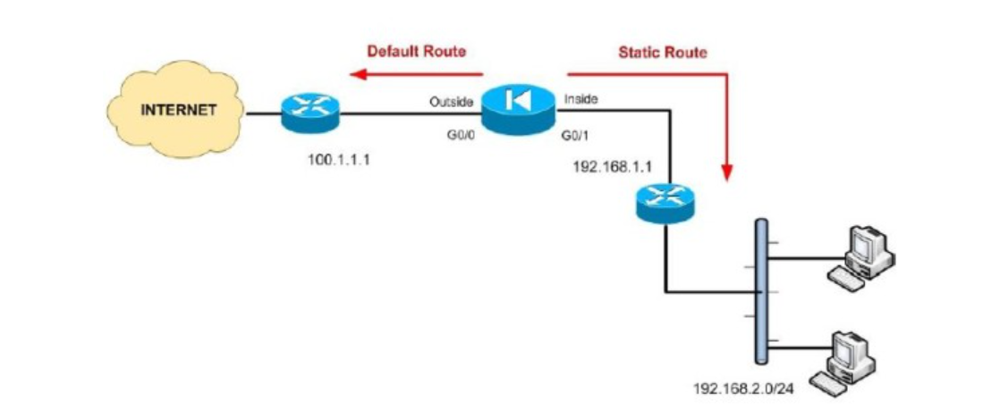

## 1-Khái niệm

- Định tuyến (Routing) là quá trình tìm kiếm và xác định đường đi tốt nhất trên một mạng máy tính để gói tin tới được đích thông qua các thiết bị định tuyến.
Để làm được điều đó thì các thiết bị định tuyến cần phải dựa vào thông tin bẳng định tuyến (Routing Table) và giao thức định tuyến ( Routing Protocol).
## Phân loại định tuyến

- Static Route- Định tuyến tĩnh.

- Dynamic Route- ĐỊnh tuyến động.

- Default Route.

## 2-Định tuyến tĩnh

- Định tuyến tĩnh là phương pháp định tuyến theo phương thức người quản trị khai báo thông tin định tuyến cho thiết bị định tuyến theo phương thức thủ công.
### Ưu điểm:
- Sử dụng ít băng thông hơn so với các phương thức định tuyến khác.

- Không tiêu tốn tài nguyên để tính toàn và phân tích gói tin định tuyến.
- Dễ dàng triển khai, cấu hình.
- Có tính bảo mật tốt hơn.
### Nhược điểm:
- Không có khả năng tự động cập nhật đường đi.
- Phải cấu hình thủ công khi mạng có sự thay đổi.
- Khả năng mở rộng kém, phù hợp với mô hình mạng nhỏ.
- Những trường hợp sử dụng định tuyến tĩnh:
- Đường truyền có băng thông thấp.
- Người quản trị cần kiểm soát các kết nối trong hệ thống.
- Hệ thống co các tuyến kết nối ít.
- Kết nối dùng định tuyến tĩnh là đường dự phòng cho đường kết nối dùng giao thức định tuyến động.
- Phương thức triển khai định tuyến tĩnh: Next hop hoặc Exit Interface
- Next hop: thông tin sẽ chuyển đến Router kế tiếp nào trước khi đến đích.
- Exit Interface: thông tin sẽ được đưa ra cổng nào trước khi đến đích.

## 3-Định tuyến động

- Định tuyến động là phương thức tự động chia sẻ, trao đổi thông tin giữa các thiết bị định tuyến dựa trên các giao thức định tuyến động.
- Tự động cập nhật thông tin bảng định tuyến nếu hệ thống có sự thay đổi.
- Tính toán và đưa ra tuyến đường chuyển thông tin tốt nhất.

### Mục đích của định tuyến động

- Trong một mạng rất lớn có rất nhiều bộ định tuyến như mạng Internet, việc cập nhật bảng định tuyến bằng tay là không thể, vì vậy cần phải có giao thức định tuyến, giao thức định tuyến cho phép các Router xây dựng bảng định tuyến một cách linh hoạt đó là:

- Khám phá mạng từ xa.
- Duy trì việc cập nhật thông tin định tuyến.
- Tính toán và chọn tuyến đường đi tốt nhất đến đích.
- Nếu tuyến đường chuyển thông tin chính bị lỗi, tự tính toán và đưa ra tuyến đường chuyển thông tin backup.

### Phân loại định tuyến động

- Exterior Gateway Protocols: có giao thức BGP
- Interior Gateway Protocols: Distance Vector Protocols và Link- State Protocols.
- Giao thức Distance Vector: có giao thức RIPv1, RIPv2 và IGRP, EIGRP.
- Giao thức Link- State: có giao thức OSPF và IS-IS

