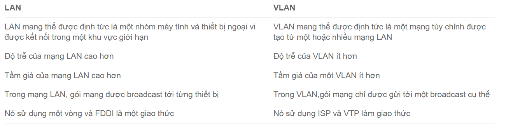

# Giới thiệu

VLAN là cụm từ viết tắt của virtual local area network (hay virtual LAN) hay còn được gọi là mạng LAN ảo. VLAN là một kỹ thuật cho phép tạo lập các mạng LAN độc lập một cách logic trên cùng một kiến trúc hạ tầng vật lý. Việc tạo lập nhiều mạng LAN ảo trong cùng một mạng cục bộ (giữa các khoa trong một trường học, giữa các cục trong một công ty,...) giúp giảm thiểu miền quảng bá (broadcast domain) cũng như tạo thuận lợi cho việc quản lý một mạng cục bộ rộng lớn. VLAN tương đương như mạng con (subnet).

Với mạng LAN thông thường, các máy tính trong cùng một địa điểm (cùng phòng...) có thể được kết nối với nhau thành một mạng LAN, chỉ sử dụng một thiết bị tập trung như hub hoặc switch. Có nhiều mạng LAN khác nhau cần rất nhiều bộ hub, switch. Tuy nhiên thực tế số lượng máy tính trong một LAN thường không nhiều, ngoài ra nhiều máy tính cùng một địa điểm (cùng phòng) có thể thuộc nhiều LAN khác nhau vì vậy càng tốn nhiều bộ hub, switch khác nhau. Do đó vừa tốn tài nguyên số lượng hub, switch và lãng phí số lượng port Ethernet.

Với nhu cầu tiết kiệm tài nguyên, đồng thời đáp ứng nhu cầu sử dụng nhiều LAN trong cùng một địa điểm, giải pháp đưa ra là nhóm các máy tính thuộc các LAN khác nhau vào cùng một bộ tập trung switch. Giải pháp này gọi là mạng LAN ảo hay VLAN.

# Phân loại VLAN
Có 3 kiểu VLAN cơ bản

- Static VLAN: là VLAN tĩnh phân chia theo cổng. Cắm máy vào cổng nào thì nó sẽ theo VLAN đó.

- Dynamic VLAN: quy định theo địa chỉ MAC, trên Switch gán MAC: 111111 là của PC1 thuộc VLAN 10 thì Pc1 có cắm vào bất kì cổng nào trên Switch nó vẫn thuộc VLAN 10. Để gán được MAC vào VLAN thì ta phải có một VMPS Server (VLAN Mangerment Policy Server)

- Voice VLAN: chỉ dành riêng cho dữ liệu Voice.

Thông thường hay dùng Static VLAN.

# Cách thức vận hành của VLAN

Các Virtual LAN ở trong mạng được xác định bằng một con số cụ thể (ID vlan),phạm vi giá trị hợp lệ là 1- 4094. Trên một switch VLAN, ta có thể chỉ định các cổng với số VLAN thích hợp.

Tiếp đến, switch sẽ cho phép dữ liệu cần được gửi giữa các port khác nhau có cùng một Virtual LAN.

Vì hầu hết các mạng đều có nhiều hơn là chỉ một switch duy nhất. Vì vậy, cần có một cách nào đó để có thể gửi lưu lượng giữa hai switch trong mạng. Cách đơn giản nhất chính là gán một port trên mỗi switch của Virtual LAN và chạy một cable giữa chúng.

# Các ưu nhược điểm của VLAN

###  Ưu điểm của VLAN

- Giải quyết các vấn đề điển hình liên quan đến broadcast

- Giảm kích thước của broadcast domain

- Cho phép tạo thêm một lớp bảo mật bổ sung

- Giúp việc quản lý thiết bị trở nên đơn giản, dễ dàng hơn

- Cho phép tạo một nhóm logic các thiết bị, phân loại theo chức năng

- Có thể tạo các nhóm thiết bị được kết nối logic, có thể hoạt động như trên mạng riêng của mình

- Cho phép phân đoạn mạng dựa trên nhóm, hay chức năng

- Có thể cấu trúc mạng theo vị trí địa lý

- Đem lại hiệu suất cao hơn, độ trễ (latency) thấp hơn

- Người dùng có thể bảo vệ những thông tin nhạy cảm của mình

- Xóa bỏ ranh giới vật lý

- Tăng cường bảo mật mạng

- Phân tách các máy chủ

- Không cần thêm phần cứng, cáp, giúp tiết kiệm đáng kể chi phí

- Việc thay đổi IP subnet của người dùng sẽ nằm trong phần mềm
Giảm số lượng thiết bị cho cấu trúc liên kết mạng
Đơn giản hóa việc quản lý các thiết bị vật lý

### Nhược điểm của VLAN

- Packet có thể bị rò rỉ giữa các VLAN

- Các mối đe dọa ở trong một hệ thống đơn lẻ có thể phát tán virus cho toàn bộ mạng

- Cần có một router bổ sung để kiểm soát workload trong những mạng lớn

- Khả năng tương tác có thể gặp vấn đề

- Một VLAN không thể chuyển tiếp lưu lượng mạng sang những VLAN khác

### Lợi ích của VLAN

- Đối với những mạng LAN có quy mô lớn, khoảng 200 thiết bị trở lên, thì việc sử dụng mạng Virtual LAN sẽ đem lại lợi ích to lớn

- Lý tưởng cho những mạng có lưu lượng truy cập cao

- Hữu ích cho những nhóm người dùng cần tính bảo mật cao, hoặc không thích mạng bị chậm do số lượng broadcast lớn

- Có thể được ứng dụng khi mạng có nhiều người dùng, nhưng lại không ở trên cùng một broadcast domain

- Có thể “biến hóa” một switch đơn nhất thành nhiều switch

# So sánh LAN và VLAN

