# 1.Mô hình cơ bản
Em thực hành bài lab cơ bản trên phần mềm mô phỏng topo mạng cisco packet tracer của hãng cisco

Cả bài tập có liên quan đến các kiến thức cơ bản : cấu hình SW layer2,SW core layer3 ,VLAN,TRUNKING,SPANNING TREE PER VLAN,DHCP,ROUT TĨNH,MAIL SERVER,DNS ,DHCP ,WEB .

 YÊU CẦU KẾT QUẢ: Các client trong mạng ping được nhau ,truy cập các dịch vụ đơn sơ: web,mail,dns.
Spanning tree với VLAN 30 theo mặc định thông số của SW không điều chỉnh
với VLAN 40 thì cây phải đi theo kiểu khác (per vlan)

##  Các chức năng chính của các thiết bị như sau:
- SW0 nhiệm vụ chuyển mạch cho VLAN 10 cổng f0/1-10 và VLAN 20 trên dãy cổng f0/11-20.Tương ứng với các mạng 192.168.10.0/24 và 192.168.20.0/24

- SW1 chuyển mạch chính cho VLAN 30 với mạng 192.168.30.0/24
- SW2 chuyển mạch chính cho VLAN 40 với mạng 192.168.40.0/24
- SW3 chuyển mạch chính cho VLAN 50 với mạng 192.168.50.0/24
- SW core chuyển mạch trung tâm cho các VLAN 10,20,30,40,50 ,Được cấu hình các gateway ảo trên từng VLAN.Định tuyến các gói tin từ trong ra ngoài,làm DHCP server cho các VLAN 10,20,30,40,50
- R1: Định tuyến tĩnh các mạng bên trong sang R2
- R2 :Định tuyến tĩnh mạng trong sang R1
- Các địa chỉ IP dùng trung gian tương ứng với các cổng hiện ở R1 và R2
- Các SV làm nhiệm vụ tương ứng DNS ,MAil,web HTTP.

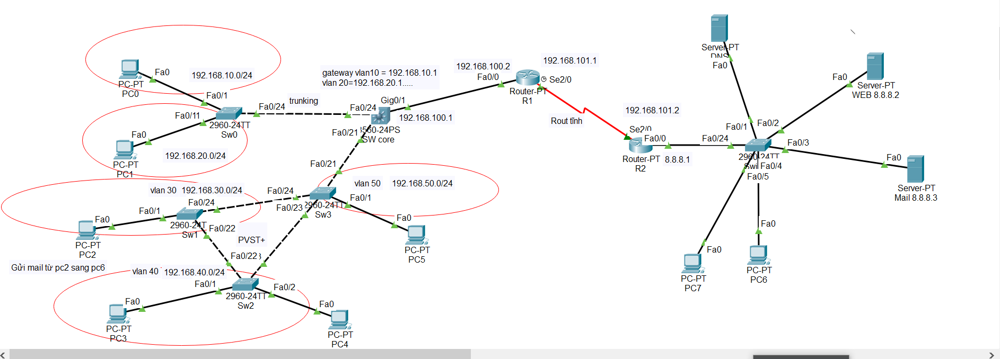

# 2.Cấu hình
### **2.1 SW0 1 2 3** 
Trên sw0 cấu hình các cổng 1-9 access vlan10:

sw1(config)#hostname sw0       **//đổi tên sw1 thành sw0**

sw0(config)#vlan 10            **//khai báo vlan 10**

sw0(config-vlan)#exit      

sw0(config-vlan)#vlan 20       **//khai báo vlan 20**

sw0(config-vlan)#exit          

sw0(config)#interface range fastEthernet 0/1-10   **//chọn các cổng 1-10**

sw0(config-if-range)#sw access vlan 10    **//access vlan10**

sw0(config-if-range)#exit 

sw0(config)#interface range fastEthernet 0/11-20   **//chọn các cổng 11-20**

sw0(config-if-range)#sw access vlan 20            **//access vlan 20**

sw0(config-if-range)#exit 

sw0(config)#interface fastEthernet 0/24     **khai báo cổng 24 chạy trunk**

sw0(config-if)#sw mode trunk               **khai báo cổng 24 chạy trunk**

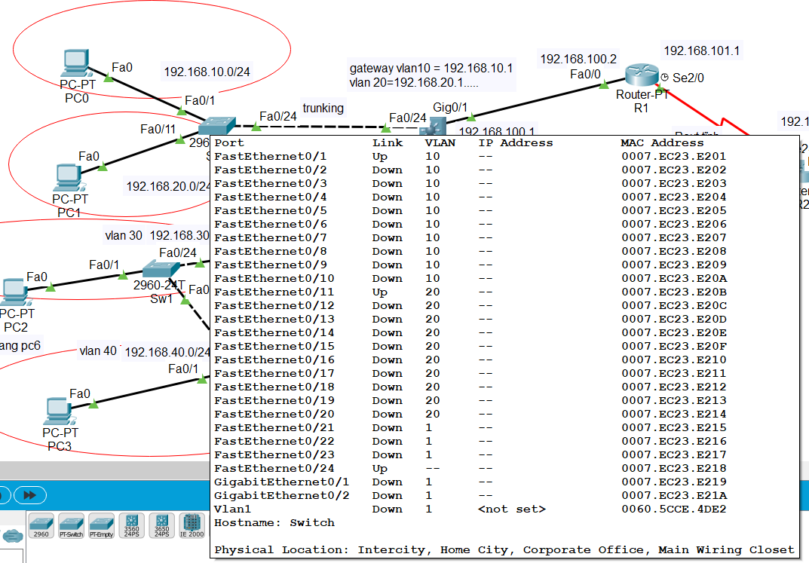

Ta làm tương tự với các sw 1 2 3 với 2 dạng access và trunk

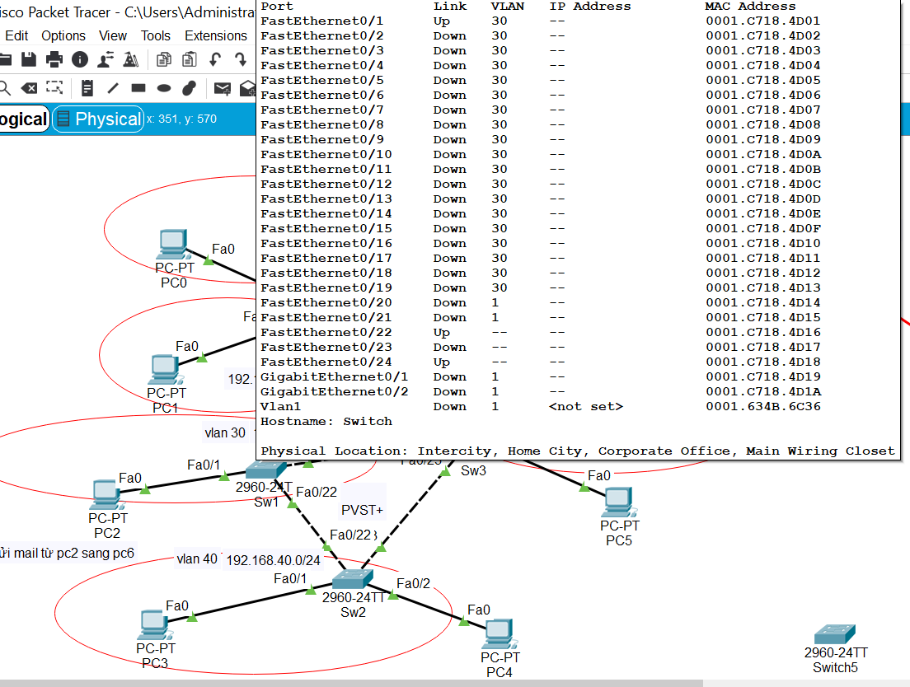

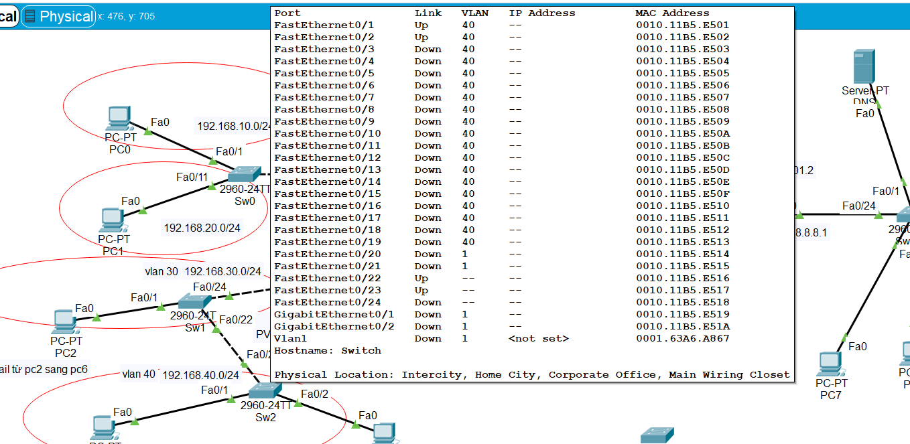

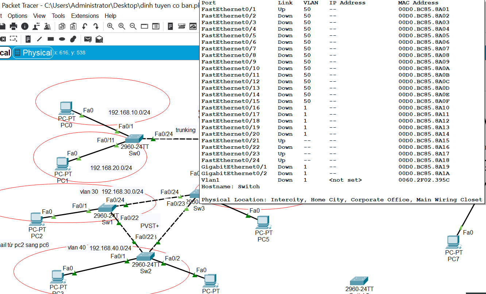

### **2.2 Spanning tree - STP**
Spanning tree protocol định nghĩa trong chuẩn IEEE 802.1D. Spanning tree là giao thức không thể thiểu trong môi trường layer 2

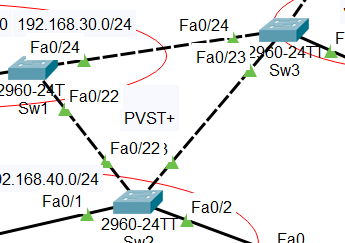

 - Khi Sw nhận được 1 frame
SW học source MAC vào bảng MAC address
ban đầu bảng MAC trắng nên nó sẽ flood frame ra tất cả các cổng.
 - Theo mô hình trên thì nó sẽ xảy ra hiện tượng:
Broadcast storm
Instability MAC address table
Multiple Frame copies
 - Hiện tương Loop trong mạng khi các switch đấu nối theo 1 vòng tròn khép kín
 - IEEE đưa ra chuẩn 802.1D(spanning tree protocol) để chống loop. Về mặt luận lý thì nó sẽ khóa 1 port( Block port)
 - Để tìm ra block port nó trải qua các bước:
Bầu chọn Root Switch
Bầu chọn Root port
Bầu chọn Alternated port

 ## Quá trình tìm Block Port Spanning tree
1. Root Switch:
- Khi các Sw được đấu nối khởi động nó sẽ gửi gói tin BPDU(bridge protocol data unit) trên các port của Switch.
- Thông số quyết định Sw nào được làm Root Sw là Bridge-ID(8 byte) gồm có các thông số :
priority(của switch):
dài 2 byte(9 -> 65535), default = 32768.
Sw nào có chỉ số priority có chỉ số nhỏ nhất sẽ được chọn làm Root-switch
MAC Address Switch:
dài 6 byte.
Xét từ trái sang phải từng giá trị hexa thì switch nào có MAC nhỏ nhất làm Root-switch
- Khi bầu xong Root-switch thì chỉ có Root-switch được gửi BPDU(2s/1 lần). Việc gửi đó để duy trì cây spanning tree đó không bị Loop
- Theo nguyên tắc đánh số MAC của nhà sản xuất thì khi bầu chọn root-switch nó sẽ chọn switch đời đầu làm root-switch. Nên trong thực tế ta ko bao giờ cho bầu chọn bằng MAC mà ta chỉnh priority

2. Root port:
- Là port cung cấp đường về Root-switch mà có tổng path-cost là nhỏ nhất
- Khi bầu chọn Root-port thì Root-Switch ko tham gia quá trình bầu chọn này
- Mỗi Root-switch chỉ có 1 Root-port
- Path-cost là giá trị cost trên từng cổng của Switch.

- Nguyên tắc tính tổng path-cost: tính từ switch đang muốn tính --> Root-switch

  - Đi ra: ko cộng

  - Đi vào: cộng cost

3. Cấu hình
- **Trên sw 1 và 3**

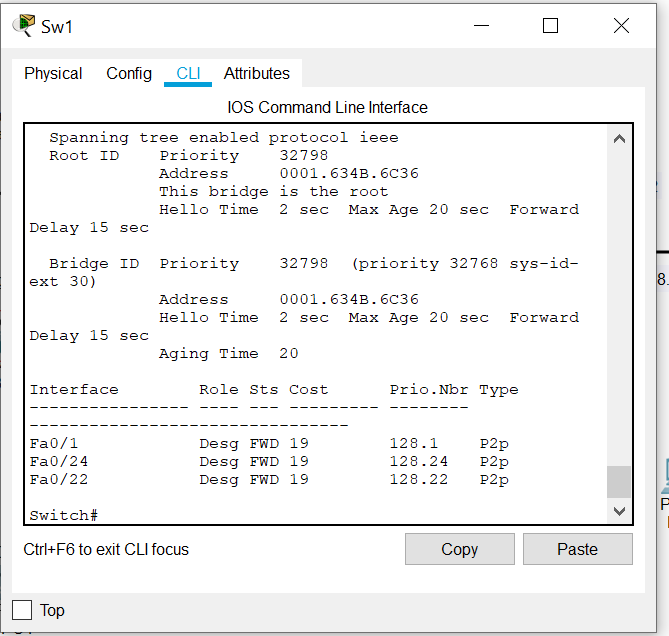

- **Trên sw 2 và 3**

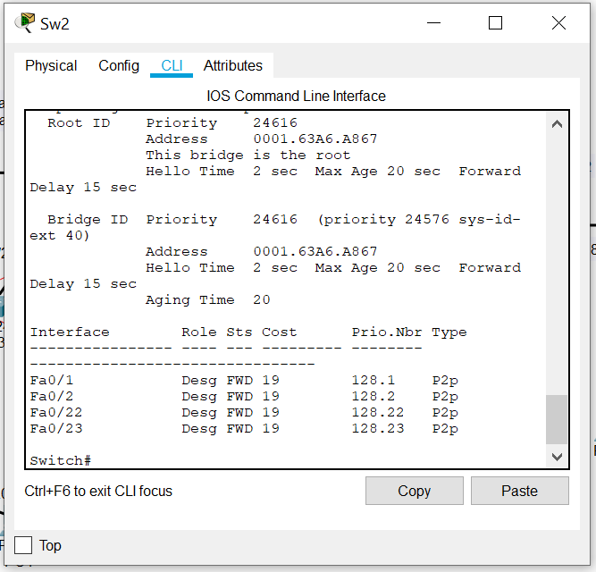
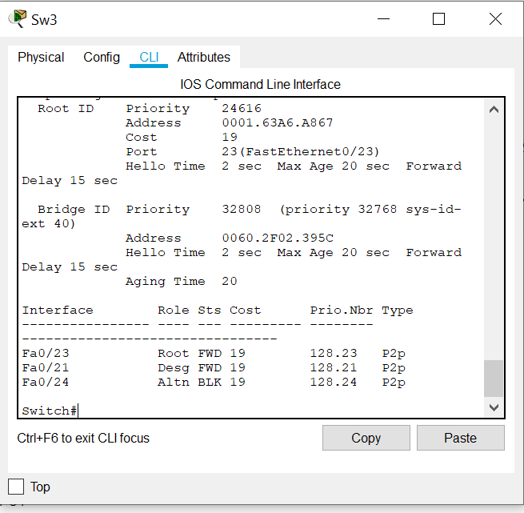

### 2.2 SWCORE

Đầu tiên ta khai báo các VLAN trong mạng có các ID =10 20 30 40 50
- Trên sw core ta cấu hình sw này làm dhcp server

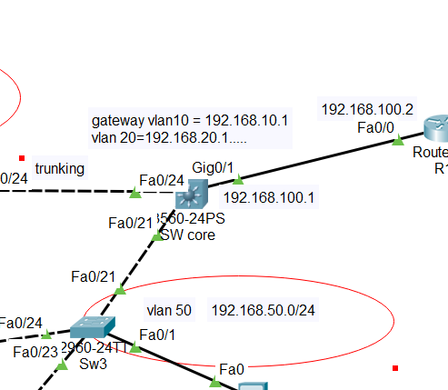

Ta cấu hình cấp IP cho các VLAN 10,20,30,40,50 trong mạng, chọn các thông số gateway tương ứng và dns 8.8.8.8 và chừa lại các IP từ 1-10 mỗi VLAN để dùng việc khác

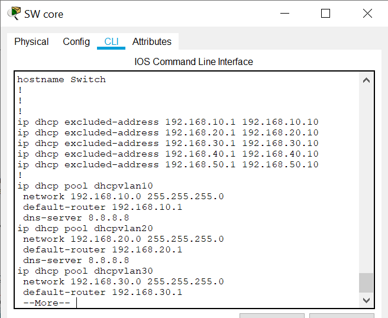

- Bật chế độ routing thông các vlan bên trong sw
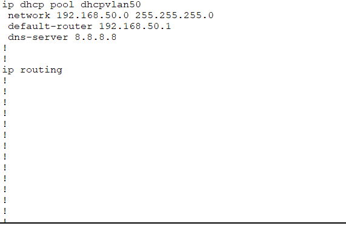

### Cổng trunk trên sw core
Mặc định nếu chúng ta không khai báo kiểu đóng gói khi gõ lệnh trunk như sw layer 2 sẽ báo lỗi sai câu lệnh
Nên ta cần khai báo kiểu đóng gói dot1Q trước câu lệnh để trunking

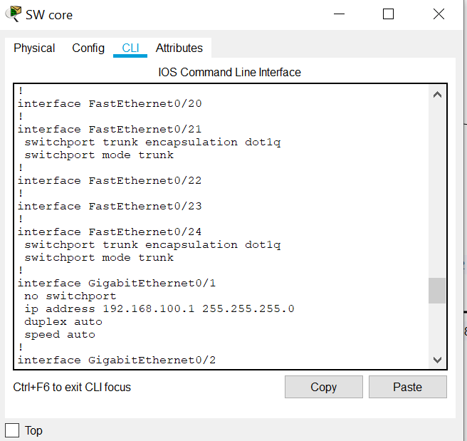

## Định tuyến ở SW core
Ta sẽ định tuyến toàn bộ các tin của các VLAN trong mạng ra ngoài thông qua cổng Gi0/1 của sw core
trước tiên cần đặt IP cho interface out này
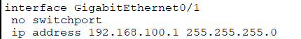

Và tạo default route đến interface xuống của router R1

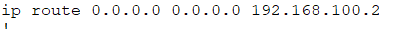

### 2.3 R1
R1 có vai trò định tuyến gói tin ra ngoài mạng 

Ta khai báo địa chỉ IP cho 2 cổng sử dụng 

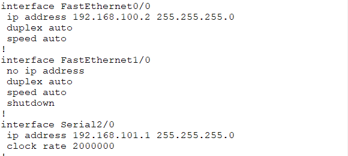

Router kế bên trong có 1 mạng 8.8.8.0/24

Ta cấu hình định tuyến các mạng VLAN 10 20 30 40 50  kết nối với f0/0 của router
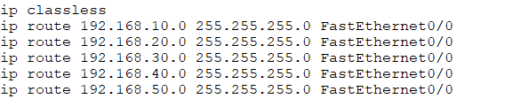

và định tuyến với mạng 8.8.8.0/24 bên kia của R2

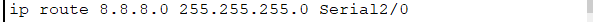

### 2.4 R2
Nhiệm vụ của R2 là định tuyến cho mạng 8.8.8.0/24 ra ngoài mạng, kết nối với mạng bên kia của R1

với các interface f0/0 mang vai trò default gateway 8.8.8.1/24, s2/0 có ip 192.168.101.2/24 kết nối trực tiếp với R1

R2 cũng làm dhcp Server

- Cấp IP cho mạng bên trong: 

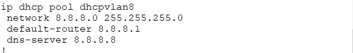

Gán các ip cho các interface

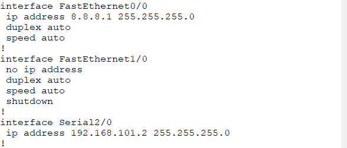

### 2.5 SW 4

SW 4 làm nhiệm vụ chuyển mạch cho 1 Vlan 8 trong mạng có khả năng giao tiếp với bên ngoài, chứa các SV : DNS,WEB,MAIL

IP DNS SERVER : 8.8.8.8/24

IP WEB SERVER : 8.8.8.2/24(dinhtu.local)

IP MAILSERVER : 8.8.8.3/24( kèm cả web dinhtu.com)

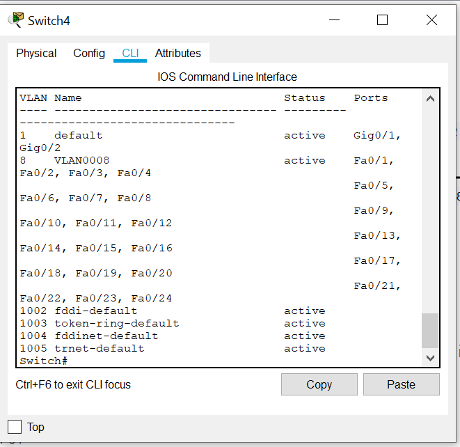

### 2.6 CÁC SERVER WEB,MAIL ,DNS

#### 2.7 DNS SERVER
Kích hoạt dịch vụ DNS và tạo các bản ghi HOST A ,CNAME

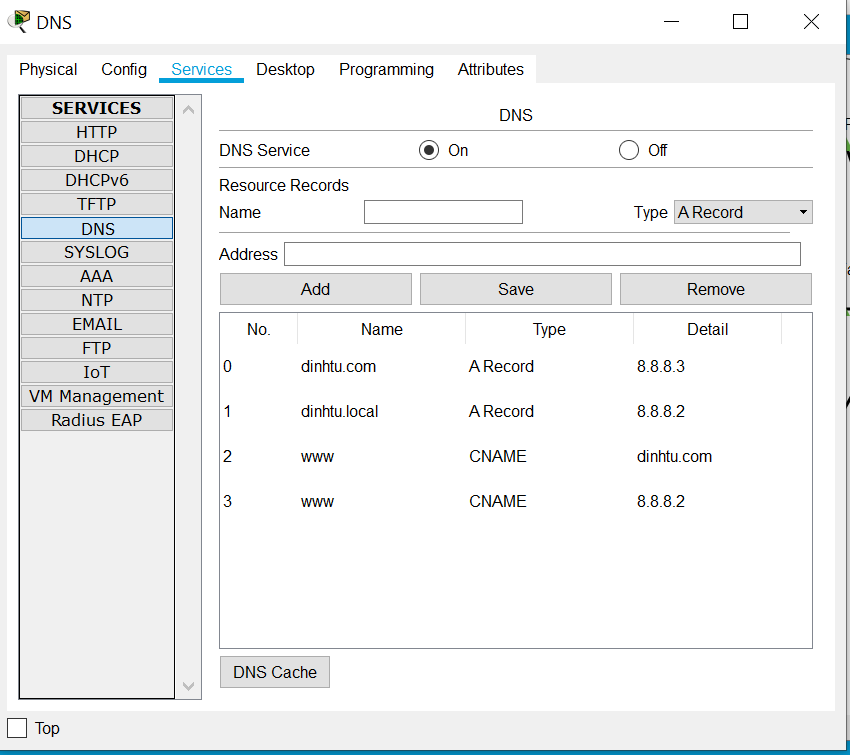

#### 2.8 WEB SERVER dinhtu.local

Bật dịch vụ http

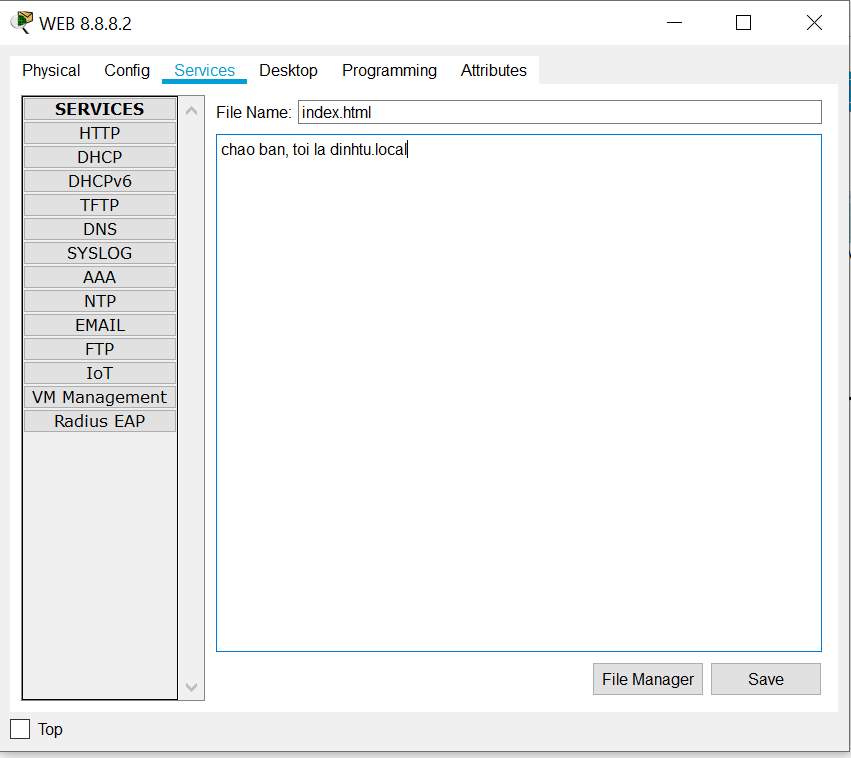

### 2.9 MAIL SERVER @dinhtu.com 

Bật dịch vụ gửi thư SMTP và đọc thư POP3 trên máy chủ

tạo các tài khoản mail client và cài đặt thông số nhận gửi mail ở máy client

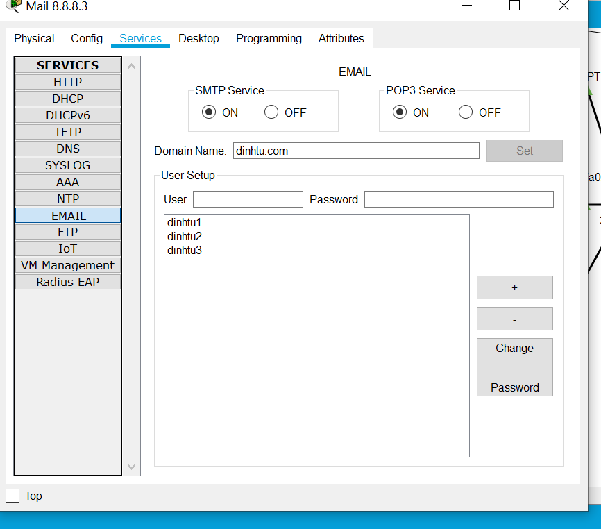

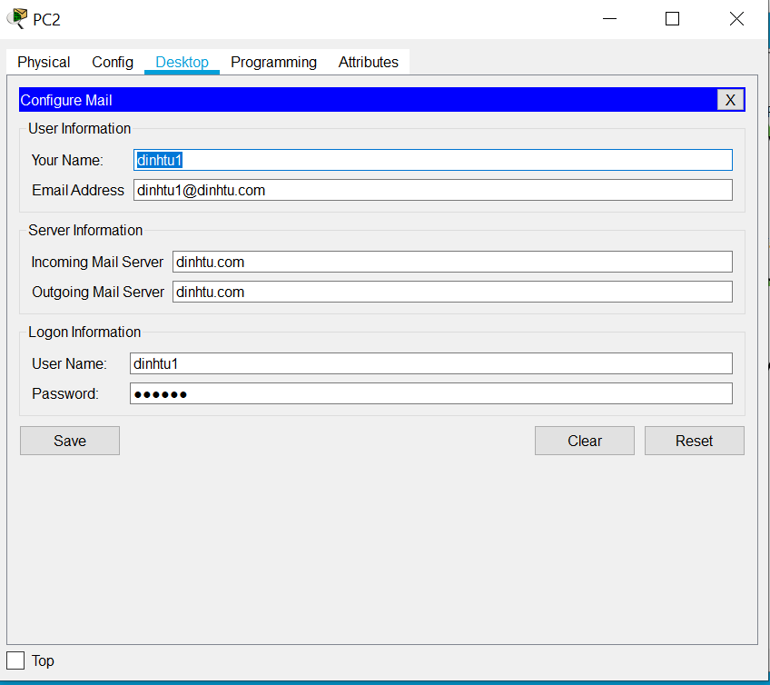

# 3.BÁO CÁO KẾT QUẢ BẰNG HÌNH ẢNH 
- Các máy tính ở tất cả các VLAN đã nhận đc địa chỉ IP động
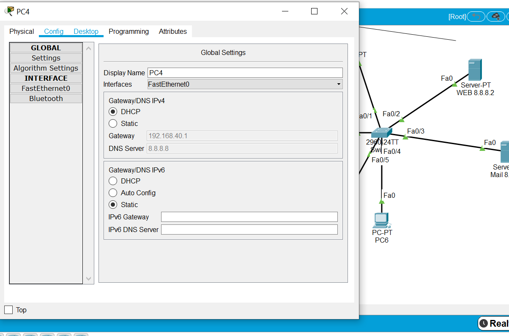

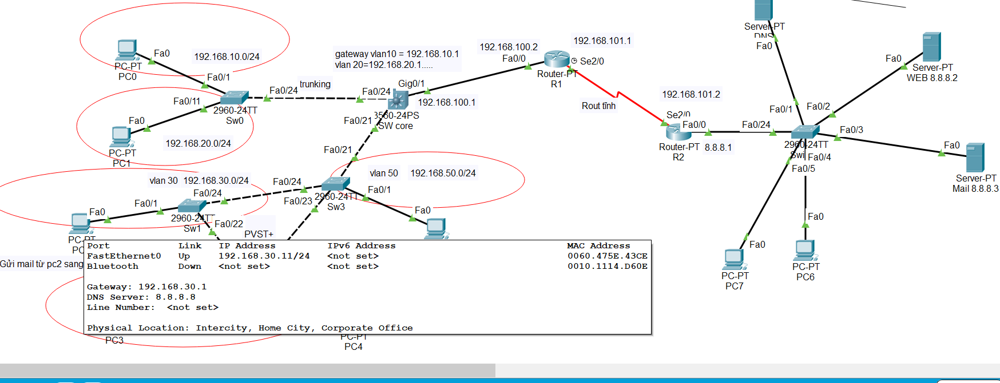

- PC ở VLAN 10 ping 8.8.8.8
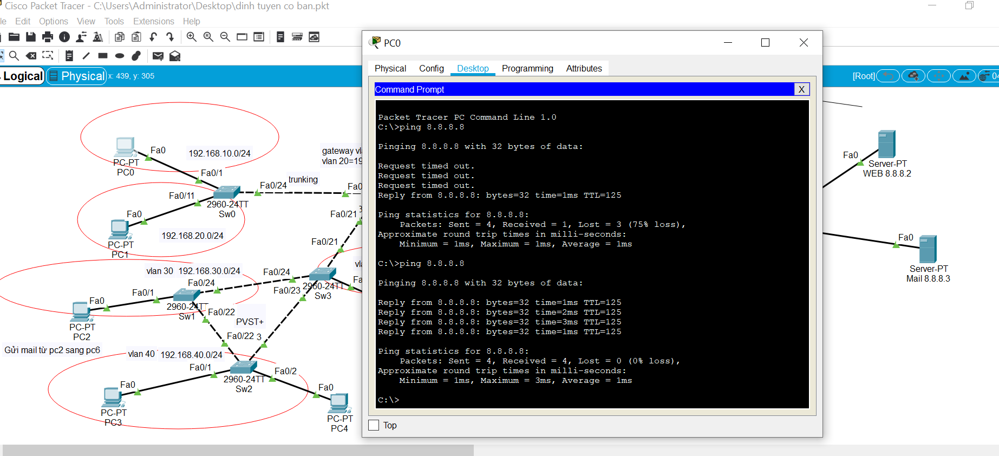

- Test gửi mail từ PC 6 về PC 2

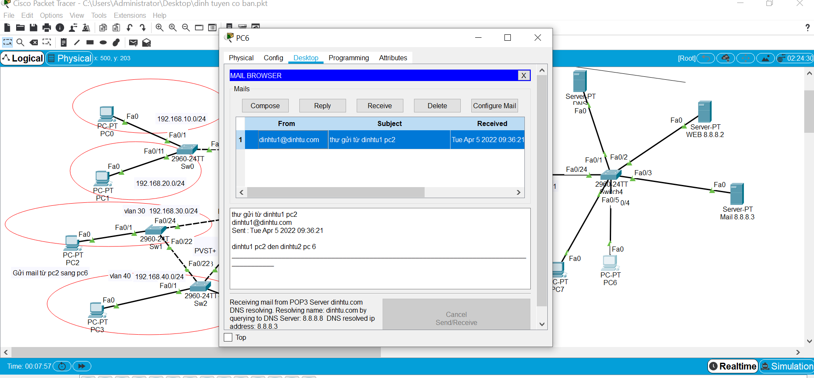
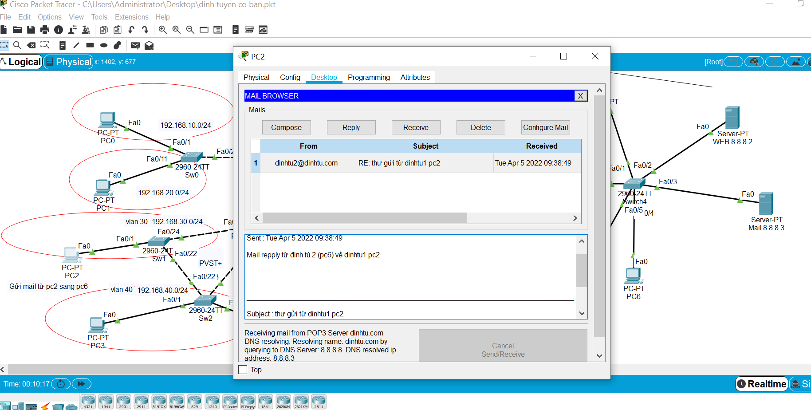

- Truy cập HTTP từ 1 máy tính ở VLAN 30( PC2)
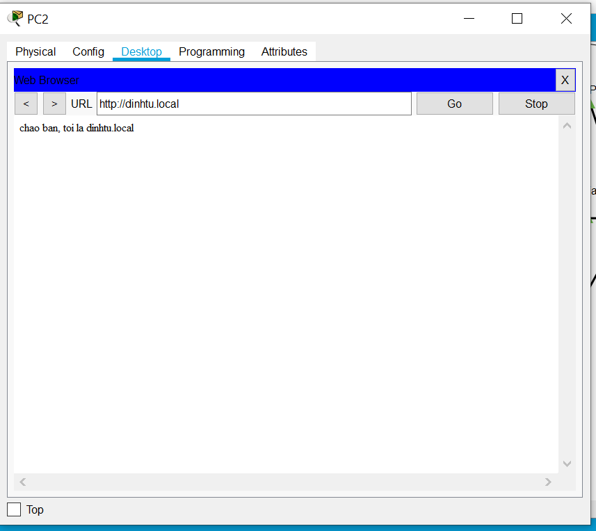
http trên mail server
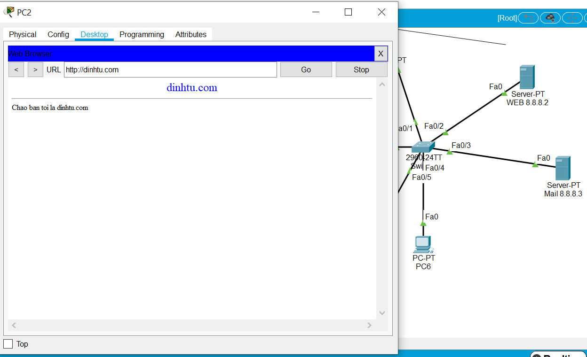

