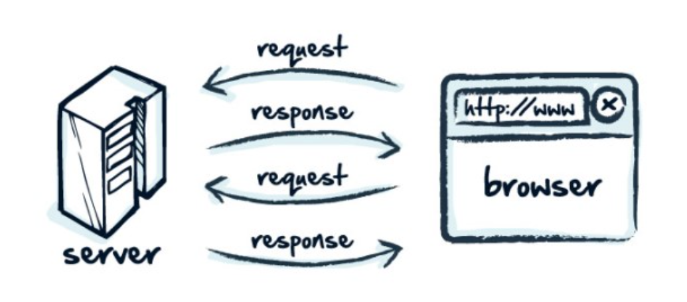
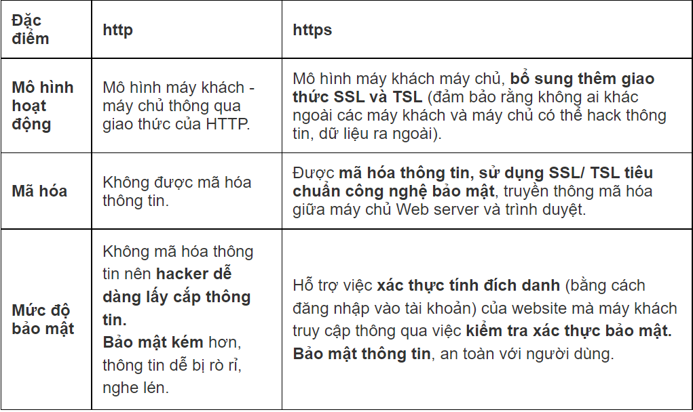
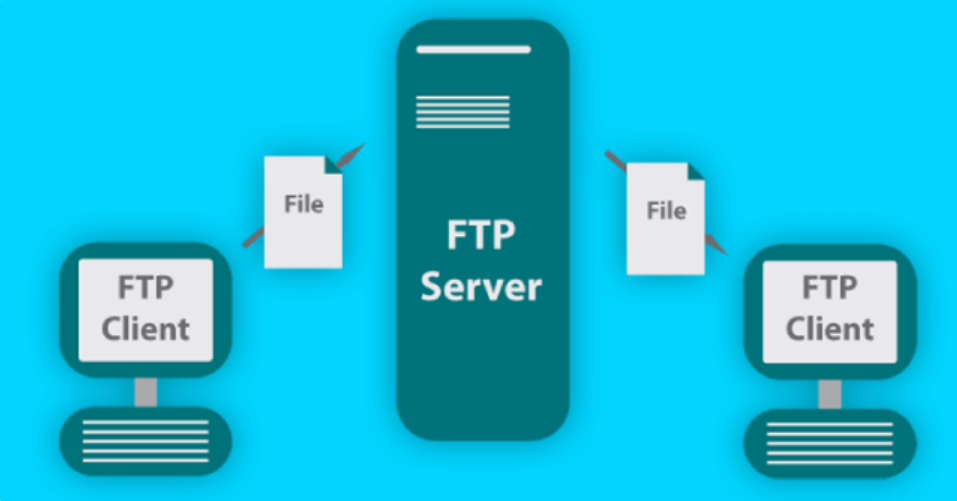
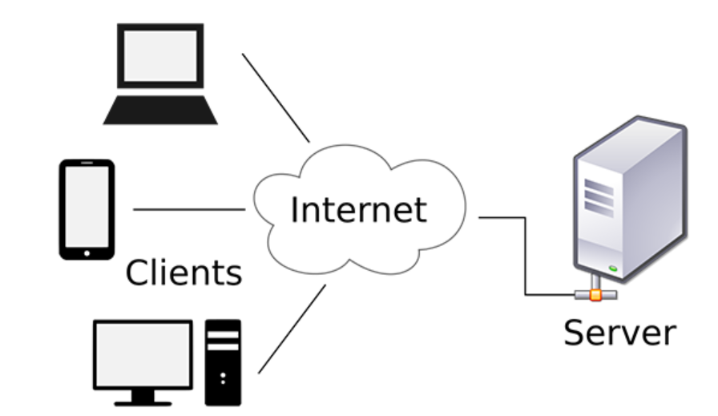
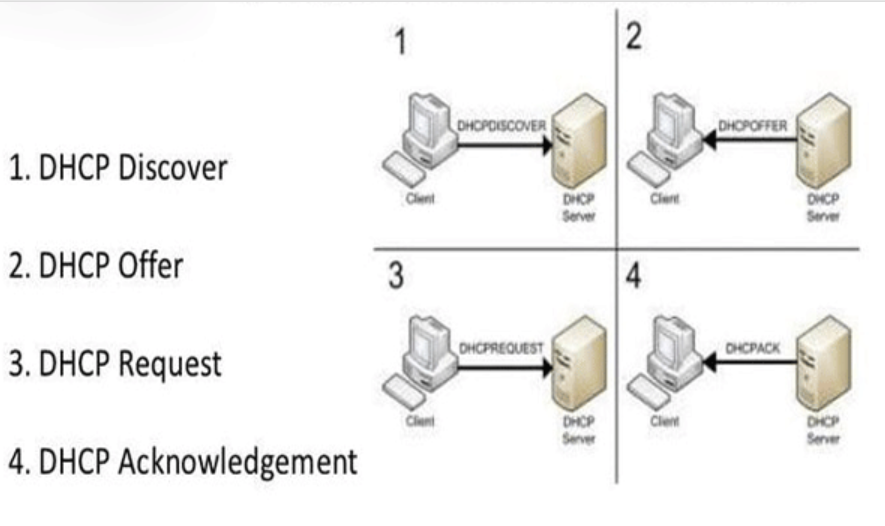
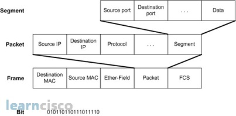

# 1-Http
- Http là chữ viết tắt của HyperText Transfer Protocol (giao thức truyền tải siêu văn bản). Đây là một giao thức ứng dụng được sử dụng thường xuyên nhất trong bộ các giao thức TCP/IP (gồm một nhóm các giao thức nền tảng cho internet). 

- Http hoạt động dựa trên mô hình Client (máy khách) – Server (máy chủ). Các máy tính của người dùng sẽ đóng vai trò làm máy khách (Client). Sau một thao tác nào đó của người dùng, các máy khách sẽ gửi yêu cầu đến máy chủ (Server) và chờ đợi câu trả lời từ những máy chủ này.

- HTTP sử dụng mặc định port TCP =80 

### 1.2 Https 
Là phiên bản an toàn của http (viết tắt của Hyper Text Transfer Protocol Secure - giao thức truyền tải siêu văn bản bảo mật), giao thức mà qua đó dữ liệu được gửi giữa trình duyệt và trang web bạn đang kết nối,sử dụng SSL/ TSL tiêu chuẩn công nghệ bảo mật, truyền thông mã hóa giữa máy chủ Web server và trình duyệt

- Https sử dụng port mặc định TCP =443

### So sánh Http và Https

# 2-DNS 

- DNS là viết tắt của cụm từ Domain Name System, mang ý nghĩa đầy đủ là hệ thống phân giải tên miền. Hiểu một cách ngắn gọn nhất, DNS cơ bản là một hệ thống chuyển đổi các tên miền website mà chúng ta đang sử dụng, ở dạng www.tenmien.com sang một địa chỉ IP dạng số tương ứng với tên miền đó và ngược lại.
- Về chức năng, DNS có thể được hiểu như một “người phiên dịch” và “truyền đạt thông tin”. DNS sẽ làm công việc dịch tên miền thành một địa chỉ IP gồm 4 nhóm số khác nhau. Ví dụ như www.tenmien.com thành 222.252.22.88 hoặc ngược lại dịch một địa chỉ IP thành tên miền
- DNS hoạt động trên cả 2 giao thức TCP 53 và UDP 53

Khi “dịch” như thế, trình duyệt sẽ hiểu và đăng nhập vào được. Và khi người dùng đăng nhập vào một website, thay vì phải nhớ và nhập một dãy số địa chỉ IP của hosting, thì chỉ cần nhập tên website là trình duyệt tự động nhận diện.

Mỗi máy tính trên Internet đều có một địa chỉ IP duy nhất. Địa chỉ IP này được dùng để thiết lập kết nối giữa server và máy khách để khởi đầu một kết nối. Bất kỳ khi nào, bạn truy cập vào một website tùy ý hoặc gửi một email, thì DNS đóng vai trò rất quan trọng trong trường hợp này.

### Các loại bản ghi DNS

- CNAME Record (Bản ghi CNAME): Cho phép bạn tạo một tên mới, điều chỉnh trỏ tới tên gốc và đặt TTL. Tóm lại, tên miền chính muốn đặt một hoặc nhiều tên khác thì cần có bản ghi này. 

- A Record: Bản ghi này được sử dụng phổ biến để trỏ tên Website tới một địa chỉ IP cụ thể. Đây là bản ghi DNS đơn giản nhất, cho phép bạn thêm Time to Live (thời gian tự động tái lại bản ghi), một tên mới và Points To ( Trỏ tới IP nào).

- MX Record: Với bản ghi này, bạn có thể trỏ Domain đến Mail Server, đặt TTL, mức độ ưu tiên (Priority). MX Record chỉ định Server nào quản lý các dịch vụ Email của tên miền đó.

- AAAA Record: Để trỏ tên miền đến một địa chỉ IPV6 Address, bạn sẽ cần sử dụng AAA Record. Nod cho phép bạn thêm Host mới, TTL,IPv6.

- TXT Record: Bạn cũng có thể thêm giá trị TXT, Host mới, Points To, TTL. Để chứa các thông tin định dạng văn bản của Domain, bạn sẽ cần đến bản ghi này.

- SRV Record: Là bản ghi dùng để xác định chính xác dịch vụ nào chạy Port nào. Đay là Record đặc biệt trong DNS. Thông qua nó, bạn có thể thêm Name, Priority, Port, Weight, Points to, TTL.

- NS Record: Với bản ghi này, bạn có thể chỉ định Name Server cho từng Domain phụ. Bạn có thể tạo tên Name Server, Host mới, TTL.

### Các máy chủ DNS phổ biến
Hiện nay DNS có rất nhiều loại khác nhau. Dưới đây là tổng hợp 6 dịch vụ DNS phổ biến nhất:

- DNS Google :DNS Google là một trong những DNS server được sử dụng nhiều nhất hiện nay vì tốc độ nhanh và ổn định : 8.8.8.8 và 8.8.4.4

- DNS OpenDSN : 208.67.222.222 và 208.67.220.220​

- DNS Cloudflare : Cloudflare là một dịch vụ DNS trung gian, giúp điều phối lưu lượng truy cập qua lớp bảo vệ CloudFlare. 1.1.1.1  và 1.0.0.1

- DNS VNPT : 203.162.4.191  và 203.162.4.190

- DNS Viettel  : 203.113.131.1 và 203.113.131.2

- DNS FPT : 210.245.24.20 và 210.245.24.22

# 3-FTP 

FTP viết tắt từ File Transfer Protocol, là một giao thức truyền tải tập tin từ máy tính này đến máy tính khác thông qua một mạng TCP hoặc qua mạng Internet. Nhờ vào giao thức này nên người sử dụng có thể tải dữ liệu như hình ảnh, văn bản, các tập tin nhạc, video... từ máy tính của mình lên máy chủ đang đặt ở một nơi khác hoặc tải các tập tin đã có trên máy chủ về máy tính cá nhân của mình một cách dễ dàng. FTP cũng là giao thức dùng để truyền tải dữ liệu web lên máy chủ web cho dù máy chủ đặt rất xa.

- FTP hoạt động ở TCP 21

## Mô hình hoạt động của giao thức FTP

Hình thức hoạt động của giao thức FTP dựa trên hai tiến trình cơ bản là kiểm soát kết nối và kết nối dữ liệu. Điều này xảy ra giữa client FTP và server FTP, hay còn gọi là Control Connection và Data Connection.

Control connection (kiểm soát kết nối): Khi phiên làm việc bắt đầu thì trong suốt quá trình diễn ra công việc thì tiến trình này sẽ kiểm soát kết nối và chỉ thực hiện nhiệm vụ các thông tin điều khiển đi qua trong suốt quá trình truyền dữ liệu.

Data connection (kết nối dữ liệu): Khác với Control connection thì đây là tiến trình nhằm thực hiện các kết nối chứ không còn kiểm soát nữa. Nó sẽ kết nối các dữ liệu khi dữ liệu được gửi từ server tới client hoặc ngược lại. Tiến trình này thực hiện xuyên suốt quá trình đến khi việc truyền dữ liệu hoàn tất thì nó cũng ngừng lại.

# 4-SSH

SSH là giao thức đăng nhập vào server từ xa, cho phép người dùng kiểm soát, chỉnh sửa và quản trị dữ liệu của server thông qua nền tảng Internet. SSH là viết tắt của Secure Socket Shell. SSH cũng giúp việc kết nối của mạng lưới máy chủ và máy khách an toàn, hiệu quả và bảo mật thông tin tốt hơn.

SSH cũng có chức năng mã hóa dữ liệu đường truyền. Điều này phục vụ cho quá trình chuyền tập tin, chạy chương trình. SSH cũng chuyển tiếp kết nối TCP/IP qua liên kết an toàn

SSH sử dụng port TCP 22 

SSH hoạt động ở tầng thứ 4 trong mô hình TCP/IP. Nó cho phép tương tác giữa máy chủ và máy khách.

# 5-DHCP

DHCP viết tắt của Dynamic Host Configuration Protocol, là giao thức tự động cấp phát địa chỉ IP đến các thiết bị trong mạng. Các địa chỉ IP được cung cấp từ giao thức DHCP sẽ cho phép chúng ta truy cập vào internet. Ngoài ra nó cũng đảm bảo không có trường hợp hai hoặc nhiều thiết bị có cùng IP và còn cung cấp các thông tin cấu hình như DNS, subnet mask, default gateway.

- Cách hoạt động của DHCP về cơ bản khá đơn giản, khi có một thiết bị cần truy cập mạng, nó sẽ gửi yêu cầu từ một router và được router gán cho một địa chỉ IP khả dụng.

- Router hoạt động như một máy chủ DHCP đối với các mô hình mạng nhỏ hoặc hộ gia đình. Đối với các mạng lớn hơn một router không thể quản lý số lượng lớn các thiết bị nên sẽ có một máy chủ chuyên dụng để cấp IP

- Khi muốn kết nối với mạng thiết bị sẽ gửi yêu cầu DHCP DISCOVER đến máy chủ. Máy chủ DHCP sẽ tìm địa chỉ IP khả dụng rồi cung cấp cho thiết bị cùng với gói DHCP OFFER.
Sau khi nhận được địa chỉ, thiết bị sẽ phản hồi với máy chủ bằng một gói tin DHCP REQUEST. Đây là lúc chấp nhận yêu cầu, máy chủ sẽ gửi tin báo nhận (ACK) xác nhận thiết bị đã có IP và thời gian sử dụng IP đến khi có địa chỉ mới.

Ưu điểm của DHCP 

- Giúp các thiết bị kết nối mạng nhanh chóng từ máy tính, laptop, điện thoại, máy tính bảng…
Quản lý địa chỉ IP một cách khoa học, tránh trường hợp trùng IP trên nhiều, đảm bảo cấu hình tự động cho mọi thiết bị kết nối mạng.
Quản lý địa chỉ IP và các tham số TCP/IP dễ dàng qua các trạm.
Các nhà quản trị mạng có thể thay đổi cấu hình và thông số của IP để nâng cấp cơ sở hạ tầng.
Các thiết bị có thể di chuyển tự do từ mạng này sang mạng khác và nhận IP mới tự động.

Nhược điểm của DHCP 
- Việc sử dụng IP động của DHCP không phù hợp với các thiết bị cố định và cần truy cập liên tục như máy in, file server.
- DHCP thường chỉ được sử dụng tại các hộ gia đình hoặc mô hình mạng nhỏ.

# 6- Giao thức ARP

Trong một hệ thống mạng máy tính, có 2 địa chỉ được gán cho máy tính là:

Địa chỉ logic: là địa chỉ của các giao thức mạng như IP, IPX, ... Loại địa chỉ này chỉ mang tính chất tương đói, có thể thay đổi theo sự cần thiết của người dùng. Các địa chỉ này thường được phân thành 2 phần riêng biệt là phần địa chỉ mạng và phần địa chỉ máy. Cách đánh địa chỉ như vậy nhắm giúp cho việc tìm ra các đường kết nối từ hệ thống mạng này sang hệ thống mạng khác dễ dàng hơn.

Địa chỉ vật lý: hay còn gọi là địa chỉ MAC - Medium Access Control address là địa chỉ 48 bit, dùng để định danh duy nhất do nhà cung cấp gán cho mỗi thiết bị. Đây là loại địa chỉ phẳng, không phân lớp, nên rất khó dùng để định tuyến.

Trên thực tế, các card mạng (NIC) chỉ có thể kết nối với nhau theo địa chỉ MAC, địa chỉ cố định và duy nhất của phần cứng.

=> Do vậy phải có một cơ chế để ánh xạ địa chỉ logic - lớp 3 sang địa chỉ vật lý - lớp 2 để các thiết bị có thể giao tiếp với nhau.

Từ đó, ta có giao thức phân giải địa chỉ ARP - Address Resolution Protocol giải quyết vấn đề trên.

- ARP là phương thức phân giải địa chỉ động giữa địa chỉ lớp network và địa chỉ lớp datalink. Quá trình thực hiện bằng cách: một thiết bị IP trong mạng gửi một gói tin local broadcast đến toàn mạng yêu cầu thiết bị khác gửi trả lại địa chỉ phần cứng ( địa chỉ lớp datalink ) hay còn gọi là Mac Address của mình.

- ARP là giao thức lớp 2 - Data link layer trong mô hình OSI và là giao thức lớp Link layer trong mô hình TCP/IP.

- Ban đầu ARP chỉ được sử dụng trong mạng Ethernet để phân giải địa chỉ IP và địa chỉ MAC. Nhưng ngày nay ARP đã được ứng dụng rộng rãi và dùng trong các công nghệ khác dựa trên lớp hai.

## Cấu trúc bản tin ARP

Kích thước bản tin ARP là 28 byte, được đóng gói trong frame Ethernet II nên trong mô hình OSI, ARP được coi như là giao thức lớp 3 cấp thấp.

Cấu trúc bản tin ARP được mô tả như hình sau:

