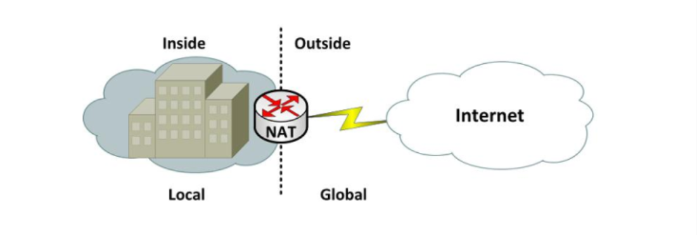
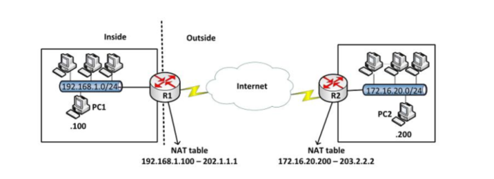
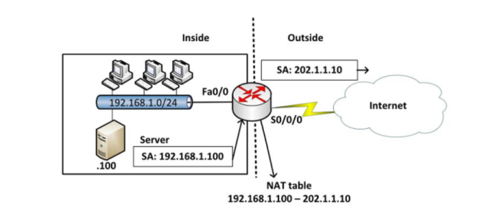
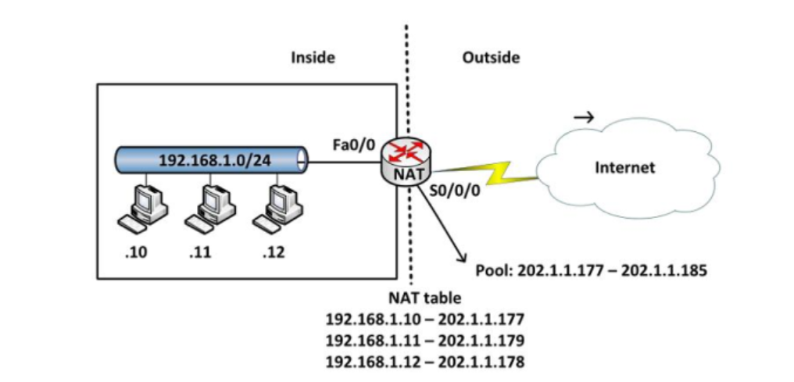
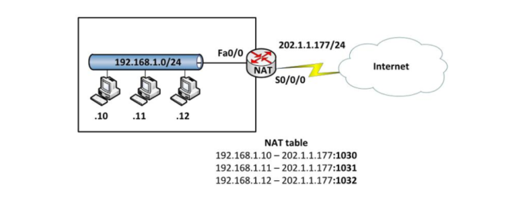

# Định nghĩa:
NAT (Network Address Translation) là một kỹ thuật cho phép chuyển đổi từ một địa chỉ IP này thành một địa chỉ IP khác. Thông thường, NAT được dùng phổ biến trong mạng sử dụng địa chỉ cục bộ, cần truy cập đến mạng công cộng (Internet). Vị trí thực hiện NAT là router biên kết nối giữa hai mạng.

Nhằm tiết kiệm địa chỉ IPv4 nên người ta đã phát triển ra IPv4 private và IPv4 public
Địa chỉ private:

- Lớp mạng A : 10.0.0.0 - 10.255.255.255

- Lớp mạng B : 172.16.0.0 - 172.31.255.255

- Lớp mạng C : 192.168.0.0 - 192.168.255.255

 Địa chỉ public:

- Là các địa chỉ còn lại. Các địa chỉ public là các địa chỉ được cung cấp bởi các tổ chức có thẩm quyền.

### Các thuật ngữ sử dụng trong NAT

- Địa chỉ inside local: là địa chỉ IP gán cho một thiết bị ở mạng bên trong. Địa chỉ này hầu như không phải địa chỉ được cung cấp bởi NIC (Network Information Center) hay nhà cung cấp dịch vụ.

- Địa chỉ inside global: là địa chỉ đã được đăng ký với NIC, dùng để thay thế một hay nhiều địa chỉ IP inside local.

- Địa chỉ outside local: là địa chỉ IP của một thiết bị bên ngoài khi nó xuất hiện bên trong mạng. Địa chỉ này không nhất thiết là địa chỉ được đăng ký, nó được lấy từ không gian địa chỉ bên trong.

- Địa chỉ outside global: là địa chỉ IP gán cho một thiết bị ở mạng bên ngoài. Địa chỉ này được lấy từ địa chỉ có thể dùng để định tuyến toàn cầu từ không gian địa chỉ mạng.

# Các công nghệ NAT

### STATIC NAT

- Static NAT được dùng để chuyển đổi một địa chỉ IP này sang một địa chỉ khác một cách cố định, thông thường là từ một địa chỉ cục bộ sang một địa chỉ công cộng và quá trình này được cài đặt thủ công, nghĩa là địa chỉ ánh xạ và địa chỉ ánh xạ chỉ định rõ ràng tương ứng duy nhất.

- Static NAT rất hữu ích trong trường hợp những thiết bị cần phải có địa chỉ cố định để có thể truy cập từ bên ngoài Internet. Những thiết bị này phổ biến là những Server như Web, Mail,...

### Dynamic NAT

- Dynamic NAT được dùng để ánh xạ một địa chỉ IP này sang một địa chỉ khác một cách tự động, thông thường là ánh xạ từ một địa chỉ cục bộ sang một địa chỉ được đăng ký. Bất kỳ một địa chỉ IP nào nằm trong dải địa chỉ IP công cộng đã được định trước đều có thể được gán một thiết bị bên trong mạng.

### NAT Overload
- Nat Overload là một dạng của Dynamic NAT, nó thực hiện ánh xạ nhiều địa chỉ IP thành một địa chỉ (many - to - one) và sử dụng các địa chỉ số cổng khác nhau để phân biệt cho từng chuyển đổi. NAT Overload còn có tên gọi là PAT (Port Address Translation).Chỉ số cổng được mã hóa 16 bit, do đó có tới 65536 địa chỉ nội bộ có thể được chuyển đổi sang một địa chỉ công cộng.

# Tổng kết định nghĩa

- Static NAT được sử dụng để ánh xạ địa chỉ theo kiểu “one-to-one” và được chỉ định bởi người quản trị. 
- Dynamic NAT là kiểu chuyển dịch địa chỉ dạng “one-to-one” một cách tự động. 
- NAT Overload là kiểu chuyển dịch địa chỉ dạng “many-to-one” một cách tự động, sử dụng các chỉ số cổng (port) để phân biệt cho từng chuyển dịch.

