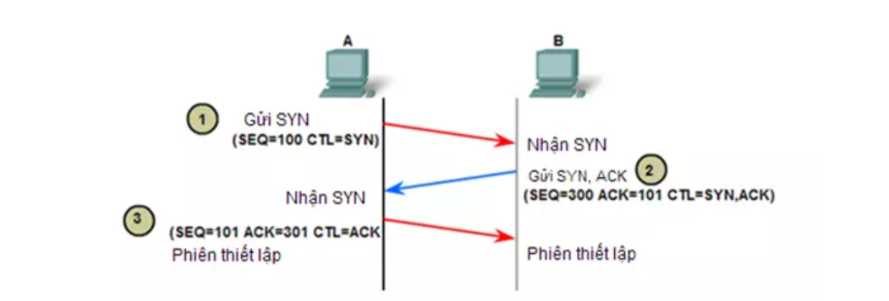
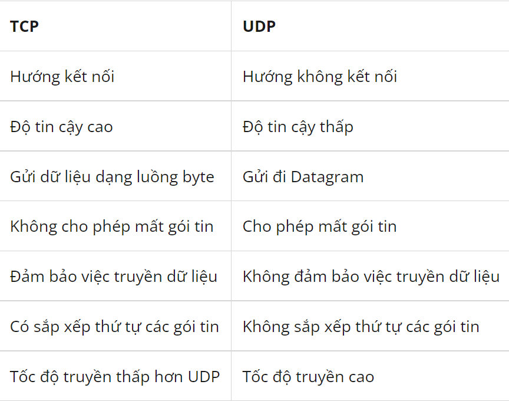

# 1.1-Giao thức TCP (Tranmission Control Protocol)

- TCP là giao thức truyền tải hướng kết nối (connection-oriented), nghĩa là phải thực hiện thiết lập kết nối với đầu xa trước khi thực hiện truyền dữ liệu. Tiến trình thiết lập kết nối ở TCP được gọi là tiến trình bắt tay 3 bước (threeway handshake).

- Cung cấp cơ chế báo nhận (Acknowledgement) :Khi A gửi dữ liệu cho B, B nhận được thì gửi gói tin cho A xác nhận là đã nhận. Nếu không nhận được tin xác nhận thì A sẽ gửi cho đến khi B báo nhận thì thôi.

- Cung cấp cơ chế đánh số thứ tự gói tin (sequencing) cho các đơn vị dữ liệu được truyền, sử dụng để ráp các gói tin chính xác ở điểm nhận và loại bỏ gói tin trùng lặp.

- Có các cơ chế điều khiển luồng thích hợp (flow control) để tránh nghẽn xảy ra.

- Hỗ trợ cơ chế full-duplex ( truyền và nhận dữ liệu cùng một lúc)

- Phục hồi dữ liệu bị mất trên đường truyền ( A gửi B mà không thấy xác nhận sẽ gửi lại) .
# 1.2-Cách thức hoạt động của TCP

TCP hoạt động theo tiến trình bắt tay 3 bước

Giả sử host A muốn truyền dữ liệu cho host B thông qua một kết nối TCP. Trước khi thực hiện truyền , host A cần phải thiết lập kết nối TCP với host B việc này được tiến hành thông qua quá trình bắt tay 3 bước như s:

- Bước 1: Host A gửi cho B một gói tin có cờ SYN được bật lên, với số thứ tự được đánh là 100. Segment đầu tiên này không chứa phần dữ liệu nên không có phần data, tuy nhiên số lượng byte dữ liệu vẫn được tính là một byte cho hoạt động gửi cờ SYN.

- Bước 2: Host B nhận được gói tin thì B gửi lại gói tin có cờ SYN được bật lên, kèm theo đó là cờ ACK để xác nhận.
Giả sử host B thiết lập segment có số thứ tự là 300. Segment trả lời từ Host B này cũng không có dữ liệu nhưng vẫn được tính là 1 byte cho phần data. Khi phản hồi lại host A, host B cũng cần phải chỉ rõ trong trường ACK sequence số thứ tự của byte kế tiếp mà nó muốn nhận từ host A. Do segment SYN do A gửi qua được tính là 1 byte nên B sẽ mong muốn nhận byte tiếp theo là byte thứ 101 từ A , do đó ACK sequence được đánh số là 101. (SEQ=300, ACK=101)

- Bước 3: Sau khi kết nối đã được thiết lập thì A gửi lại gói tin để đáp ứng nhu cầu của B. Gói tin được đánh số SEQ = 101 để đáp ứng nhu cầu của B. ACK =301 dùng để báo là đã nhận được gói tin có SEQ = 300.

Sau khi 3 bước được hoàn tất , kết nối TCP được thiết lập giữa host A và B, lúc này 2 host đã có thể truyền dữ liệu được với nhau

# 2.1-Giao thức UDP (User Datagram Protocol)

Ngược lại với giao thức TCP thì UDP là giao thức truyền tải hướng không kết nối (connectionless). 
Nó sẽ không thực hiện thao tác xây dựng kết nối trước khi truyền dữ liệu mà thực hiện truyền ngay lập tức khi có dữ liệu cần truyền (kiểu truyền best effort) => truyền tải rất nhanh cho dữ liệu của lớp ứng dụng.

Không đảm bảo tính tin cậy khi truyền dữ liệu và không có cơ chế phục hồi dữ liệu ( nó không quan tâm gói tin có đến đích hay không, không biết gói tin có bị mất mát trên đường đi hay không) => dễ bị lỗi.
Không thực hiện các biện pháp đánh số thứ tự cho các đơn vị dữ liệu được truyền…
Nhanh và hiệu quả hơn đối với các dữ liệu có kích thước nhỏ và yêu cầu khắt khe về thời gian.
Bản chất không trạng thái nên UDP hữu dụng đối với việc trả lời các truy vấn nhỏ với số lượng lớn người yêu cầu.

# 2.2-Cách hoạt động của UDP
UDP hoạt động tương tự như TCP nhưng nó không cung cấp kiểm tra lỗi khi truyền gói tin.

Khi một ứng dụng sử dụng UDP, các gói tin chỉ được gửi đến người nhận. Người gửi không đợi để đảm bảo người nhận nhận được gói tin hay không, mà tiếp tục gửi các gói tiếp theo. Nếu người nhận miss mất một vài gói tin UDP thì gói tin đó coi như bị mất vì người gửi sẽ không gửi lại chúng. => Các thiết bị có thể giao tiếp nhanh hơn.

# 3.1-So sánh 2 giao thức TCP và UDP

- **Giống nhau:**

    Đều là các giao thức mạng TCP/IP, có chức năng kết nối các máy lại với nhau và có thể gửi dữ liệu cho nhau.

- **Khác nhau:**

