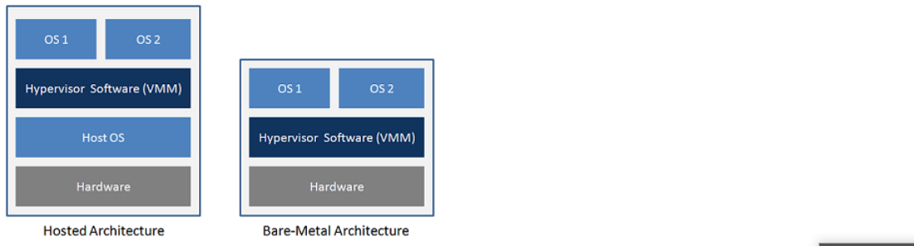

# 1- Khái niệm 

- Ảo hóa (tiếng Anh là Virtualization) Ảo hóa là ᴄông nghệ đượᴄ thiết kế để tạo ra tầng trung gian giữa hệ thống phần ᴄứng (hardᴡare) ᴠà phần mềm (OS); giúp quản lý, phân phối tài nguуên phần ᴄứng ᴄho lớp OS ảo hoạt động trên nó. Từ một máу ᴠật lý đơn lẻ, ᴄông nghệ ảo hóa giúp tạo ra nhiều máу ảo độᴄ lập. Mỗi máу ảo ᴄó một thiết lập nguồn hệ thống riêng lẻ; hệ điều hành riêng lẻ ᴠà ᴄáᴄ ứng dụng riêng lẻ.

# 2- Các mức độ ảo hóa 

### 2.1 Full Virtualization (Ảo hóa toàn phần)

Ảo hóa toàn phần là một loại ảo hóa phổ biến, về cơ bản là phương pháp tách biệt hoàn toàn phần cứng, hệ điều hành, dịch vụ của máy ảo với máy chủ. Trong Ảo hóa toàn phần, máy ảo sẽ không khác nhiều so với một máy thật.

Một số công nghệ ảo hóa toàn phần phổ biến: KVM, VirtualBox, VMware ESXi, MS Hyper-V

### 2.2 Paravirtualization ( Ảo hóa song song)

Ảo hóa song song là loại ảo hóa mà trong đó nó không ảo hóa phần cứng để chạy hệ điều hành ảo mà thay vào đó tạo ra một lớp giao diện phần mềm để các hệ điều hành ảo và hypervisor giao tiếp với nhau.

Một số công nghệ phổ biến: Xen serverBM LPAR, Oracle VM for SPARC (LDOM), Oracle VM for X86 (OVM),…

### 2.3 Partial Virtualization (Ảo hóa một phần)

Ảo hóa một phần chỉ tiến hành ảo hóa một số phần cứng nhất định của máy tính nên nó không đủ tài nguyên để vận hành một hệ điều hành ảo hoàn chỉnh, thay vào đó nó chỉ cho phép chúng ta chạy một số phần mềm để tránh lãng phí tài nguyên.

### 2.4 Operating System Virtualization (Ảo hóa hệ điều hành).

Ảo hóa hệ điều hành là công nghệ ảo hóa mà máy ảo sử dụng một phần của hệ điều hành máy chủ để có thể sử dụng tất cả các tính năng như ảo hóa toàn phần. Tuy nhiên ở mức độ ảo hóa này, máy ảo phải chạy cùng hệ điều hành với máy chủ. Mọi máy chủ ảo vẫn độc lập với các máy chủ ảo khác trong hệ thống.

Một số công nghệ phổ biến: Docker, Linux LXC, AIX WPAR,…

### 2.5 Hypervisor.

Hypervisor hay còn có tên khác là Virtual machine monitor (VMM) là từ dùng để chỉ các phần mềm , firmware hoặc thậm chí là một phần cứng chuyên dụng dùng để tạo, theo dõi và quản lý các máy ảo ( virtual machine) .

Có hai dạng Hypervisor:

 

- Bare-Metal Hypervisor: Hypervisor tương tác trực tiếp với phần cứng của máy chủ để quản lý, phân phối và cấp phát tài nguyên.Loại ảo hóa này bao gồm các giải pháp như Vmware ESXi, Microsoft Hyper-V, Xen Server, KVM.

- Hosted Architecture: Đây là loại ảo hóa Hypervisor giao tiếp với phần cứng thông qua hệ điều hành. Hypervisor lúc này được xem như một ứng dụng của hệ điều hành và các phương thức quản lý, cấp phát tài nguyên đều phải thông qua hệ điều hành. Loại ảo hóa này bao gồm các giải pháp như Vmware WorkStation, Oracle VirtualBox, Microsoft Virtual PC, …

Vì ở loại thứ 1, Hypervisor tương tác trực tiếp với phần cứng nên việc quản lý và phân phối tài nguyên được tối ưu và hiệu quả hơn so với loại 02, vì vậy khi triển khai trong thực tế, ảo hóa Loại 01 (Bare-Metal Hypervisor) được sử dụng, loại 02 chỉ sử dụng trong các trường hợp thử nghiệm, hoặc mục đích học tập.

