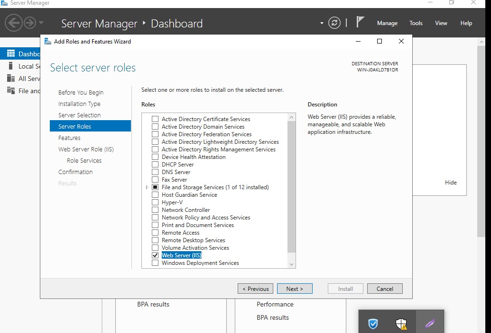

# Caì đặt dịch vụ IIS

- IIS là viết tắt của từ (Internet Information Services ), được đính kèm với các phiên bản của Windows. Internet Information Services (IIS) chính là các dịch vụ dành cho máy chủ chạy trên nền hệ điều hành Window nhằm cung cấp và phân tán các thông tin lên mạng, nó bao gồm nhiều dịch vụ khác nhau như Web Server, FTP Server. Cài đặt:


- Add roll and feature


- Tìm tích vào dịch vụ IIS 



img src="imgwindow/206.png">


- Mình có thể tích 1 vài roll để monitor


- Đợi quá trình hoàn tất máy sẽ khởi động lại


- File lưu trữ file tại

```
C:\inetpub\wwwroot

```
- Tạo thử 1 file index.html 


