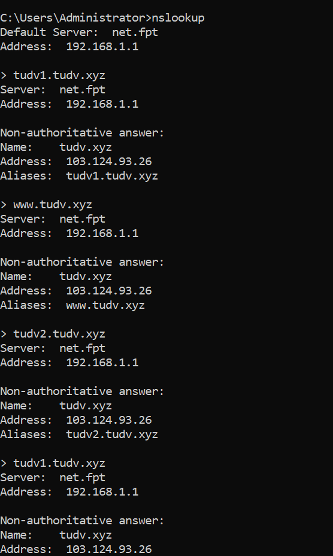
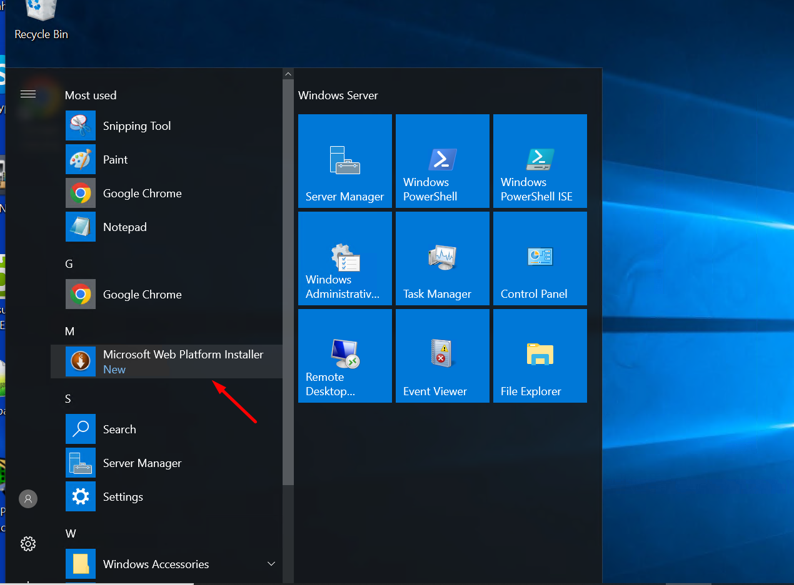
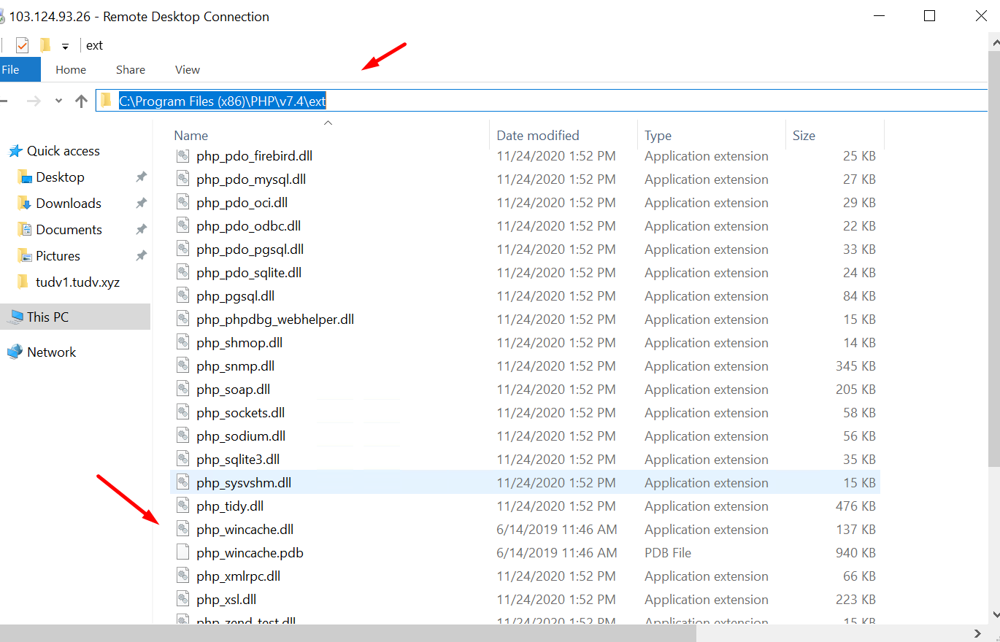

# Triển khai web wordpress window

Mô hình IIS,MySQL,PHP,Wordpress

- 2 website ``tudv1.tudv.xyz`` và ``tudv2.tudv.xyz``

- IP winserver: 103.124.93.26

- Chuẩn bị bản ghi

- Cấu hình windowserver chạy 2 web wordpress là tudv1.tudv.xyz và tudv2.tudv.xyz trên 1 máy chủ window có địa chỉ IP 103.124.93.26.

- Tạo IIS nhanh với các bổ trợ kèm theo

- Quá trình cài iis kết thúc

  - Ta tạo trong ổ C thư mục chứa mã nguồn web

  - Tạo 2 folder bên trong chứa web1 và web2

- 

- Trong mỗi folder ta tạo thử 2 bản index.html với nội dung để phân biệt 2 trang web

- Quay lại server manager click tool > iis

- Click tên máy của winserver

- Click Sites

- Và chuột phải tạo create site

- Tạo site đầu tiên là tudv1.tudv.xyz

- Click vào web 1 và chuột phải đẩy file index.html nãy mình tạo  lên hàng 1

- Làm tương tự cho web 2

- Test truy cập:

- Bước tiếp theo tìm kiếm webplatform tại trang chủ microsoft

- Tải về và setup

- Cài đặt xong ta tìm kiếm wordpress

- Add vào và cài đặt

- Máy chưa cài sql mình cứ điền mk của root mysql

- Máy sẽ cài php và mysql

# Quá trình cài đặt bị lỗi mất mấy tiếng nên em chuyển sang làm thủ công:

- Tải wordpress thủ công

- Tải PHP và phần mở rộng WinCache

- Cài đặt PHP và WinCache

  - Giải nén toàn bộ file cho PHP  .zip  bạn tải trước đó vào thư mục  cài đặt . C:\Program Files (x86)\PHP
  

  - Giải nén WinCache( exe) vào thư mục ext của PHP: C:\Program Files (x86)\PHP\v7.4\ext :  Bạn sẽ có được file Php_wincache.dll

  - Mở Control Panel, click System and Security, click System, sau đó click Advanced system settings.

    Trong cửa sổ System Properties , chọn tab Advanced, sau đó click Environment Variables.

    Trong System variables, chọn Path, sau đó click Edit.

    Thêm đường dẫn vào thư mục PHP mà bạn đã cài đặt, như ở ví dụ là 

    C:\Program Files (x86)\PHP

    Sau đó Click OK.

 

  - Vào phần quản lý IIS chọn tên hosting trong bảng điều khiển nháy đúp (double-click) Handler Mappings.

  - Trong mục điều khiển Action, click Add Module Mapping.

  - Trong phần Request path, mục loại (type) thêm *.php.

  - Trên biểu mẫu (form) phần Module  chọn FastCgiModule

  - Trong hộp Executable chọn đường dẫn đầy đủ tới Php-cgi.exe. Ví dụ: C:\Program Files (x86)\PHP\Php-cgi.exe

  -  Trong phần Name nhập tên cho moudle mapping ví dụ: FastCGI

  - Click OK

  

  - Chọn tên hosting trong mục điều khiển click đúp(double-click) Default Document.

  - Trong bảng điều khiển Action  chọn Add trong phần Name nhập index.php và click OK.

  

- Tải Mysql về và đăng nhập root tạo ra 2 database cho 2 web wordpress:

  tạo 2 database wordpress1 và wordpress2 với 2 admin là tudv1 và tudv2

 

- Tải wordpress về cho vào `` C:\Webserver\tudv1.tudv.xyz``
và ``C:\Webserver\tudv2.tudv.xyz``
 
- Khai báo liên kết vào database 

- Làm tương tự cho web 2

# Kết quả: 

