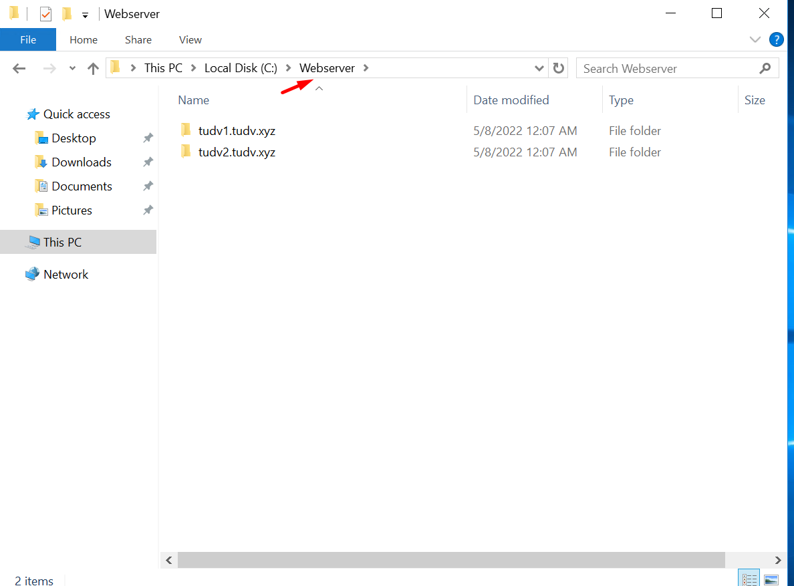

# Triển khai web wordpress window

Mô hình IIS,MySQL,PHP,Wordpress

- Chuẩn bị bản ghi

- Cấu hình windowserver chạy 2 web wordpress là tudv1.tudv.xyz và tudv2.tudv.xyz trên 1 máy chủ window có địa chỉ IP 103.124.93.26.

- Tạo IIS nhanh với các bổ trợ kèm theo

- Quá trình cài iis kết thúc

  - Ta tạo trong ổ C thư mục chứa mã nguồn web

  - Tạo 2 folder bên trong chứa web1 và web2

- 

- Trong mỗi folder ta tạo thử 2 bản index.html với nội dung để phân biệt 2 trang web

- Quay lại server manager click tool > iis

- Click tên máy

- Click Sites

- Và chuột phải tạo create site

- Tạo site đầu tiên là tudv1.tudv.xyz

