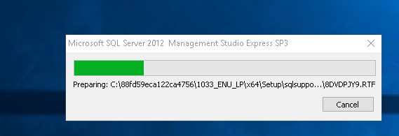

# Cài đặt môi trường ASP.net

Windows, IIS, SQL, ASP.NET) Stack

## 1 - IIS ASP.net
- Add roll and features

## 2 - Cài đặt sql management studio

- Tạo mới 1 server độc lập

- Hệ thống sẽ kiểm tra và tải về các bản cập nhật

- Next

- Next

- Tùy chọn xác thực windows hoặc 2 mĩ pass sql

- Quá trình cài đặt bắt đầu 

## 3- Cài đặt SQL management studio

