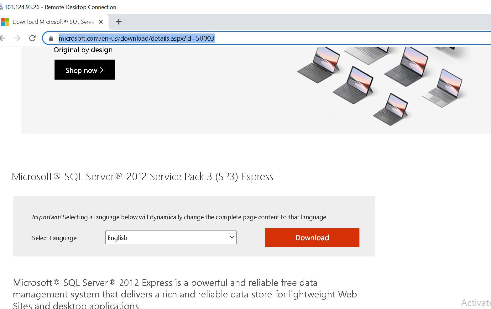

# Cài đặt môi trường ASP.net

  - Hệ quản trị CSDL SQL Express 2012

  - Webserver IIS

  - Mã nguồn ASP.net

## 1 - SQL EXPRESS 2012

- Tải bản cài MSSQL:
https://www.microsoft.com/en-us/download/details.aspx?id=50003

- CÀi mới sql độc lập

- Đồng ý điều khoản

- Cài ASP.net

