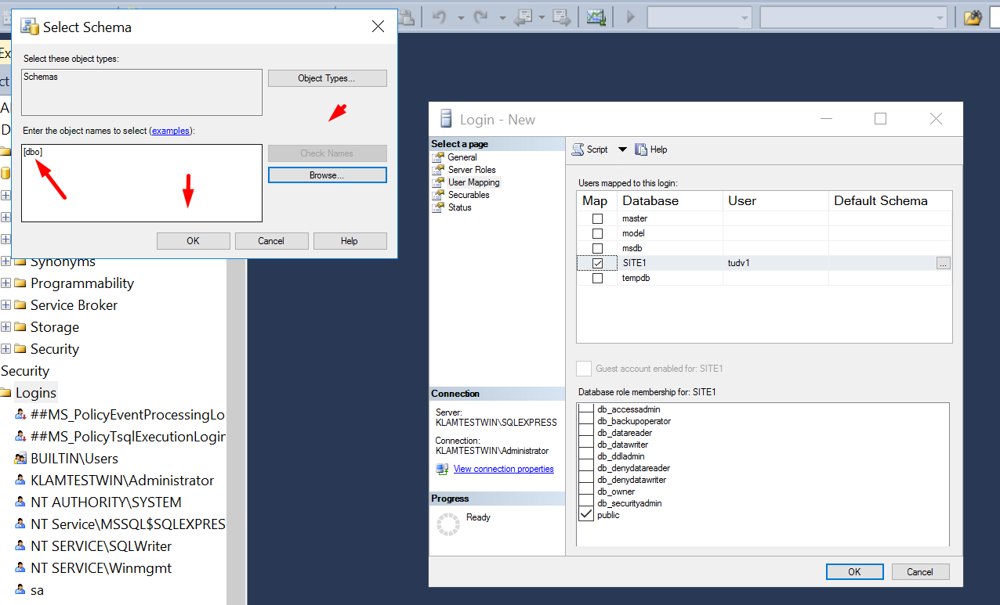

# Cài đặt môi trường ASP.net

Windows, IIS, SQL, ASP.NET) Stack

## 1 - IIS ASP.net
- Add roll and features

- Test thử 

## 2 - Cài đặt sql server

- Tạo mới 1 server độc lập

- Hệ thống sẽ kiểm tra và tải về các bản cập nhật

- Next

- Next

- Tùy chọn xác thực windows hoặc cả tính năng kết nối = user pass sql

- Quá trình cài đặt bắt đầu 

## 3- Cài đặt SQL management studio

- Chạy file

## 4 USER,Restore database, backup , attach database.

- Mở phần mềm MSSMS lên kết nối quản lý database sql với xác thực là tài khoản máy tính:

- Chúng ta có thể tạo ra các database và user mang quyền với database đó

- Tạo user database và gán quyền owner

- các tùy chọn bao gồm tên, mật khẩu user database, chính sách về mật khẩu của user, default database khi user connect sẽ vào thẳng database đó

- Tiếp theo là gán quyền sở hữu SITE1 cho tudv1

- Backup database SITE1

- Các tùy chọn như backup full, thời gian backup, và chỗ lưu file backup

- Giờ ta xóa DATABASE SITE1 rồi tiến hành restore lại database:

- Attach và detach

  - Khi ta có 1 database muốn chuyển sang máy khác ta    sẽ phải làm thao tác detach trước để lấy 2 file mang đi máy khác: test với database SITE1

  

  

  - Check vào ô Drop Connections (để ngắt toàn bộ kết nối đến   database này) -> Nhấn OK

  - 2 File cần thiết để attach là file mặc định nằm trong 

  C:\Program Files\Microsoft SQL Server\MSSQL11.SQLEXPRESS\MSSQL\DATA

 

- Bấm ok là xong

- Ngoài backup file.bak ra còn backup file.sql 

- Khi restore tạo lại database mới tên giống database cũ. rồi tìm đến file script , bôi đen toàn bộ dòng lệnh và chon excute .

