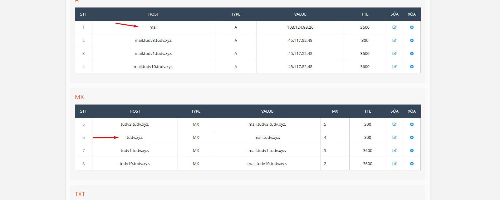

# Set up

- Chuẩn bị môi trường window server có IP là 103.124.93.26

- DNS đã trỏ 2 bản ghi A và MX

- Cài dịch vụ iis

- Vào trang chủ tải file cài đặt về máy chủ

- Tiến hành setup:

- Điền thông tin công ty. quốc gia.mail đăng ký nhận liense free

- Đợi 1 lúc cho quá trình cài đặt vào máy bắt đầu 

- Điền thông tin domain 

- Điền admin tên ``tudv@tudv.xyz``
- Mật khẩu phức tạp

- Finish

- Cài đặt hoàn tất

