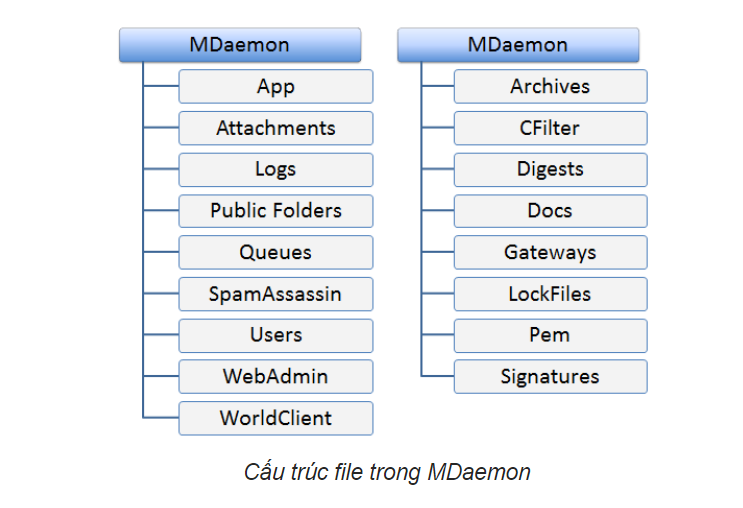
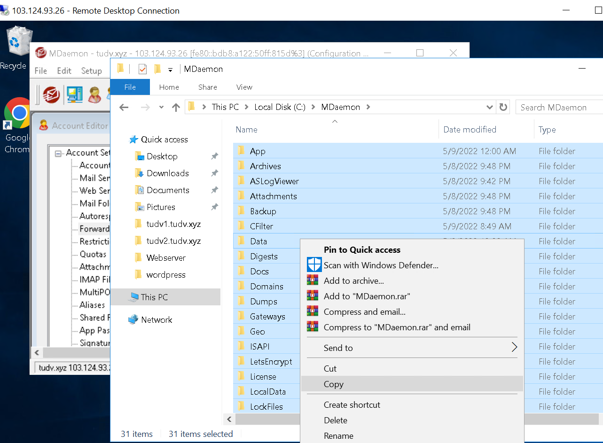
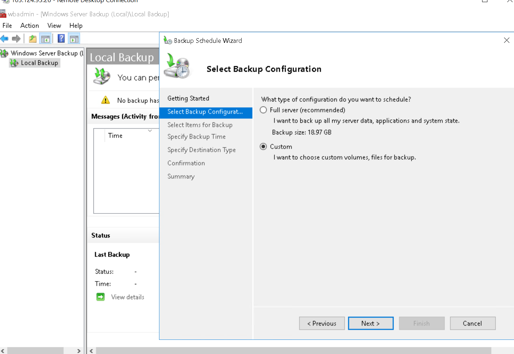
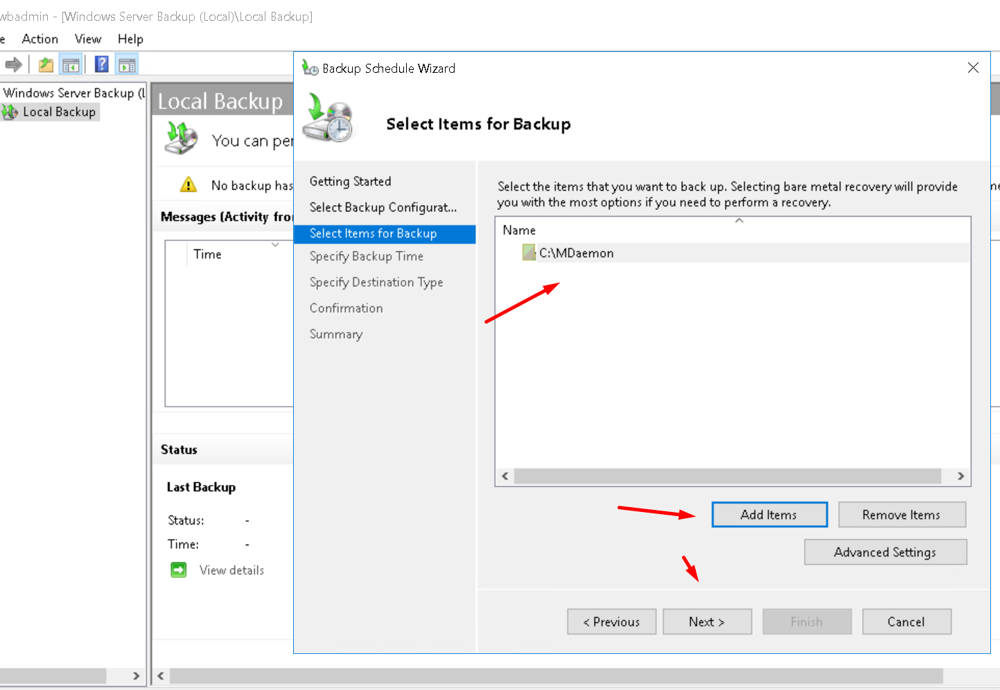
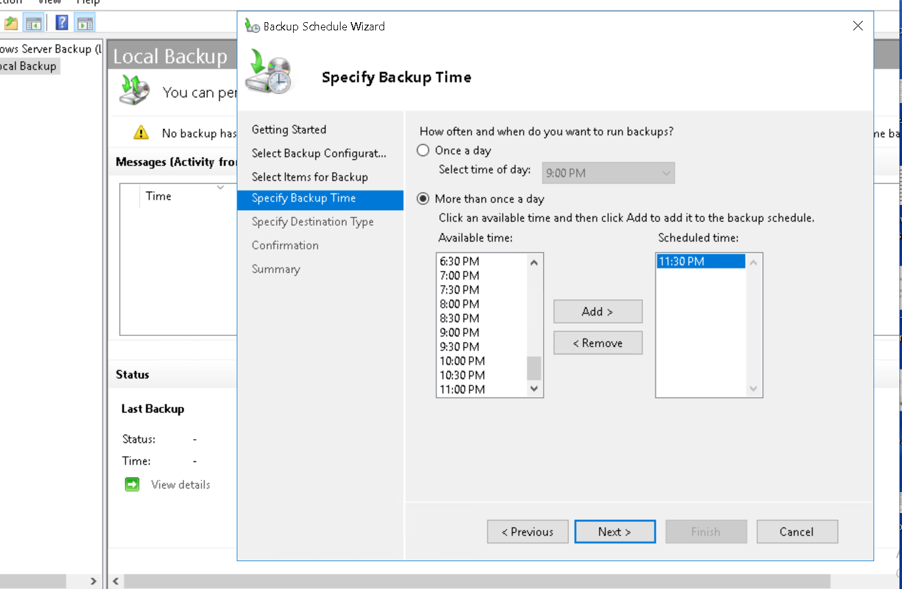
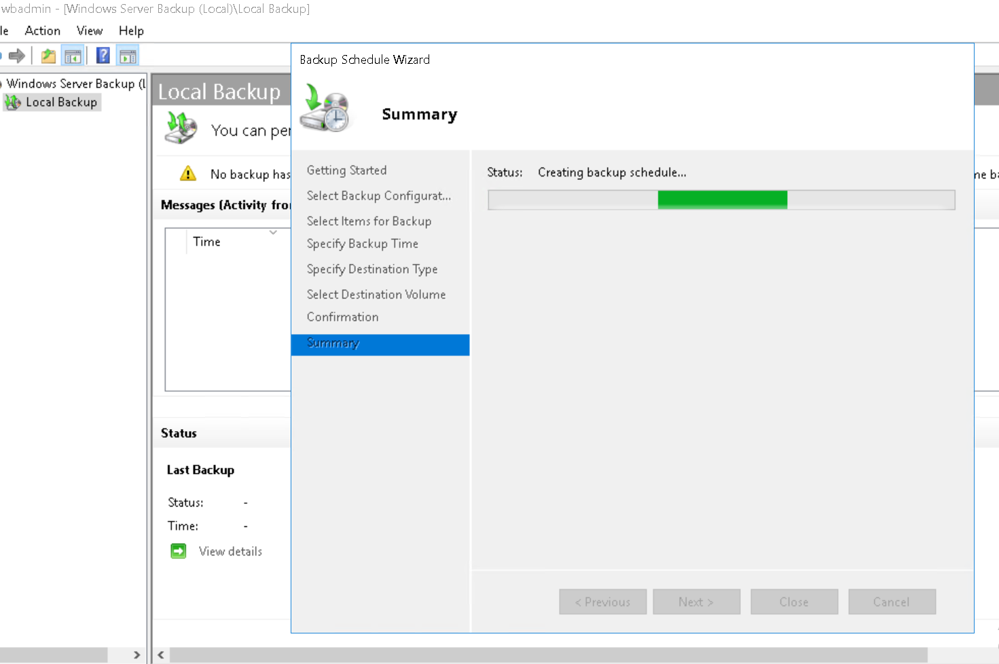
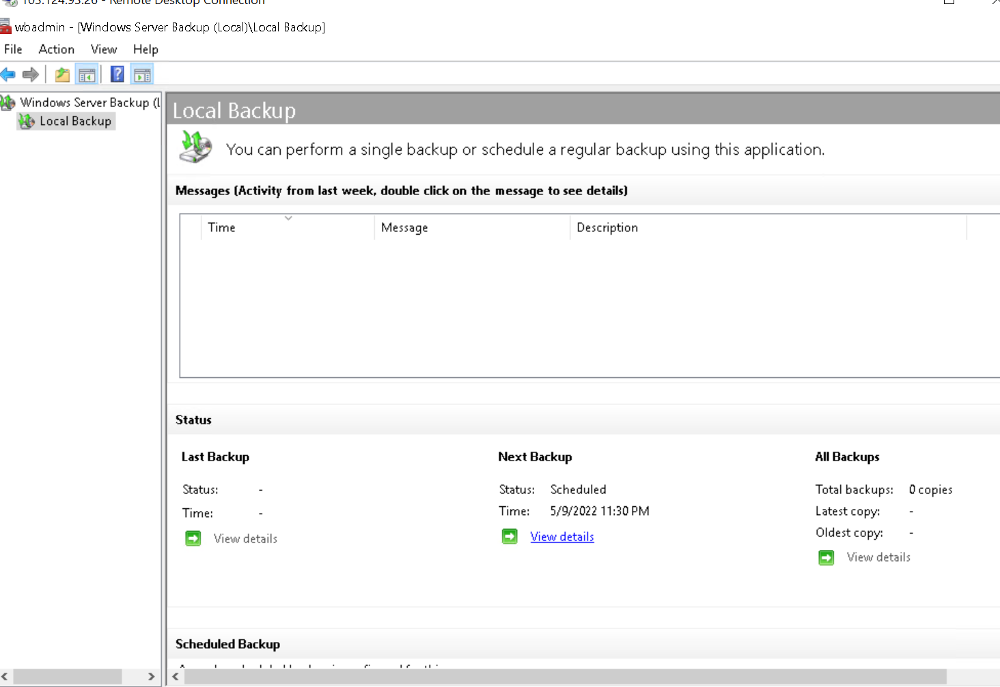

# Sao lưu

## Cấu trúc lưu trữ của MDaemon

Dữ liệu của MDaemon đều được lưu trữ dạng file trong các folder ở thư mục cài đặt MDaemon (thường là C:\MDaemon).

Toàn bộ dữ liệu MDaemon được lưu trữ trong các folder như bên dưới.

Những folder quan trọng của MDaemon bao gồm:

- [MDaemon_Path]\App: Chứa các file thực thi và cấu hình quan trọng của MDaemon

- [MDaemon_Path]\Logs: Chứa các file log theo dõi tình trạng hoạt động của hệ thống

- [MDaemon_Path]\Public Folders: Chứa các Public Folder của hệ thống Mail

- [MDaemon_Path]\Queues: Chứa các email đang nằm trong hàng đợi, chuẩn bị được gửi đi

- [MDaemon_Path]\SpamAssassin: Chứa các file cấu hình bộ lọc spam

- [MDaemon_Path]\Users: Chứa toàn bộ dữ liệu của người dùng trong hệ thống Mail. Mỗi người dùng được lưu trữ trong một folder riêng, bao gồm dữ liệu: Inbox Email, Sent Email, Contact, Calendar,… Đây là thư mục quan trọng nhất của MDaemon. Nếu như các dữ liệu khác có thể tạo lại bằng cách cài đặt và cấu hình lại, thì dữ liệu trong thư mục Users là dữ liệu của người dùng, nên chỉ có thể phục hồi bản sao lưu trước đó.

Cách đơn giản nhất để sao lưu dữ liệu MDaemon là sao lưu toàn bộ thư mục cài đặt MDaemon. Khi đó, dữ liệu trong thư mục Users (quan trọng nhất trong hệ thống MDaemon) và toàn bộ các dữ liệu khác đều được sao lưu. Nếu cần chi tiết hơn, bạn có thể chọn lọc sao lưu một số thư mục cần thiết như \Users, \App, \Public Folders. Những thư mục khác không chứa dữ liệu phát sinh trong quá trình người dùng sử dụng email nên có thể khôi phục khi cài đặt lại phần mềm.

## Sao lưu bằng Windows Server Backup

- Trên window server có sẵn  tính năng tạo backup theo định kỳ, khi folder C:\Mdaemon gặp trục trặc ta hoàn hoàn có thể restore lại

- Ta lập được thẻ backup hàng ngày 

## Ngoài ra còn có thể sử dụng các phần mềm ngoài dùng để backup

## Phục hồi dữ liệu

- Đơn giản nhất là sao chép dữ liệu từ bản sao lưu đè vào thư mục dữ liệu cần phục hồi của MDaemon chép đè tất cả dữ liệu trong thư mục cài đặt MDaemon).

- Phục hồi toàn bộ Mail Server
Khi gặp sự cố nghiêm trọng cần phải phục hồi lại toàn bộ Mail Server, việc đầu tiên bạn cần làm chuẩn bị một server mới (hoặc phục hồi server cũ) với Windows và phần mềm MDaemon được cài đặt đầy đủ. Bước tiếp theo là cấu hình Domain Controller, DNS theo đúng cấu hình cũ.

  Sau khi đã hoàn tất các thao tác cài đặt và cấu hình căn bản trên, ``tắt MDaemon (dùng  lệnh C:\MDaemon\App\MDLaunch.exe /stop)``
  rồi sao chép toàn bộ dữ liệu sao lưu đè vào thư mục cài đặt MDaemon. ``Chạy lại MDaemon bằng lệnh C:\MDaemon\App\MDLaunch.exe. ``Toàn bộ dữ liệu của MDaemon được phục hồi.

- Phục hồi một Mailbox
Toàn bộ dữ liệu của người dùng (end-user) được lưu trữ trong thư mục C:\MDaemon\Users. Khi dữ liệu của một người dùng bị lỗi cần phục hồi, bạn chỉ việc sao chép đúng bản sao lưu thư mục của người dùng đó đè vào thư mục đang có. Toàn bộ dữ liệu của người dùng sẽ được phục hồi trở lại.
