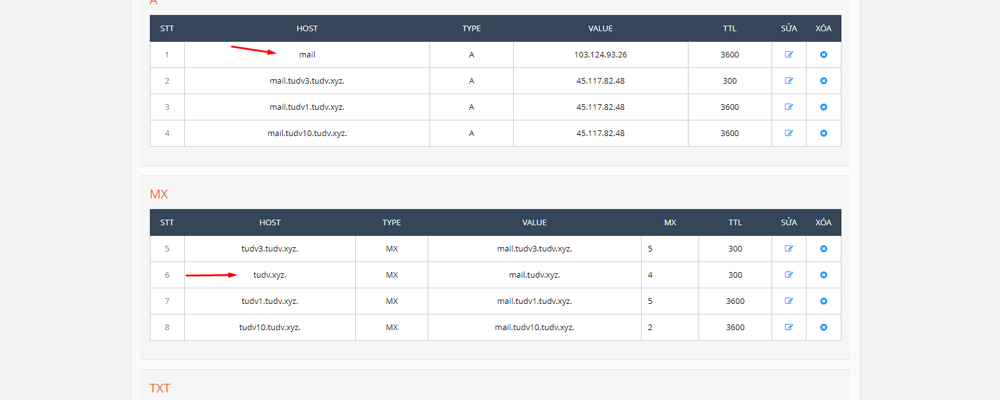
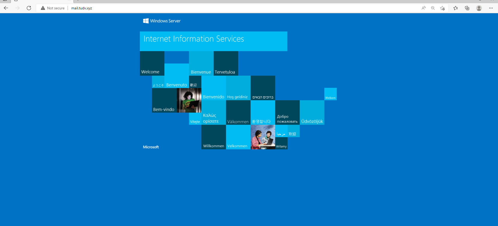
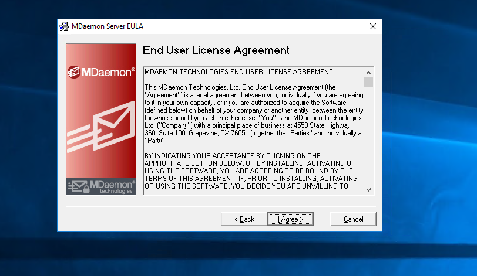
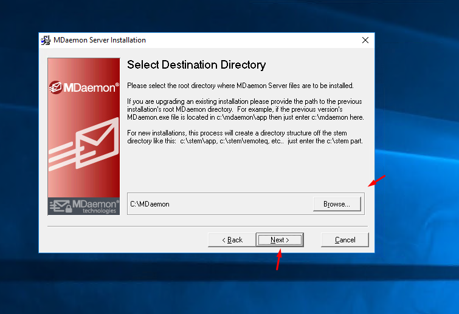
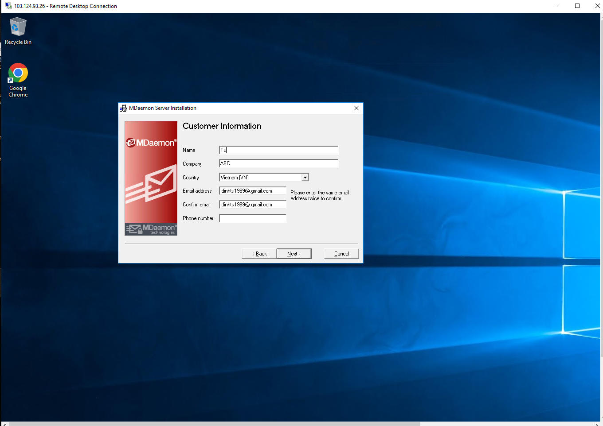
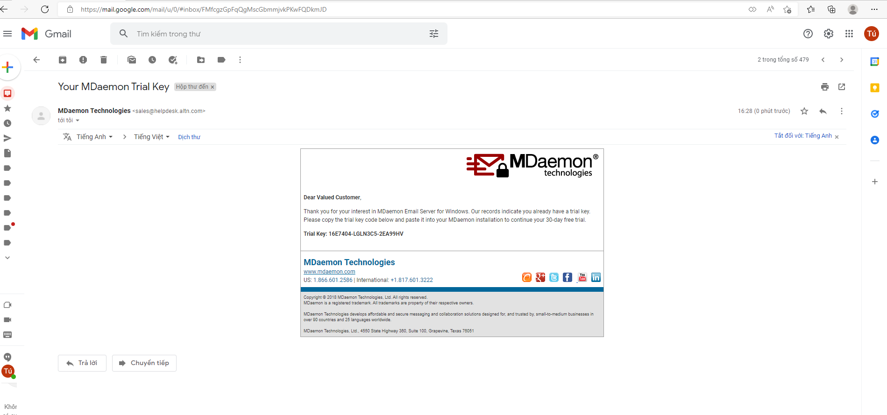
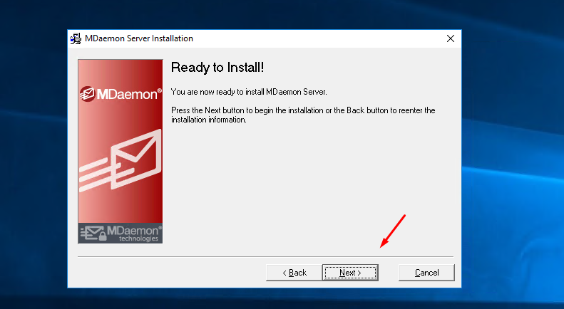
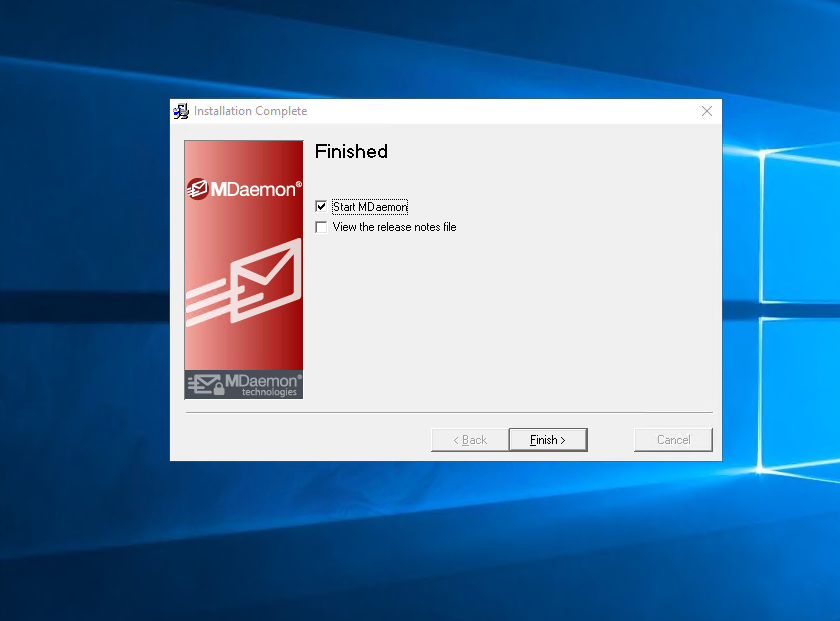

# Set up

- Chuẩn bị môi trường đã cài iis

- DNS đã trỏ 2 bản ghi A và MX

- Vào trang chủ tải file cài đặt về máy chủ

- Tiến hành setup:

- Điền thông tin để nhận liense dùng thử 30 ngày

- Cài đặt hoàn tất

