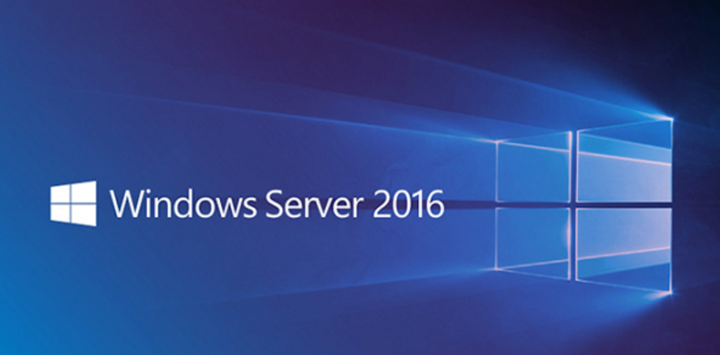
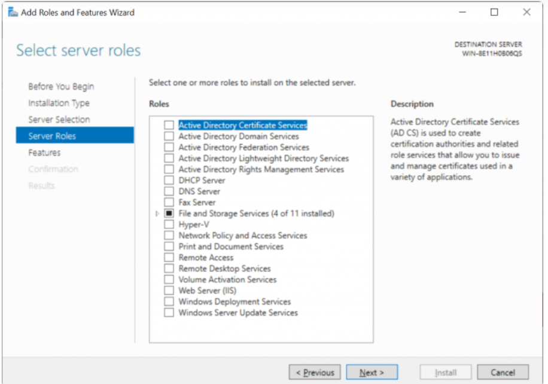

# Khái niệm

- Về cơ bản, Windows Server là một dòng hệ điều hành mà Microsoft đặc biệt tạo ra để sử dụng trên máy chủ. Điều này có nghĩa là trong hầu hết các trường hợp, Windows Server được sử dụng trong cài đặt doanh nghiệp.

- So với các bản window thường thì window server cung cấp các dịch vụ,các tính năng mà window thường không có và có 1 sự khác biệt lớn về hiệu năng với phần cứng.

- 

- Active Directory là một dịch vụ quản lý user cho phép server hoạt động như một domain controller. Thay vì logging vào máy tính local, domain controller xử lý tất việc xác thực user account.

- DHCP
DHCP, hoặc Dynamic Host Configuration Protocol. Đây là một Protocol cho phép server tự động gán địa chỉ IP cho tất cả các thiết bị trên mạng. Ở nhà, bộ định tuyến (router) của bạn có thể xử lý điều này. Nhưng trong môi trường kinh doanh, nhân viên CNTT có thể tận dụng chức năng DHCP lớn hơn trong Windows Server.

- File and Storage
Việc sở hữu một file server cho công ty cũng là một cách sử dụng phổ biến khác. Điều này cho phép bạn giữ data quan trọng ở vị trí trung tâm. Bên cạnh đó, ta có thể đặt quyền để kiểm soát ai có thể truy cập vào nội dung nào.

- Print Services
Nếu một doanh nghiệp có hàng chục máy in trong toàn bộ tòa nhà, thì thật lãng phí thời gian để nhân viên CNTT định cấu hình chúng riêng cho từng workstation mới. Thiết lập print server cho phép bạn dễ dàng map máy in với máy tính. Hơn nữa, lại giảm bớt công việc thừa.

- Windows Update Services
Thông thường, các doanh nghiệp không muốn tất cả các Windows Update được thực hiện ngay lập tức. Họ thiết lập server làm Windows Update controller. Tiếp theo, có thể định tuyến (router) tất cả các bản cập nhật workstation thông qua server đó. Cuối cùng, định cấu hình các rule cụ thể về cách chúng hoạt động.

- Và rất nhiều tính năng và các dịch vụ có thể triển khai trên máy chủ winserver như DNS,WDS,Web IIS...

 Windows Server hỗ trợ RAM lên đến 24TB, sử dụng tối đa 64 socket CPU.
Là một sản phẩm hướng đến doanh nghiệp, Windows Server có mức giá không hề rẻ. Nó có giá đắt hơn nhiều so với phiên bản Windows dành cho người tiêu dùng và có nhiều phiên bản khác nhau tùy theo nhu cầu của doanh nghiệp.